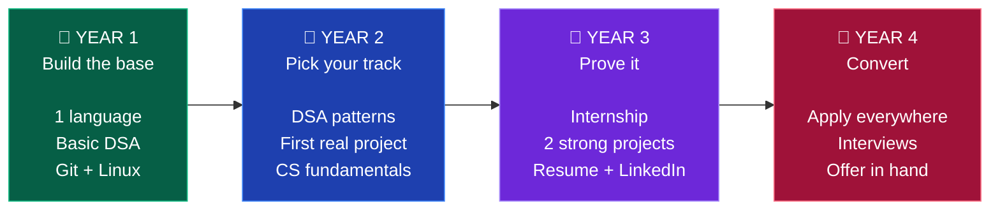
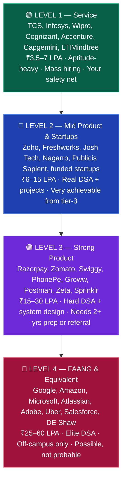

<div align="center">

<br>

# 🎓 Placement Preparation Roadmap

### A complete 4-year guide for B.Tech &amp; engineering students in India — built for tier-3 colleges

**Free forever. No signup, no course, no ₹49,999 "placement guarantee".**
Year-by-year plans · 8 career tracks · DSA · aptitude · resume · off-campus strategy

<br>

[](https://sumitsingh4411.github.io/Placement-Preparation-Roadmap/)
[](START-HERE.md)


[](https://github.com/sumitsingh4411/Placement-Preparation-Roadmap/stargazers)
[](https://github.com/sumitsingh4411/Placement-Preparation-Roadmap/network/members)
[](https://github.com/sumitsingh4411/Placement-Preparation-Roadmap/commits/main)

<br>

**[🚀 Start Here](START-HERE.md)**  ·  **[🗺️ 4-Year Roadmap](roadmap/)**  ·  **[💼 Career Tracks](tracks/)**  ·  **[🏢 Company Tiers](placements/company-tiers.md)**  ·  **[⏰ Started Late?](roadmap/late-start.md)**

<br>

> ### *Your college brings ~~three companies~~. India has **thousands**.*

<br>

</div>

---

<div align="center">

### What's inside

</div>

<div align="center">

| | | |
|:---:|:---:|:---:|
| **[🗺️ 4-Year Roadmap](roadmap/)**<br><sub>Year 1 → placement, semester by semester</sub> | **[💼 8 Career Tracks](tracks/)**<br><sub>Frontend · Backend · QA · DevOps · Data · more</sub> | **[🧮 DSA](core/dsa.md)**<br><sub>30 patterns · how many problems you need</sub> |
| **[🏢 Company Tiers](placements/company-tiers.md)**<br><sub>Who hires, what they pay, what they ask</sub> | **[📤 Off-Campus](placements/off-campus-strategy.md)**<br><sub>90% of your offers come from here</sub> | **[🧾 Resume](placements/resume.md)**<br><sub>ATS-safe, one page, with a full example</sub> |
| **[➗ Aptitude](core/aptitude-and-maths.md)**<br><sub>8-week plan for service-company tests</sub> | **[💡 Projects](projects/)**<br><sub>What actually counts, by track</sub> | **[⏰ Started Late?](roadmap/late-start.md)**<br><sub>4, 8 and 18-month recovery plans</sub> |

</div>

---

## 📌 Read this first

Nobody is coming to save you.

Your college will not teach you React. Your placement cell will bring 3 service companies offering ₹3.5 LPA. Your seniors will tell you "sab ho jayega, tension mat lo." Your syllabus is from 2011.

**None of that matters.**

Companies do not hire colleges. They hire people who can solve problems. In an online assessment, nobody can see your college name — they can only see whether your code passes the test cases. That is the single crack in the wall, and it is wide enough to walk through.

This repo is everything you need, organised the way you will actually use it: **year by year, track by track, in plain markdown you can read right here on GitHub.** No signup, no course, no ₹49,999 "placement guarantee" scam.

> [!IMPORTANT]
> This is a 4-year repo, not a 4-day one. Do not read all of it today. Open [START-HERE.md](START-HERE.md), find your current year, and do the next thing.

---

## 🧭 Where do I go?

| I am... | Go here |
|---|---|
| 🆕 Brand new, no idea what to do | **[START-HERE.md](START-HERE.md)** |
| 📅 In 1st year (or joining soon) | [roadmap/year-1.md](roadmap/year-1.md) |
| 📅 In 2nd year | [roadmap/year-2.md](roadmap/year-2.md) |
| 📅 In 3rd year | [roadmap/year-3.md](roadmap/year-3.md) |
| 📅 In 4th year | [roadmap/year-4.md](roadmap/year-4.md) |
| 😰 In 3rd/4th year and haven't started | **[roadmap/late-start.md](roadmap/late-start.md)** |
| 🤔 Confused which job role to pick | [tracks/README.md](tracks/README.md) |
| 🎯 Want to know which companies to target | [placements/company-tiers.md](placements/company-tiers.md) |
| 🧾 Need to build a resume | [placements/resume.md](placements/resume.md) |
| 📤 Have no campus placements | [placements/off-campus-strategy.md](placements/off-campus-strategy.md) |
| 💡 Need project ideas | [projects/README.md](projects/README.md) |

---

## 📖 Popular guides

The questions students search for most, answered in full:

<div align="center">

| Guide | For you if you're asking... |
|---|---|
| **[How to get placed from a tier-3 college](guides/tier-3-college-placement.md)** | *"Can I get a good job from a tier-3 college?"* |
| **[B.Tech placement preparation](guides/btech-placement-preparation.md)** | *"How do I prepare for placement in B.Tech?"* |
| **[Software engineer roadmap (India)](guides/software-engineer-roadmap-india.md)** | *"What's the roadmap to become a software engineer?"* |
| **[DSA roadmap for placement](guides/dsa-roadmap-for-placement.md)** | *"How many DSA questions are enough?"* |
| **[Off-campus placement guide](guides/off-campus-placement-guide.md)** | *"How do freshers get off-campus jobs?"* |

</div>

---

## 🗺️ The 4-year map



<div align="center">

| Year | One-line goal | Hours/week | Success looks like |
|:---:|---|:---:|---|
| **1** | Learn to code, actually | 8–10 | 150 problems solved, 1 language you're comfortable in |
| **2** | Pick a track and go deep | 12–15 | 1 deployed project, 300 problems, track basics done |
| **3** | Get proof: internship + projects | 15–20 | Internship or freelance work, resume that passes ATS |
| **4** | Apply relentlessly, convert | 20+ | 100+ applications, multiple offers |

</div>

---

## 💼 Career tracks

Pick **one**. Depth beats breadth. You can switch later — nobody cares if your first job title says QA and your second says SDE.

<div align="center">

| Track | What you build | Hardest part | Entry difficulty | Typical fresher CTC |
|---|---|---|:---:|---|
| **[🎨 Frontend](tracks/frontend.md)** | What users see and click | CSS layouts, state management | 🟢 Easiest to start | ₹4–18 LPA |
| **[⚙️ Backend](tracks/backend.md)** | APIs, databases, servers | System design, DB modelling | 🟡 Medium | ₹5–25 LPA |
| **[🧩 Full Stack](tracks/full-stack.md)** | Both ends, end to end | Breadth without depth trap | 🟡 Medium | ₹4–20 LPA |
| **[🧪 QA / SDET](tracks/qa-sdet.md)** | Automation that catches bugs | Being taken seriously | 🟢 Easiest to get hired | ₹3.5–20 LPA |
| **[☁️ DevOps / Cloud](tracks/devops-cloud.md)** | Pipelines, infra, deployments | Few fresher roles exist | 🔴 Hard as fresher | ₹5–22 LPA |
| **[🤖 Data / AI / ML](tracks/data-ai-ml.md)** | Models, pipelines, insights | Math + huge competition | 🔴 Hardest | ₹5–30 LPA |
| **[📱 Mobile](tracks/mobile.md)** | Android / iOS / cross-platform | Smaller job market | 🟡 Medium | ₹4–20 LPA |
| **[💼 Non-coding tech](tracks/non-coding-tech-roles.md)** | BA, Product, Support, Cloud Ops | Proving technical depth | 🟢 Easy entry | ₹3.5–12 LPA |

</div>

> [!TIP]
> **Confused?** Default to **Full Stack** or **QA/SDET**. Full Stack has the most openings for freshers. QA/SDET has the least competition and is the most realistic path from a tier-3 college into a product company. Both are respectable careers, not consolation prizes.

---

## 📚 Core skills (everyone needs these)

These sit *underneath* every track. You cannot skip them.

<div align="center">

| | Topic | Why it matters | Time to competent |
|:---:|---|---|:---:|
| 🧮 | **[DSA](core/dsa.md)** | The ONLY filter for product companies | 8–12 months |
| ➗ | **[Aptitude & Maths](core/aptitude-and-maths.md)** | Round 1 of every service company + many product ones | 2–3 months |
| 🖥️ | **[CS Fundamentals](core/cs-fundamentals.md)** | OS, DBMS, CN, OOP — asked in every interview | 3–4 months |
| 🏗️ | **[System Design](core/system-design.md)** | Separates ₹6 LPA from ₹25 LPA | 3–6 months |
| 🛠️ | **[Git & Linux](core/git-and-linux.md)** | Assumed knowledge — nobody will teach you | 3–4 weeks |

</div>

---

## 🏢 Which companies can I actually get?

Full breakdown with names, CTC, hiring process and difficulty: **[placements/company-tiers.md](placements/company-tiers.md)**



> [!WARNING]
> **Do not aim only at Level 4 and refuse everything else.** The students who end up unemployed are usually the ones who rejected a ₹6 LPA offer in August waiting for Google in March. Take the offer. Keep preparing. Switch in 18 months — that is how almost every tier-3 student reaches a top company.

---

## 🧠 The honest truth about tier-3

<div align="center">

| Reality | What it actually means for you |
|---|---|
| Top companies rarely visit your campus | **90% of your offers will come from off-campus.** [Learn the system →](placements/off-campus-strategy.md) |
| Your college brand adds nothing | So your **GitHub, projects and DSA are 100% of your resume** |
| Your professors won't help | The internet is better than them anyway. Everything you need is free |
| Your friends don't code | Find your people online — Discord, Twitter/X, LinkedIn, open source |
| You'll get rejected a lot | 100 applications → ~10 responses → ~3 interviews → 1 offer. **This ratio is normal.** Do not take it personally |
| Nobody asks your CGPA after job #1 | But keep it **above 7.0** — many companies hard-filter at 6.5 or 7.0 |

</div>

**What actually works, ranked:**

1. **Consistency** — 2 focused hours daily beats 14 hours every Sunday. Every time.
2. **Proof over claims** — a deployed link beats "familiar with React" on a resume.
3. **Referrals** — a referral is 10× more likely to get you an interview than a portal application.
4. **Applying early** — most freshers start applying in the final semester. Start in your 3rd year.
5. **Communication** — you will lose interviews you technically passed because you couldn't explain your thinking.

---

## 🗂️ Repo structure

```
Placement-Preparation-Roadmap/
│
├── START-HERE.md                  👈 read this first
│
├── roadmap/                       📅 what to do, year by year
│   ├── year-1.md                     Build the base
│   ├── year-2.md                     Pick a track, go deep
│   ├── year-3.md                     Internship + projects
│   ├── year-4.md                     Apply and convert
│   └── late-start.md                 Behind? Emergency plan
│
├── tracks/                        💼 pick ONE career path
│   ├── frontend.md                   backend.md
│   ├── full-stack.md                 qa-sdet.md
│   ├── devops-cloud.md               data-ai-ml.md
│   ├── mobile.md                     non-coding-tech-roles.md
│
├── core/                          📚 non-negotiable skills
│   ├── dsa.md                        aptitude-and-maths.md
│   ├── cs-fundamentals.md            system-design.md
│   └── git-and-linux.md
│
├── placements/                    🎯 how to actually get hired
│   ├── company-tiers.md              resume.md
│   ├── portfolio-and-github.md       linkedin-and-networking.md
│   ├── off-campus-strategy.md        interview-playbook.md
│   └── internships.md
│
├── projects/README.md             💡 ideas by track and level
├── resources/                     🔗 free learning + practice
└── templates/                     📋 resume, trackers, 90-day plan
```

---

## ✅ How to use this repo

1. **Fork it** (top right). It becomes your personal, editable copy.
2. **Star it** so you can find it again.
3. Open [START-HERE.md](START-HERE.md) and take the 10-minute orientation.
4. Copy [templates/weekly-tracker.md](templates/weekly-tracker.md) into your fork and tick boxes as you go.
5. Come back every Sunday. Update your progress. That's the whole system.

> [!NOTE]
> Every roadmap file has checkboxes. On GitHub, ticking a checkbox in **your fork** actually saves. That's your progress tracker — no app needed.

---

## 🤝 Contributing

Found a broken link? Got a better free resource? Landed a job and want to add your interview experience? **Please do.**

Interview experiences from tier-3 students are the single most valuable thing you can add here. Read [CONTRIBUTING.md](CONTRIBUTING.md).

---

## 📜 License

[MIT](LICENSE) — free forever. Copy it, fork it, translate it, teach from it. Just don't sell it as a paid course.

---

<div align="center">

### Your college is a starting point, not a ceiling.

**Nobody is going to hand you an opportunity. Build one.**

<br>

⭐ **Star this repo if it helped** — it helps another tier-3 student find it.

</div>
