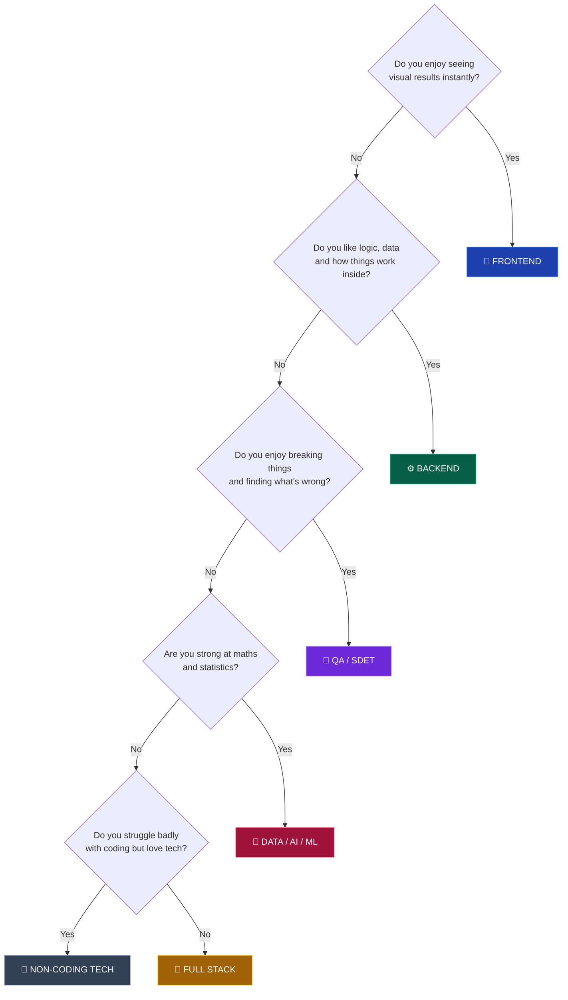

# 🚀 START HERE

### 10 minutes. Read it once. Then you'll know exactly what to do.

[← Back to home](README.md)

---

## Step 1 — Accept three facts

**Fact 1: Your college does not decide your salary. Your skill does.**
An online assessment is a text editor and test cases. It does not know your college's NIRF rank.

**Fact 2: You are behind, and that is fine.**
A student in a tier-1 college started coding in class 11 with a personal laptop and coaching. You didn't. That gap is real, and it is closable in 12–18 months of daily work. Not by talent — by hours.

**Fact 3: The bottleneck is consistency, not information.**
Everything you need is free and already on the internet. 10,000 students have this exact repo bookmarked. About 200 will still be here in 6 months. The only question that matters is whether you're one of them.

---

## Step 2 — Find your year

| Your current year | Your one job this year | Open this |
|:---:|---|---|
| **1st** | Learn one language properly. Stop switching. | **[roadmap/year-1.md](roadmap/year-1.md)** |
| **2nd** | Pick a track. Build something real. Start DSA seriously. | **[roadmap/year-2.md](roadmap/year-2.md)** |
| **3rd** | Get proof — internship, projects, resume, LinkedIn. | **[roadmap/year-3.md](roadmap/year-3.md)** |
| **4th** | Apply everywhere. Convert interviews. | **[roadmap/year-4.md](roadmap/year-4.md)** |
| **3rd/4th and haven't started** | Damage control. It's not over. | **[roadmap/late-start.md](roadmap/late-start.md)** |

---

## Step 3 — Pick your track (10 minutes, decide today)

Answer honestly:

**Still unsure?** Pick **Full Stack**. It has the widest job market for freshers, and it lets you discover whether you prefer frontend or backend by actually doing both. You can specialise in 6 months.

**Coding genuinely not clicking after 6+ honest months?** Read [tracks/non-coding-tech-roles.md](tracks/non-coding-tech-roles.md). Business Analyst, Product Analyst, Cloud Support and Technical Support are real, well-paid careers — not failure.

👉 **All tracks:** [tracks/README.md](tracks/README.md)

---

## Step 4 — Set up your environment (do it today, 1 hour)

- [ ] **Laptop** — 8GB RAM minimum. A ₹25k refurbished ThinkPad beats no laptop. If you truly have none, use your college lab + [GitHub Codespaces](https://github.com/codespaces) (free 60 hrs/month) or [Replit](https://replit.com) from a phone browser.
- [ ] **VS Code** — install it. [code.visualstudio.com](https://code.visualstudio.com)
- [ ] **Git** — install it. Then read [core/git-and-linux.md](core/git-and-linux.md)
- [ ] **GitHub account** — use a professional username. `sumit-singh-dev` ✅ · `xX_darkGamer69_Xx` ❌ (recruiters see this)
- [ ] **LeetCode account** — [leetcode.com](https://leetcode.com)
- [ ] **A real email** — `firstname.lastname@gmail.com`. Not `coolboy123@gmail.com`.
- [ ] **LinkedIn** — even if empty today. [placements/linkedin-and-networking.md](placements/linkedin-and-networking.md)

---

## Step 5 — The one habit that decides everything

> **2 hours a day. Every day. Including exam weeks (reduce to 30 min, never zero).**

That's ~730 hours a year. ~2,900 hours across a degree. That is more than enough to get a good job.

**The rule that beats motivation:** never skip two days in a row. One skipped day is life. Two is the start of quitting.

<b>📅 What a realistic 2-hour day looks like</b>

 

| Time | Activity |
|---|---|
| 45 min | DSA — 2 problems, or 1 hard problem understood properly |
| 60 min | Track work — build, follow a tutorial, then rebuild it without the tutorial |
| 15 min | Theory — CS fundamentals, or read a good engineering blog |

On college/exam days: do only the 45-minute DSA block. Never zero.

<b>🚫 The 6 mistakes that kill tier-3 students</b>

 

1. **Tutorial hell** — watching 40-hour courses and building nothing. *Fix: after any tutorial, rebuild the project from scratch with no video open.*
2. **Language hopping** — 2 weeks Python, 2 weeks Java, 2 weeks Go. *Fix: pick one, stay 12 months.*
3. **Collecting roadmaps instead of following one** — you're doing it right now. *Fix: close this file after Step 7 and go do something.*
4. **Starting DSA in the 4th year** — the single most common regret. *Fix: start today, even 1 problem a day.*
5. **Waiting for campus placements** — they will bring you 3 service companies. *Fix: read [off-campus-strategy.md](placements/off-campus-strategy.md) in your 3rd year, not your 4th.*
6. **Comparing yourself to tier-1 students on LinkedIn** — you see their offers, not their 3-year head start. *Fix: compare only to yourself last month.*

---

## Step 6 — Know your target

You are not "trying for a job." You are targeting a specific level.

| Level | Companies | CTC | What it takes | Realistic timeline |
|:---:|---|:---:|---|---|
| 🟢 **1** | TCS, Infosys, Wipro, Cognizant, Accenture | ₹3.5–7 LPA | Aptitude + basic coding + degree | **6 months of prep** |
| 🔵 **2** | Zoho, Freshworks, Nagarro, funded startups | ₹6–15 LPA | 300+ DSA + 2 real projects | **12–18 months** |
| 🟣 **3** | Razorpay, Zomato, PhonePe, Groww, Postman | ₹15–30 LPA | 500+ DSA + system design + strong projects | **24 months** |
| 🔴 **4** | Google, Amazon, Microsoft, Atlassian, Adobe | ₹25–60 LPA | Elite DSA + referrals + luck | **24–36 months, or switch after 2 yrs** |

**The strategy that actually works:** clear Level 1 as insurance, aim your preparation at Level 2–3, and reach Level 4 by switching jobs after 18–24 months of real experience. Most tier-3 students at FAANG got there as an experienced hire, not as a fresher.

Full details: **[placements/company-tiers.md](placements/company-tiers.md)**

---

## Step 7 — Your first week

Do exactly this. Nothing else.

- [ ] **Day 1** — Complete Step 4 above (environment setup). Create your GitHub account.
- [ ] **Day 2** — Pick your language: **C++**, **Java**, or **Python**. Write it down. Do not change it for 12 months. → [core/dsa.md](core/dsa.md#choosing-your-language)
- [ ] **Day 3** — Solve 2 easy problems on LeetCode. They will feel impossible. That is normal and it passes.
- [ ] **Day 4** — Learn Git basics (add, commit, push). Push a "hello world" to GitHub. → [core/git-and-linux.md](core/git-and-linux.md)
- [ ] **Day 5** — Open your year's roadmap file and read it fully.
- [ ] **Day 6** — Pick your track. Read that track's file.
- [ ] **Day 7** — Copy [templates/weekly-tracker.md](templates/weekly-tracker.md) into your fork. Plan next week.

---

## That's it. Close this file.

**Information is not progress. Go solve a problem.**

 

[🗺️ Roadmaps](roadmap/) • [💼 Tracks](tracks/) • [📚 Core Skills](core/) • [🎯 Placements](placements/) • [🏠 Home](README.md)

