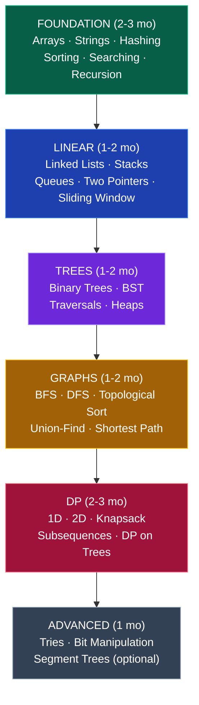
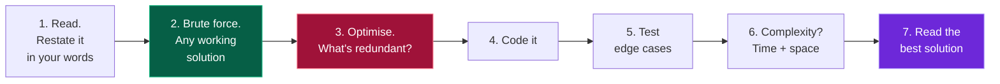

# 🧮 DSA — Data Structures & Algorithms

### The only universal filter. Every product company tests it. Every tier-3 student who cracked one, did this.

[🏠 Home](../README.md) • [📚 Core skills](../core/) • [🗺️ Roadmaps](../roadmap/)

---

## Why this matters more for you than for a tier-1 student

A tier-1 student can get an interview on their college name. **You get one on your ability to solve problems.**

An online assessment is the most level playing field in Indian hiring: a text editor, some test cases, and a timer. It doesn't know your college's ranking, your CGPA or your English accent. This is the crack in the wall — and DSA is how you walk through it.

> [!IMPORTANT]
> **DSA is not about being smart. It's about pattern recognition.** There are roughly 30 patterns. Once you've internalised them, most interview problems become "oh, that's sliding window with a hashmap." Getting there takes about 300 problems. There is no shortcut, and there doesn't need to be one — it's just work.

---

## Choosing your language

| Language | Pros | Cons | Pick if |
|---|---|---|---|
| **C++** ⭐ | Fastest execution, brilliant STL, best for contests | Steeper syntax | You want maximum DSA strength |
| **Java** ⭐ | Most common in Indian mass hiring, rich collections | Verbose | You're targeting service + enterprise |
| **Python** | Cleanest syntax, fastest to write | Slower; occasionally restricted in OAs | You want the gentlest start, or you're doing data/ML |

**Pick one and stay with it for 12 months.** The language is not the skill — the patterns are. Switching languages mid-way resets your muscle memory for no benefit.

---

## The 30 patterns that cover ~90% of interviews

| # | Pattern | Typical problems |
|:---:|---|---|
| 1 | **Two Pointers** | Pair sum, remove duplicates, container with most water |
| 2 | **Sliding Window** | Max subarray of size K, longest substring without repeats |
| 3 | **Fast & Slow Pointers** | Cycle detection, find middle of linked list |
| 4 | **Prefix Sum** | Subarray sum equals K, range sum queries |
| 5 | **Hashing / Frequency Map** | Two sum, anagrams, first unique character |
| 6 | **Binary Search** | Search in rotated array, find peak element |
| 7 | **Binary Search on Answer** ⭐ | Koko eating bananas, split array largest sum, min capacity |
| 8 | **Sorting + Greedy** | Meeting rooms, activity selection, gas station |
| 9 | **Merge Intervals** | Insert interval, merge intervals, non-overlapping intervals |
| 10 | **Cyclic Sort** | Find missing number, find duplicate |
| 11 | **Linked List Reversal** | Reverse in K-groups, palindrome linked list |
| 12 | **Stack** | Valid parentheses, min stack, evaluate expression |
| 13 | **Monotonic Stack** ⭐ | Next greater element, largest rectangle in histogram, daily temperatures |
| 14 | **Queue / Deque** | Sliding window maximum, first negative in window |
| 15 | **Tree DFS** | Path sum, diameter, max depth, validate BST |
| 16 | **Tree BFS** | Level order traversal, zigzag, right side view |
| 17 | **BST Operations** | Insert, delete, floor/ceil, kth smallest, LCA |
| 18 | **Graph BFS/DFS** | Number of islands, clone graph, flood fill |
| 19 | **Topological Sort** ⭐ | Course schedule, alien dictionary, task ordering |
| 20 | **Union-Find (DSU)** ⭐ | Connected components, redundant connection, accounts merge |
| 21 | **Shortest Path** | Dijkstra, Bellman-Ford, network delay time |
| 22 | **Backtracking** | Subsets, permutations, N-Queens, Sudoku, word search |
| 23 | **1D DP** | Climbing stairs, house robber, coin change |
| 24 | **2D DP / Grid DP** | Unique paths, minimum path sum, edit distance |
| 25 | **Knapsack DP** ⭐ | 0/1 knapsack, subset sum, partition equal subset |
| 26 | **DP on Subsequences** | LIS, LCS, longest palindromic subsequence |
| 27 | **Heap / Top-K** ⭐ | Kth largest, merge K sorted lists, top K frequent |
| 28 | **Trie** | Word search II, autocomplete, prefix matching |
| 29 | **Bit Manipulation** | Single number, count set bits, subsets via bitmask |
| 30 | **Matrix Traversal** | Spiral, rotate image, set matrix zeroes |

⭐ = disproportionately common in real interviews. Prioritise these.

---

## The learning sequence

> [!WARNING]
> **Do not jump to DP in month 2.** DP without solid recursion is memorising solutions you'll forget in a week. Recursion → backtracking → memoisation → tabulation. In that order.

---

## How many problems do you actually need?

| Target | Problems | Mix | Realistic timeline |
|---|:---:|---|---|
| **Service companies** | 150–200 | 70% Easy, 30% Medium | 4–6 months |
| **Mid product / startups** | 300–400 | 40% Easy, 55% Medium, 5% Hard | 8–12 months |
| **Strong product** | 450–550 | 25% Easy, 60% Medium, 15% Hard | 12–18 months |
| **FAANG-level** | 500–700 | 20% Easy, 60% Medium, 20% Hard | 18–24 months |

> [!IMPORTANT]
> **Quality beats quantity, badly.** 300 problems you can re-solve from scratch beats 800 you copied from editorials. If you can't re-solve a problem 2 weeks later without help, it doesn't count toward your total.

---

## The method (this is the whole skill)

### For each problem

### The 25-minute rule

| Time | What to do |
|---|---|
| **0–25 min** | Try genuinely. Brute force first — a working slow solution beats no solution. |
| **25–35 min** | Look at hints only, not the full solution. Try again. |
| **35+ min** | Read the editorial. Understand *why*, not just *what*. |
| **Then** | **Close everything. Rewrite from memory.** This step is where the learning happens. |
| **+7 days** | Redo it cold. If you can't, you never learned it. |

**Struggling for 25 minutes is not wasted time — it's the mechanism.** Your brain retains what it fought for. Reading solutions immediately feels productive and teaches you almost nothing.

### Spaced repetition (the part everyone skips)

Keep a simple sheet:

| Problem | Pattern | Date solved | Redo 1 (+7d) | Redo 2 (+30d) | Confident? |
|---|---|---|---|---|---|
| Two Sum | Hashing | 01 Aug | ✅ | ✅ | Yes |
| Course Schedule | Topo sort | 05 Aug | ❌ redo | — | No |

**Every Sunday: re-solve 5 old problems from memory.** This one habit is why some people retain 400 problems and others forget everything they did three months ago.

---

## Which sheet should you follow?

| Sheet | Problems | Best for |
|---|:---:|---|
| **[Striver's SDE Sheet / A2Z](https://takeuforward.org/strivers-a2z-dsa-course/strivers-a2z-dsa-course-sheet-2/)** ⭐ | 450 | **Best all-round choice for Indian interviews.** Structured, video solutions, free |
| **[NeetCode 150](https://neetcode.io/practice)** ⭐ | 150 | Best if you're short on time. Excellent video explanations |
| **[Blind 75](https://leetcode.com/discuss/general-discussion/460599/blind-75-leetcode-questions)** | 75 | Absolute minimum before interviews. Do this if you have 2 months |
| **[LeetCode Top Interview 150](https://leetcode.com/studyplan/top-interview-150/)** | 150 | Official, well-curated |
| **[GFG Must-Do Coding Questions](https://www.geeksforgeeks.org/must-coding-questions-company-wise/)** | ~200 | Company-wise, good for service companies |

> [!TIP]
> **Pick ONE sheet and finish it.** Students who jump between sheets solve the same 40 easy problems five times and never reach graphs and DP. **Recommendation: Striver's A2Z if you have 8+ months, NeetCode 150 if you have less.**

---

## Where to practise

| Platform | Use it for |
|---|---|
| **[LeetCode](https://leetcode.com/)** ⭐ | Primary platform. Company tags, contests, discussions |
| **[GeeksforGeeks](https://practice.geeksforgeeks.org/)** | Indian company-specific questions, theory articles |
| **[Codeforces](https://codeforces.com/)** | Only if you enjoy competitive programming |
| **[CodeChef](https://www.codechef.com/)** | Indian contests, good beginner ladders |
| **[HackerRank](https://www.hackerrank.com/)** | Many companies run their OAs here — get familiar with the interface |
| **[InterviewBit](https://www.interviewbit.com/)** | Structured, timed practice |

---

## 📅 Sample daily routine

| Phase | Daily plan |
|---|---|
| **Beginner** (0–100 problems) | 1 new problem (45 min) + revise 1 old |
| **Building** (100–300) | 2 new problems (75 min) + revise 2 old |
| **Interview prep** (300+) | 3 problems **timed** (45 min each) + 1 contest/week |
| **Exam week** | 1 easy problem. **Never zero.** |

**The rule that beats motivation: never skip two days in a row.**

---

## 🎤 In the actual interview

### Say everything out loud

Silence reads as "doesn't know." A wrong idea explained clearly reads as "thinks like an engineer." **The interviewer is evaluating your process, not just your answer.**

### The script that works

1. **Clarify** — "Can the array contain negatives? Are there duplicates? What should I return if it's empty?"
2. **Examples** — walk through a small input by hand
3. **Brute force** — "The naive approach is O(n²) because... let me start there."
4. **Optimise** — "The redundant work is X. If I use a hashmap, I can avoid it — that's O(n)."
5. **Confirm** — "Does that approach sound reasonable before I code it?"
6. **Code** — narrating as you go
7. **Test** — dry-run with your example plus edge cases (empty, single element, all same, negatives)
8. **Complexity** — time and space, stated confidently

### If you're stuck

**Say so, productively:** *"I'm considering two approaches — sorting first, or a hashmap. Sorting is O(n log n), the hashmap might be O(n) but I need to think about the space cost. Let me explore the hashmap direction."*

That's not failure — it's exactly what senior engineers sound like. Going silent for four minutes is what fails interviews.

---

## 📚 Free resources

| Need | Resource |
|---|---|
| Full DSA course (Java) | [Kunal Kushwaha DSA Bootcamp](https://www.youtube.com/@KunalKushwaha) ⭐ |
| Full DSA course (C++) | [Striver / takeUforward](https://www.youtube.com/@takeUforward) ⭐ |
| Full DSA course (Hindi) | [CodeHelp — Love Babbar](https://www.youtube.com/@CodeHelp) · [Apna College](https://www.youtube.com/@ApnaCollegeOfficial) |
| Pattern-based practice | [NeetCode.io](https://neetcode.io/) ⭐ *(best explanations on the internet)* |
| Visualisations | [VisuAlgo](https://visualgo.net/) · [Algorithm Visualizer](https://algorithm-visualizer.org/) |
| Theory reference | [GeeksforGeeks](https://www.geeksforgeeks.org/) |
| Interview patterns | [Grokking the Coding Interview patterns (free summaries)](https://github.com/dipjul/Grokking-the-Coding-Interview-Patterns-for-Coding-Questions) |
| Complexity | [Big-O Cheat Sheet](https://www.bigocheatsheet.com/) |
| Mock interviews | [Pramp](https://www.pramp.com/) · [interviewing.io](https://interviewing.io/) |

---

## ⚠️ DSA mistakes that cost people offers

| Mistake | Fix |
|---|---|
| **Reading solutions after 5 minutes** | 25 minutes minimum. The struggle is the mechanism. |
| **Solving only Easy problems** | Comfortable = not learning. Aim to fail ~40% of your attempts. |
| **Never revising** | You forget 70% in a month without spaced repetition. Redo 5 old problems weekly. |
| **Jumping between sheets** | Pick one. Finish it. |
| **Memorising solutions** | Learn the *pattern*. Interviewers change the problem slightly and memorisers collapse. |
| **Skipping recursion, going straight to DP** | DP without recursion is memorisation. Build the ladder properly. |
| **Never practising untimed → timed** | Real OAs are timed. Practise under a clock from month 6. |
| **Solving silently** | Practise narrating out loud. It's a separate skill from solving. |
| **Only competitive programming** | CP ≠ interview DSA. Different problem style. Do interview DSA. |
| **Starting in the final year** | The most common regret in every "I got placed" post. Start today. |

---

### 2 problems a day for a year is 700 problems. Nobody who did that stayed unplaced.

[🏠 Home](../README.md) • [📚 Core](../core/) • [🖥️ CS Fundamentals](cs-fundamentals.md) • [🏗️ System Design](system-design.md) • [🎤 Interview Playbook](../placements/interview-playbook.md)

