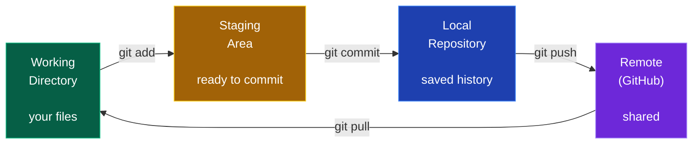

<div align="center">

# 🛠️ Git & Linux

### Assumed knowledge. Nobody teaches it, everybody expects it.

[🏠 Home](../README.md) • [📚 Core skills](../core/) • [🧮 DSA](dsa.md)


</div>

---

## Why this comes first

On day one of any job or internship, someone will say *"clone the repo, create a branch, and push a PR."* Nobody will explain what that means. It is assumed.

**It also takes about 3 weeks to learn and lasts your entire career.** This is the highest ratio of usefulness to effort in this entire repo.

---

# 🌿 Git & GitHub

## The mental model



Understand these four boxes and 90% of Git confusion disappears.

## Commands you'll use daily

```bash
# ── Setup (once) ──────────────────────────────────────
git config --global user.name "Your Name"
git config --global user.email "you@example.com"
git config --global init.defaultBranch main

# ── Starting ──────────────────────────────────────────
git init                          # new repo in current folder
git clone <url>                   # copy an existing repo

# ── The daily loop ────────────────────────────────────
git status                        # what changed? (use constantly)
git add <file>                    # stage one file
git add .                         # stage everything
git commit -m "add login API"     # save a snapshot
git push                          # send to GitHub
git pull                          # get others' changes

# ── History ───────────────────────────────────────────
git log --oneline --graph --all   # visual history
git diff                          # unstaged changes
git diff --staged                 # staged changes
git show <commit>                 # what a commit changed

# ── Branching ─────────────────────────────────────────
git branch                        # list branches
git switch -c feature/login       # create + switch (modern)
git checkout -b feature/login     # same thing (older syntax)
git switch main                   # move to main
git merge feature/login           # merge branch into current
git branch -d feature/login       # delete after merging

# ── Remotes ───────────────────────────────────────────
git remote -v                     # list remotes
git remote add origin <url>       # connect to GitHub
git push -u origin main           # first push, sets upstream

# ── Undoing (learn these before you need them) ────────
git restore <file>                # discard unstaged changes to a file
git restore --staged <file>       # unstage, keep the changes
git commit --amend                # fix the last commit message
git reset --soft HEAD~1           # undo last commit, KEEP changes
git reset --hard HEAD~1           # undo last commit, DELETE changes ⚠️
git revert <commit>               # undo a pushed commit safely
git stash                         # shelve changes temporarily
git stash pop                     # bring them back
```

> [!WARNING]
> **`git reset --hard` permanently deletes uncommitted work.** It is the one command that can genuinely lose your code. Before running it, use `git stash` if there's any chance you want the changes back.

## Branching workflow (how real teams work)

```bash
git switch main
git pull                              # start from latest
git switch -c feature/user-profile    # branch for your work
# ... write code ...
git add .
git commit -m "add user profile page"
git push -u origin feature/user-profile
# → open a Pull Request on GitHub
# → get it reviewed → merge → delete the branch
```

**Branch naming conventions:** `feature/add-search` · `fix/login-crash` · `chore/update-deps` · `docs/readme`

## Writing good commit messages

```
✅ add JWT authentication to login endpoint
✅ fix null pointer when cart is empty
✅ refactor user service to use repository pattern
✅ update README with setup instructions

❌ update
❌ fixed bug
❌ asdfgh
❌ final final v2 FINAL
```

**Format:** imperative mood, under 50 characters, say *what* and *why*. Interviewers do scroll your commit history — it's a signal of how you'd work on a team.

<details>
<summary><b>🔧 Fixing common Git disasters</b></summary>

<br>

**"I committed to main instead of a branch"**
```bash
git branch feature/my-work     # create branch at current position
git reset --hard HEAD~1        # move main back one commit
git switch feature/my-work     # your work is safe here
```

**"I need to undo a commit I already pushed"**
```bash
git revert <commit-hash>       # creates a new commit that undoes it
git push                       # safe — never rewrite shared history
```

**"I have a merge conflict"**
```bash
# Git marks conflicts in the file like this:
# <<<<<<< HEAD
# your version
# =======
# their version
# >>>>>>> branch-name

# 1. Open the file, delete the markers, keep the correct code
# 2. git add <file>
# 3. git commit
```

**"I committed a password/API key"**
```bash
# 1. Rotate the key IMMEDIATELY — assume it's compromised
# 2. Then remove from history:
git filter-branch --force --index-filter \
  "git rm --cached --ignore-unmatch .env" HEAD
# Or use BFG Repo-Cleaner (easier)
# 3. Add .env to .gitignore so it can't happen again
```

**"I want to see who wrote this line"**
```bash
git blame <file>
```

**"I lost commits after a reset --hard"**
```bash
git reflog                     # shows EVERYTHING, including "lost" commits
git reset --hard <hash>        # recover
```
*`git reflog` has saved more careers than any other command. Remember it exists.*

</details>

## GitHub for your career

Your GitHub profile **is** your resume as a tier-3 student. Treat it that way.

- [ ] **Professional username** — `sumit-singh-dev` ✅ not `xX_gamer_Xx` ❌
- [ ] **Profile README** — create a repo named exactly your username *(it shows on your profile)*
- [ ] **Pin your 6 best repos**
- [ ] **Every repo needs a README** — what it does, tech stack, screenshots, live link, setup steps
- [ ] **Add a `.gitignore`** — never commit `node_modules`, `.env`, build folders
- [ ] **Never commit secrets** — API keys, passwords, `.env` files
- [ ] Commit regularly — a consistent green graph shows discipline
- [ ] Add topics/tags to repos so they're discoverable
- [ ] Delete or archive junk repos *(`tutorial-1`, `test`, `practice`)*

📖 **[placements/portfolio-and-github.md](../placements/portfolio-and-github.md)**

---

# 🐧 Linux

## Why you need it

Every server runs Linux. Every deployment happens over SSH. Every log you'll ever read is on a Linux box. DevOps, backend and QA roles all assume you can navigate a terminal without panicking.

**How to practise:** use WSL2 on Windows, the built-in terminal on macOS, or dual-boot Ubuntu. Even 20 minutes a day in a terminal builds real fluency.

## Commands you'll actually use

```bash
# ── Navigation ────────────────────────────────────────
pwd                     # where am I?
ls -lah                 # list all, long format, human sizes
cd /path/to/dir         # change directory
cd ..                   # up one level
cd ~                    # home directory

# ── Files & directories ───────────────────────────────
touch file.txt          # create empty file
mkdir -p a/b/c          # create nested directories
cp file.txt backup.txt  # copy
cp -r dir1 dir2         # copy directory
mv old.txt new.txt      # move or rename
rm file.txt             # delete file
rm -rf dir/             # delete directory ⚠️ NO undo
find . -name "*.log"    # find files by pattern

# ── Reading files ─────────────────────────────────────
cat file.txt            # print whole file
less file.txt           # scrollable view (q to quit)
head -n 20 file.txt     # first 20 lines
tail -n 20 file.txt     # last 20 lines
tail -f app.log         # follow live ⭐ (debugging servers)
wc -l file.txt          # count lines

# ── Searching ⭐ ───────────────────────────────────────
grep "error" app.log            # find lines containing "error"
grep -i "error" app.log         # case-insensitive
grep -r "TODO" .                # recursive search
grep -n "error" app.log         # show line numbers
grep -c "error" app.log         # count matches

# ── Pipes & redirection ⭐ ─────────────────────────────
cat app.log | grep "error" | wc -l        # count error lines
ls -la > files.txt                        # write output to file
echo "text" >> file.txt                   # append to file
ps aux | grep node                        # find node processes

# ── Permissions ───────────────────────────────────────
chmod +x script.sh      # make executable
chmod 755 file          # rwx for owner, rx for others
chown user:group file   # change ownership
ls -l                   # view permissions

# ── Processes ─────────────────────────────────────────
ps aux                  # all running processes
top / htop              # live process monitor
kill <PID>              # terminate a process
kill -9 <PID>           # force kill
lsof -i :3000           # what's using port 3000? ⭐

# ── System ────────────────────────────────────────────
df -h                   # disk usage
du -sh *                # size of each item here
free -h                 # memory usage
uname -a                # system info

# ── Networking ────────────────────────────────────────
curl https://api.example.com          # HTTP request
curl -X POST -d '{"a":1}' <url>       # POST with data
ping google.com                       # connectivity
netstat -tulpn                        # open ports
ssh user@server                       # connect to a server
scp file.txt user@server:/path        # copy file to server
```

> [!WARNING]
> **`rm -rf` has no recycle bin.** There is no undo. Double-check the path before you press enter — especially if the command contains a variable. `rm -rf $DIR/` when `$DIR` is empty becomes `rm -rf /`.

## Understanding permissions

```
-rwxr-xr--  1 user group  4096 Jul 26 10:30  script.sh
│└┬┘└┬┘└┬┘
│ │  │  └── others: r-- (read only)          = 4
│ │  └───── group:  r-x (read + execute)     = 5
│ └──────── owner:  rwx (read+write+execute) = 7
└────────── file type (- = file, d = directory)
                                    → chmod 754
```

`r` = 4 · `w` = 2 · `x` = 1. Add them up per group. `chmod 755` is the most common for scripts and directories; `644` for regular files.

## Bash scripting basics

```bash
#!/bin/bash

# Variables
NAME="World"
echo "Hello, $NAME"

# Conditionals
if [ -f "app.log" ]; then
    echo "Log file exists"
elif [ -d "logs" ]; then
    echo "Logs directory exists"
else
    echo "Nothing found"
fi

# Loops
for file in *.txt; do
    echo "Processing $file"
done

# Functions
backup() {
    tar -czf "backup-$(date +%Y%m%d).tar.gz" "$1"
    echo "Backed up $1"
}
backup ./data

# Exit codes
if command_that_might_fail; then
    echo "Success"
else
    echo "Failed with code $?"
fi
```

**Automate something real:** a script that backs up a folder, cleans old logs, or checks if your server is up. That's a genuine portfolio piece for DevOps and QA roles.

## Cron (scheduled tasks)

```bash
crontab -e        # edit your scheduled jobs
crontab -l        # list them

# Format: minute hour day month weekday command
0 2 * * *     /home/user/backup.sh          # daily at 2 AM
*/15 * * * *  /home/user/healthcheck.sh     # every 15 minutes
0 0 * * 0     /home/user/weekly-report.sh   # Sundays at midnight
```

---

## 📅 A 3-week plan (30 min/day)

<div align="center">

| Week | Focus | Do this |
|:---:|---|---|
| **1** | Git basics | init, add, commit, push, pull. **Push code every single day.** |
| **2** | Git branching + GitHub | Branches, merges, resolving a conflict on purpose, open a PR |
| **3** | Linux | Navigation, grep, pipes, permissions, processes, write one Bash script |

</div>

**Best practice project:** set up a repo, work on it via branches and PRs (even solo), and deploy it to a Linux server over SSH. That single exercise covers everything above.

---

## 📚 Free resources

<div align="center">

| Topic | Resource |
|---|---|
| Git basics | [Git & GitHub — freeCodeCamp](https://www.youtube.com/watch?v=RGOj5yH7evk) |
| Git interactive ⭐ | [Learn Git Branching](https://learngitbranching.js.org/) *(visual, genuinely the best way to learn branching)* |
| Git reference | [Pro Git book (free)](https://git-scm.com/book/en/v2) · [Oh Sh*t, Git!?!](https://ohshitgit.com/) *(fixing disasters)* |
| GitHub | [GitHub Skills](https://skills.github.com/) *(free interactive courses)* |
| Linux basics | [Linux Journey](https://linuxjourney.com/) ⭐ |
| Linux by doing ⭐ | [OverTheWire: Bandit](https://overthewire.org/wargames/bandit/) *(learn Linux by solving hacking puzzles — genuinely fun)* |
| Command reference | [ExplainShell](https://explainshell.com/) *(paste any command, see what each part does)* |
| Bash scripting | [Bash Guide for Beginners](https://tldp.org/LDP/Bash-Beginners-Guide/html/) |
| Practice terminal | [Command Line Challenge](https://cmdchallenge.com/) |
| Cheatsheets | [tldr pages](https://tldr.sh/) *(simplified man pages with examples)* |

</div>

---

## ⚠️ Mistakes

| Mistake | Fix |
|---|---|
| **Copy-pasting Git commands without understanding** | Learn the 4-box model. It removes almost all confusion. |
| **Committing `node_modules` or `.env`** | Always add a `.gitignore` first, before your first commit. |
| **Committing API keys** | Use `.env` + `.gitignore`. If you leak one, rotate it immediately. |
| **Working only on `main`** | Use branches even solo. It's what teams expect and it's good practice. |
| **Meaningless commit messages** | Interviewers read your history. "update" tells them nothing good. |
| **Fear of the terminal** | 20 minutes a day for 3 weeks and it becomes comfortable. Do Bandit. |
| **`rm -rf` without checking** | Read the path twice. There is no undo. |
| **Never using `git stash` or `git reflog`** | These two commands solve most "I broke everything" moments. |

---

<div align="center">

### Three weeks of effort. Thirty years of usefulness.

[🏠 Home](../README.md) • [📚 Core](../core/) • [🐙 GitHub profile](../placements/portfolio-and-github.md) • [☁️ DevOps](../tracks/devops-cloud.md)

</div>
