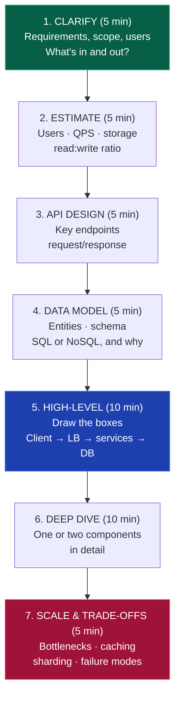

# 🏗️ System Design

### The skill that separates a ₹6 LPA offer from a ₹25 LPA one.

[🏠 Home](../README.md) • [📚 Core skills](../core/) • [🧮 DSA](dsa.md) • [🖥️ CS Fundamentals](cs-fundamentals.md)

---

## When should you start this?

> [!WARNING]
> **Do not start system design in your 2nd year.** It is the most commonly over-prioritised topic among students, because it feels impressive. But you cannot design a distributed system meaningfully if you've never built a single-server one.

**Prerequisites before you begin:**
- ✅ 350+ DSA problems solved *(DSA is what gets you through the first rounds)*
- ✅ Built and deployed at least one real full-stack application
- ✅ Comfortable with databases, APIs, and how HTTP works
- ✅ You understand [CS fundamentals](cs-fundamentals.md) — especially networking and DBMS

**When it's actually tested:**

| Level | Is system design asked? |
|---|---|
| Service companies | ❌ Almost never for freshers |
| Mid product / startups | 🟡 Sometimes — basic HLD, or "how would you scale this?" |
| Strong product companies | ✅ Often, even for freshers |
| FAANG-level | ✅ Yes for SDE-1 at some, always at SDE-2+ |
| **2+ years experience** | ✅ **Always. This is where it really matters.** |

**The honest framing for a tier-3 fresher:** system design is unlikely to *get* you your first job — DSA and projects do that. But it will be the thing that gets you your **second** job at 2–3× the salary. Learn the basics now; go deep once you're working.

---

## The building blocks

### 1. Scaling fundamentals

- [ ] **Vertical vs horizontal scaling** — bigger machine vs more machines
- [ ] **Load balancing** ⭐ — round robin, least connections, IP hash; L4 vs L7
- [ ] **Stateless vs stateful services** *(and why stateless scales)*
- [ ] Single point of failure, redundancy
- [ ] Latency vs throughput
- [ ] Availability — what "99.9%" actually means in downtime per year

### 2. Databases at scale ⭐

- [ ] **SQL vs NoSQL** — and when each is genuinely the right call
- [ ] **Replication** — leader-follower, read replicas, replication lag
- [ ] **Sharding / partitioning** ⭐ — by range, hash, or geography; hotspots
- [ ] **Indexing** — trade-offs on read vs write
- [ ] **Denormalisation** for read performance
- [ ] **CAP theorem** ⭐ — consistency, availability, partition tolerance
- [ ] Eventual vs strong consistency
- [ ] ACID vs BASE
- [ ] Connection pooling
- [ ] Database federation

### 3. Caching ⭐

- [ ] **Why cache** — and what makes a good cache candidate
- [ ] Cache levels — browser, CDN, application, database
- [ ] **Redis / Memcached**
- [ ] **Caching strategies** — cache-aside, read-through, write-through, write-behind
- [ ] **Eviction policies** — LRU, LFU, FIFO, TTL
- [ ] **Cache invalidation** *(genuinely one of the hard problems)*
- [ ] Thundering herd / cache stampede

### 4. Asynchronous processing ⭐

- [ ] **Message queues** — Kafka, RabbitMQ, SQS
- [ ] Publisher-subscriber vs point-to-point
- [ ] **Why async** — decoupling, buffering, resilience
- [ ] Background workers, job queues
- [ ] Idempotency, retries, exponential backoff
- [ ] Dead letter queues
- [ ] Event-driven architecture

### 5. Networking & delivery

- [ ] **CDN** — how and why
- [ ] **API Gateway**
- [ ] **Reverse proxy** (Nginx)
- [ ] DNS-based load balancing
- [ ] **Rate limiting** ⭐ — token bucket, leaky bucket, sliding window
- [ ] WebSockets vs long polling vs SSE
- [ ] REST vs GraphQL vs gRPC

### 6. Architecture patterns

- [ ] **Monolith vs microservices** ⭐ — the real trade-offs *(monoliths are underrated; say so)*
- [ ] Service discovery
- [ ] **Circuit breaker**, bulkhead, graceful degradation
- [ ] Saga pattern for distributed transactions
- [ ] Blob/object storage (S3) for files
- [ ] Search — Elasticsearch
- [ ] Consistent hashing ⭐

### 7. Operations

- [ ] Monitoring, logging, alerting, distributed tracing
- [ ] Health checks
- [ ] Blue-green and canary deployments
- [ ] Disaster recovery, backups
- [ ] Security — auth, encryption at rest and in transit, DDoS protection

---

## 🎤 The interview framework

Every system design interview follows the same shape. **Learn the framework, not memorised designs.**

<b>📋 What to say at each step</b>

 

**1. Clarify — never start designing immediately**
> "Before I design, let me clarify scope. Are we building for 10,000 users or 100 million? Is this read-heavy or write-heavy? Do we need real-time updates? Should I include analytics, or focus on the core flow?"

**2. Estimate — show you think in numbers**
> "Let's say 100M daily active users, each making 10 requests/day. That's 1B requests/day ≈ 12,000 QPS average, maybe 40,000 at peak. If each record is 1KB and we store 500M records/day, that's 500 GB/day, ~180 TB/year."

*(Don't obsess over precision. The point is showing you reason about scale.)*

**3. API design**
> "The core endpoints would be `POST /api/v1/urls` to create, and `GET /{shortCode}` to redirect."

**4. Data model**
> "I'd use PostgreSQL for user data because we need transactions, and Redis for the URL mappings because it's a read-heavy key-value lookup."

**5. High-level design — draw it**
> "Client → CDN → Load Balancer → API servers (stateless, autoscaled) → Cache layer → Database with read replicas. A message queue handles analytics asynchronously so it doesn't block the redirect path."

**6. Deep dive — go deep where they push**
> "For short-code generation, I'd use base-62 encoding of an auto-incrementing counter distributed via a key-generation service, rather than hashing — that avoids collision handling entirely."

**7. Trade-offs — this is the senior signal**
> "Sharding by user ID gives even distribution but makes cross-user queries expensive. Given our access pattern is mostly per-user, that's the right trade. If we needed global analytics, I'd add a separate OLAP store rather than compromise the transactional design."

**Always state trade-offs.** There is no correct answer in system design — there are only justified decisions. Saying "I'd choose X because Y, though it costs us Z" is what distinguishes a strong candidate.

---

## 📝 Practice problems (in order of difficulty)

| # | Problem | Key concepts |
|:---:|---|---|
| 1 | **URL shortener** (TinyURL) ⭐ | Hashing, base-62, caching, read-heavy design |
| 2 | **Rate limiter** ⭐ | Token bucket, Redis, distributed counters |
| 3 | **Pastebin** | Object storage, TTL, CDN |
| 4 | **Web crawler** | BFS, politeness, deduplication, distributed queues |
| 5 | **Notification system** | Queues, fan-out, retries, third-party integrations |
| 6 | **Key-value store** | Consistent hashing, replication, quorum |
| 7 | **Chat application** (WhatsApp) ⭐ | WebSockets, message ordering, delivery receipts, presence |
| 8 | **News feed** (Twitter/Instagram) ⭐ | Fan-out on write vs read, ranking, the celebrity problem |
| 9 | **YouTube / Netflix** | Video encoding, CDN, adaptive bitrate, storage |
| 10 | **Uber / Ola** | Geospatial indexing, matching, real-time location |
| 11 | **Search autocomplete** | Tries, ranking, caching prefixes |
| 12 | **E-commerce** (Amazon) | Inventory, cart, orders, payments, consistency |
| 13 | **Payment system** ⭐ | Idempotency, double-spend prevention, reconciliation |
| 14 | **Google Docs** | Operational transforms / CRDTs, real-time collaboration |
| 15 | **Distributed job scheduler** | Leader election, fault tolerance, exactly-once semantics |

> [!TIP]
> **Start with #1, #2 and #7.** URL shortener teaches you the whole framework. Rate limiter is small enough to design completely. Chat forces you to handle real-time and state. Do these three properly and you'll have the vocabulary for the rest.

---

## 🧮 Numbers worth memorising

| Operation | Approximate latency |
|---|---|
| L1 cache reference | 1 ns |
| Main memory reference | 100 ns |
| SSD random read | 150 µs |
| Read 1 MB from memory | 250 µs |
| Round trip within a datacenter | 500 µs |
| Read 1 MB from SSD | 1 ms |
| Disk seek | 10 ms |
| **Round trip India ↔ US** | **~150 ms** |

| Rule of thumb | Value |
|---|---|
| 1 million requests/day | ~12 QPS |
| 100 million requests/day | ~1,200 QPS |
| Chars → bytes | 1 char ≈ 1 byte (ASCII), 2–4 (UTF-8) |
| A single well-tuned server | ~1,000–10,000 QPS |
| Redis | ~100,000+ ops/sec |
| A day | 86,400 sec (≈ 100k for estimation) |

**You don't need precision.** You need to be able to say "that's roughly 10,000 QPS, so a handful of servers behind a load balancer, and the database will be the bottleneck before the app tier."

---

## 📚 Free resources

| Resource | Why |
|---|---|
| **[System Design Primer](https://github.com/donnemartin/system-design-primer)** ⭐ | The best free resource that exists. Start here. 300k+ GitHub stars |
| **[ByteByteGo (YouTube)](https://www.youtube.com/@ByteByteGo)** ⭐ | Short, brilliantly illustrated explanations |
| **[Gaurav Sen (YouTube)](https://www.youtube.com/@gkcs)** ⭐ | Indian, excellent for interview-style walkthroughs |
| **[Hussein Nasser (YouTube)](https://www.youtube.com/@hnasr)** | Deep backend engineering fundamentals |
| **[System Design Interview — Alex Xu](https://bytebytego.com/)** | The standard book *(paid, but the blog is free)* |
| **[High Scalability blog](http://highscalability.com/)** | Real architectures of real companies |
| **[Engineering blogs](https://github.com/kilimchoi/engineering-blogs)** | Uber, Netflix, Discord, Razorpay, Swiggy — read how they actually did it |
| **[Designing Data-Intensive Applications](https://dataintensive.net/)** | The definitive book. Read it once you're working |
| **[Excalidraw](https://excalidraw.com/)** | Draw your designs — practise drawing, you'll do it live in interviews |

---

## ⚠️ System design mistakes

| Mistake | Fix |
|---|---|
| **Starting system design before 350 DSA problems** | DSA gets you the interview. Prioritise correctly. |
| **Memorising designs** | Interviewers change one requirement and memorisation collapses. Learn the framework. |
| **Jumping straight to the architecture** | Always clarify requirements first. Designing the wrong thing perfectly is a fail. |
| **Proposing microservices for everything** | "I'd start with a monolith and extract services when we hit a specific bottleneck" is a *better* answer. |
| **Never mentioning trade-offs** | There's no right answer. Justified decisions are what's scored. |
| **Ignoring failure modes** | "What happens if this service goes down?" — always address it before you're asked. |
| **Not drawing anything** | Draw boxes and arrows. Verbal-only designs are hard to follow and read as vague. |
| **Over-engineering for 100 users** | Match the design to the stated scale. Premature scaling is a real red flag. |

---

### System design is what makes your *second* job pay 3× your first. Learn the basics now, master it while working.

[🏠 Home](../README.md) • [📚 Core](../core/) • [⚙️ Backend](../tracks/backend.md) • [🎤 Interview Playbook](../placements/interview-playbook.md)

