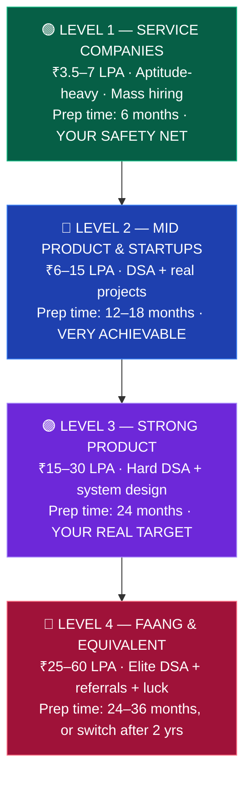
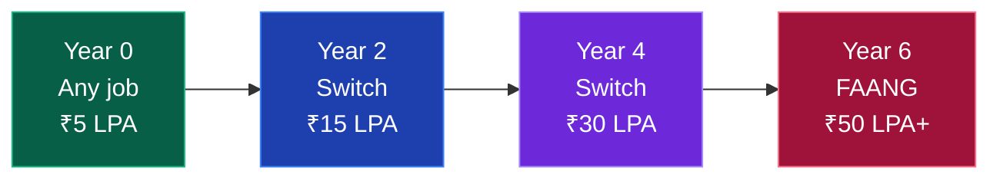

# 🏢 Company Tiers — Who Can You Actually Get?

### From ₹3.5 LPA service companies to ₹60 LPA FAANG. Know your targets, know the price of admission.

[🏠 Home](../README.md) • [🎯 Placements](../placements/) • [📤 Off-campus](off-campus-strategy.md) • [🎤 Interviews](interview-playbook.md)

---

## The four levels

> [!IMPORTANT]
> **The winning strategy for a tier-3 student:** clear **Level 1** as insurance, aim your preparation at **Level 2–3**, and reach **Level 4 by switching jobs after 18–24 months of real experience.**
>
> Most tier-3 engineers at FAANG got there as an *experienced hire*, not as a fresher. That route is far more reliable, and nobody asks where you started once you have 2 years of shipped work behind you.

---

## 🟢 Level 1 — Service Companies

**Your safety net. Register for every single one.**

| Company | CTC (fresher) | Process | Notes |
|---|:---:|---|---|
| **TCS** (NQT / Digital / Prime) | ₹3.5 / 7 / 9 LPA | NQT → technical → HR | Largest recruiter in India. NQT score is reusable |
| **Infosys** (SP / DSE / Power Programmer) | ₹3.6 / 6.5 / 9+ LPA | Online test + **puzzles** → technical → HR | Puzzle round is genuinely hard — practise separately |
| **Wipro** (WILP / Elite) | ₹3.5–6.5 LPA | Aptitude + **essay** + coding → technical → HR | The written essay round is unusual |
| **Cognizant** (GenC / GenC Next / Elevate) | ₹4–6.75 LPA | Aptitude + coding → technical → HR | GenC Next pays significantly more |
| **Accenture** | ₹4.5–6.5 LPA | Cognitive + technical + coding → communication → HR | Includes MS Office / pseudo-code questions |
| **Capgemini** | ₹4.25–7.5 LPA | **Game-based round** + aptitude + coding → technical → HR | The game-based assessment is unique — practise the format |
| **LTIMindtree** | ₹4–6.5 LPA | Aptitude + coding → technical → HR | Standard process |
| **Tech Mahindra** | ₹3.25–5.5 LPA | Aptitude + coding → technical → HR | High volume hiring |
| **HCLTech** | ₹4–7 LPA | Aptitude + technical → HR | Also hires after 12th (TechBee) |
| **IBM, DXC, Mphasis, Hexaware, Birlasoft, Zensar** | ₹3.5–6 LPA | Similar formats | Apply to all of them |

**What you need:** [Aptitude](../core/aptitude-and-maths.md) ⭐⭐ · basic coding (150 easy problems) · [CS fundamentals](../core/cs-fundamentals.md) · CGPA usually 6.0–7.0+ · **zero active backlogs**

**Timeline to be ready:** ~6 months

> [!TIP]
> **Do not skip these because "service company mein maza nahi aata."** Getting a service company offer in September removes the panic that ruins your product-company interviews in January. And a 2-year stint at TCS followed by a switch to a product company at ₹15 LPA is one of the most common successful career paths in India.

---

## 🔵 Level 2 — Mid Product & Startups

**This is where most well-prepared tier-3 students actually land. It's an excellent outcome.**

| Company | CTC | Notes |
|---|:---:|---|
| **Zoho** ⭐ | ₹6–12 LPA | **Doesn't care about college tier at all.** Pure skill-based, multi-round coding. One of the most tier-3-friendly companies in India |
| **Freshworks** | ₹8–15 LPA | Strong product company, Chennai-based |
| **Nagarro** | ₹6–9 LPA | Good engineering culture |
| **Thoughtworks** | ₹8–14 LPA | Values problem-solving and communication over pedigree |
| **Publicis Sapient** | ₹8–13 LPA | Strong tech consulting |
| **Josh Technology** | ₹9–15 LPA | Hires aggressively from tier-2/3 |
| **Societe Generale / Deutsche Bank / Wells Fargo (tech)** | ₹8–14 LPA | Banking tech, stable, good pay |
| **Newgen, Persistent, Coforge, Cyient** | ₹5–9 LPA | Product + services mix |
| **Funded startups (Series A–C)** ⭐ | ₹6–15 LPA | **Your best market.** They hire on skill, not college |
| **SaaS companies** (Chargebee, Whatfix, Hasura, BrowserStack) | ₹8–16 LPA | Strong engineering, growing fast |

**What you need:** 300–400 DSA problems · 2 solid deployed projects · [CS fundamentals](../core/cs-fundamentals.md) solid · good communication

**Timeline to be ready:** 12–18 months

> [!TIP]
> **Zoho is the single most tier-3-friendly company in India.** No college filter, no CGPA filter in most drives, purely coding-round based. Their process is long (5+ rounds) but genuinely meritocratic. Apply every year they open.

---

## 🟣 Level 3 — Strong Product Companies

**Your realistic stretch goal. Achievable with 2 years of serious preparation.**

| Company | CTC (fresher) | Focus |
|---|:---:|---|
| **Razorpay** | ₹18–28 LPA | Fintech, strong engineering |
| **Zomato / Swiggy** | ₹18–30 LPA | Scale, consumer tech |
| **PhonePe** | ₹20–32 LPA | Fintech, high bar |
| **Groww / Zerodha** | ₹18–28 LPA | Fintech, small elite teams |
| **CRED** | ₹20–32 LPA | Very high bar |
| **Postman** | ₹18–28 LPA | Developer tools |
| **Zeta / Jupiter / Slice** | ₹18–28 LPA | Banking tech |
| **Sprinklr** | ₹15–25 LPA | SaaS, hires from tier-2/3 |
| **Meesho / Myntra / Nykaa** | ₹16–28 LPA | E-commerce |
| **Dream11 / MPL / Games24x7** | ₹18–30 LPA | Gaming, high scale |
| **Navi / Cashfree / Juspay** | ₹15–28 LPA | Fintech |
| **InMobi / Media.net** | ₹18–30 LPA | Adtech, strong DSA bar |
| **Salesforce / ServiceNow / VMware** | ₹18–30 LPA | Enterprise product |
| **Walmart Global Tech / Target / Lowe's** | ₹18–28 LPA | Retail tech, large India centres |

**What you need:** 450–550 DSA problems (Mediums fluent, Hards attempted) · [system design basics](../core/system-design.md) · 2–3 impressive projects · internship experience strongly preferred · excellent communication

**Timeline to be ready:** ~24 months

---

## 🔴 Level 4 — FAANG & Equivalent

**Possible. Not probable as a fresher from tier-3. Plan for it as a switch, not a first job.**

| Company | CTC (fresher) | Reality for tier-3 |
|---|:---:|---|
| **Google** | ₹30–55 LPA | Off-campus only. Referral essentially required |
| **Microsoft** | ₹30–50 LPA | Engage/internship programme is the main route |
| **Amazon** | ₹25–45 LPA | **Most accessible of the four.** Regular off-campus SDE-1 hiring |
| **Adobe** | ₹28–45 LPA | Off-campus, strong DSA bar |
| **Atlassian** | ₹30–50 LPA | Small fresher intake |
| **Uber** | ₹30–50 LPA | Very high bar |
| **Salesforce** | ₹25–40 LPA | Reasonable fresher hiring |
| **Flipkart** | ₹25–40 LPA | Large India hiring |
| **DE Shaw / Tower Research / Quadeye / Graviton** | ₹40–80 LPA | Quant/HFT. Extremely hard, mostly tier-1 |
| **Nvidia / Qualcomm / Texas Instruments** | ₹20–40 LPA | Systems/hardware, values depth |
| **Goldman Sachs / JP Morgan / Morgan Stanley** | ₹20–35 LPA | Finance tech, structured hiring |

**What you need:** 600+ DSA problems, Hards comfortable · [system design](../core/system-design.md) · exceptional projects or open-source work · **referrals** · genuine persistence across multiple attempts

**Timeline:** 24–36 months of dedicated preparation, **or** 18–24 months of experience then switch

> [!WARNING]
> **Do not build your entire plan around Level 4 as a fresher.** The students who end up unemployed are usually the ones who rejected a ₹7 LPA offer in September while waiting for Amazon in March. Take the offer. Keep preparing. The switch route works and it's far less stressful.

<b>🎯 The switch strategy — how tier-3 students actually reach FAANG</b>

 

**Why this works better than grinding for FAANG as a fresher:**

- **Experienced hiring has a much lower bar relative to competition.** As a fresher you compete with 50,000 people for 200 seats. With 2 years of experience, you compete with a few hundred for the same team.
- **Nobody asks about your college after your first job.** Your last 2 years of work is the resume.
- **You get paid to learn.** Real production experience teaches you things no amount of LeetCode does — and system design interviews reward exactly that.
- **Salary compounds fast.** ₹5 → ₹15 → ₹30 LPA in four years is a completely normal Indian trajectory for someone who keeps learning.
- **Less pressure = better interviews.** Interviewing while employed is a fundamentally different psychological experience.

**How to make it work:** while employed, keep 1 hour a day for DSA and system design, ship visible work, build your network, and start interviewing at the 18-month mark.

---

## 📊 Reality check — what to actually expect

| Preparation level | Realistic outcome |
|---|---|
| **Nothing until final year** | Service company if you clear aptitude, or unplaced |
| **6 months serious prep** | Service companies comfortably (₹3.5–7 LPA) |
| **12 months serious prep** | Startups + mid product (₹6–12 LPA) |
| **18 months serious prep** | Good product companies (₹10–18 LPA) |
| **24 months serious prep** | Strong product companies (₹15–30 LPA) |
| **24 months + internship + referrals + luck** | Level 4 possible (₹25 LPA+) |

**"Serious prep" means:** 2+ focused hours daily, consistently, including holidays and exam weeks (reduced, never zero).

---

## 🔍 How to find these companies hiring

| Source | What it's good for |
|---|---|
| **LinkedIn Jobs** | Set alerts. Apply within 24 hrs of a posting |
| **Company career pages** ⭐ | Apply directly — better than aggregators |
| **[Instahyre](https://www.instahyre.com/)** | Curated product-company roles |
| **[Wellfound](https://wellfound.com/)** (AngelList) ⭐ | Startups. Founders read applications directly |
| **[Naukri Campus](https://www.naukri.com/campus)** | Fresher-specific drives |
| **[Unstop](https://unstop.com/)** | Hiring challenges and hackathons that convert to offers |
| **Telegram channels** | Off-campus drive announcements — fast, but verify before applying |
| **Twitter/X** ⭐ | Many startups post openings only here. Underused = low competition |
| **[Hasjob](https://hasjob.co/)** | Indian startup jobs |

📖 **Full system: [off-campus-strategy.md](off-campus-strategy.md)**

---

## ⚠️ Company-selection mistakes

| Mistake | Fix |
|---|---|
| **Only applying to FAANG** | Apply across all four levels simultaneously. Volume across tiers is the strategy. |
| **Rejecting service companies out of ego** | An offer in hand removes the desperation that ruins later interviews. |
| **Not researching the company before an interview** | Read their About page, product and recent news. It's 10 minutes and it shows. |
| **Chasing CTC over learning** | ₹12 LPA at a company where you learn nothing is worse than ₹8 LPA where you grow. Especially in years 1–3. |
| **Ignoring the bond/service agreement** | Some companies have 1–2 year bonds with penalties. Read before signing. |
| **Believing the CTC headline** | Ask for the **fixed** component. "₹12 LPA" with ₹7 fixed is a ₹7 LPA job. |
| **Not applying because "they won't take tier-3"** | You have a 0% chance if you don't apply. Let them reject you. |

---

### Apply at every level, simultaneously. One offer changes your entire trajectory.

[🏠 Home](../README.md) • [📤 Off-campus strategy](off-campus-strategy.md) • [🧾 Resume](resume.md) • [🎤 Interview playbook](interview-playbook.md) • [🧮 DSA](../core/dsa.md)

