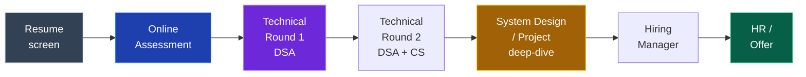

# 🎤 Interview Playbook

### Everything from the OA to the offer letter.

[🏠 Home](../README.md) • [🎯 Placements](../placements/) • [🧮 DSA](../core/dsa.md) • [🏢 Company tiers](company-tiers.md)

---

## The typical hiring process

| Company type | Rounds | Emphasis |
|---|:---:|---|
| **Service** | 3–4 | Aptitude ⭐ → basic coding → technical → HR |
| **Mid product** | 4–5 | OA → 2 DSA rounds → project → HR |
| **Strong product** | 5–6 | OA → 2–3 DSA → system design → HM → HR |
| **FAANG** | 5–7 | OA → 3–4 DSA → design → behavioural ("bar raiser") |

---

## 💻 Round 1 — The Online Assessment

**What it is:** 60–120 minutes, 2–4 coding problems plus sometimes MCQs, on HackerRank/HackerEarth/Codility.

**How to clear it:**

- [ ] **Practise timed.** 45 minutes per Medium problem, on a clock, from month 6 of your prep
- [ ] **Read all problems first (2 min).** Solve the easiest one first — a fully solved easy problem beats two half-solved hards
- [ ] **Get a brute force working, then optimise.** Partial credit is real; most OAs score per test case passed
- [ ] **Handle edge cases** — empty input, single element, all identical, negatives, integer overflow
- [ ] **Watch the input format.** Many students fail on parsing, not on the algorithm
- [ ] **Know your language's fast I/O** — `sync_with_stdio(false)` in C++, `BufferedReader` in Java
- [ ] **Do the MCQs.** They're often OS/DBMS/CN/output-prediction and are free marks if you did [CS fundamentals](../core/cs-fundamentals.md)

> [!TIP]
> **Practise on the actual platform beforehand.** HackerRank's editor, its input parsing and its "run vs submit" behaviour are different from LeetCode's. Fighting the interface during a timed test costs real points.

---

## 🧮 Rounds 2–3 — Technical / DSA

### The script that works

1. **Clarify (2 min)** — *"Can the array have negatives? Duplicates? What should I return for empty input? How large can n be?"*
2. **Example (1 min)** — walk through a small case by hand
3. **Brute force (2 min)** — *"The naive approach is O(n²) — check every pair. Let me start there and optimise."*
4. **Optimise (3 min)** — *"The redundant work is re-scanning. A hashmap of seen values gets this to O(n) time, O(n) space."*
5. **Confirm** — *"Does that approach sound right before I code it?"*
6. **Code (15 min)** — narrating what you're writing and why
7. **Test (3 min)** — dry-run your example, then edge cases
8. **Complexity** — state time and space confidently

### The rules that decide the round

| ✅ Do | ❌ Don't |
|---|---|
| **Talk continuously** — narrate every thought | Go silent for 3 minutes while thinking |
| Ask clarifying questions | Start coding immediately |
| Say the brute force out loud first | Fish for the optimal solution silently |
| **Take hints gracefully** — they're testing collaboration | Ignore or argue with hints |
| Admit when you're stuck, productively | Pretend to type while panicking |
| Test your own code before saying "done" | Say "it works" without checking |
| Use clear variable names | `a`, `b`, `temp1`, `temp2` |

> [!IMPORTANT]
> **Silence is what fails interviews, not wrong answers.** The interviewer is scoring your *process*. A candidate who explores a wrong approach out loud, notices the flaw, and corrects it scores higher than one who silently produces a correct answer. They're hiring a colleague, not a compiler.

### When you're completely stuck

**Say this:**
> *"I'm considering two directions — sorting first, which is O(n log n), or a hashmap, which might get me O(n) but costs space. Let me think through the hashmap version... actually, the issue is I need the indices, not just the values. So I'd store value → index."*

That is exactly what a good engineer sounds like. Freezing silently is the only real failure mode.

**If you truly can't get it:** *"I'm not seeing the optimal approach. Could I get a hint on the direction?"* — asking for a hint costs you far less than five minutes of dead air.

---

## 🏗️ System design round

Only for strong product / FAANG, or 2+ YOE. Full framework and practice problems: **[core/system-design.md](../core/system-design.md)**

**The 30-second version:** clarify requirements → estimate scale → design the API → design the data model → draw the high-level architecture → deep dive on one component → discuss trade-offs and failure modes. **Always state trade-offs.**

---

## 📁 Project deep-dive round

**This round is where tier-3 students win or lose.** Your project is the one thing on your resume they can't get from anyone else.

<b>❓ Prepare written answers to these before every interview</b>

 

1. **Walk me through your project.** *(2 minutes, structured: problem → solution → stack → outcome. Rehearse this out loud.)*
2. Why did you build it? What problem does it solve?
3. Why this tech stack? What would you have used instead?
4. Explain your database schema. Why did you model it that way?
5. **What was the hardest bug you hit? How did you debug it?** ⭐ *(The most revealing question. Have a real, specific story with a real debugging process.)*
6. How does authentication work in your app, end to end?
7. What happens if 10,000 users hit this simultaneously? What breaks first?
8. How would you scale this?
9. **What would you do differently if you rebuilt it today?** ⭐ *(Tests self-awareness. "Nothing" is a bad answer.)*
10. What did you deliberately NOT build, and why?
11. How did you test it?
12. Which part are you most proud of?

**Question 5 and 9 separate builders from copiers.** If you built it yourself, you have vivid answers. If you followed a tutorial, you'll have nothing — which is exactly what the question is designed to reveal.

> [!WARNING]
> **Never put a project on your resume that you can't explain line by line.** Interviewers will open your GitHub, pick a file, and ask "what does this do?" A tutorial project you don't understand is worse than having no project at all.

---

## 🗣️ HR & behavioural round

**Do not treat this as a formality.** People get rejected here after clearing every technical round.

### Use the STAR method

| | |
|---|---|
| **S**ituation | Set the context briefly |
| **T**ask | What was your specific responsibility? |
| **A**ction | **What YOU did** *(spend most of your time here)* |
| **R**esult | The outcome, quantified if possible |

<b>❓ Questions you WILL be asked — with how to answer</b>

 

**1. "Tell me about yourself."** ⭐
*(Asked in 100% of interviews. Prepare a 90-second answer.)*

Structure: who you are now → what you've built → why you're here.
> "I'm a final-year CS student at [College]. Over the past two years I've focused on backend development — I built [project], which handles [specific thing], and I interned at [X] where I shipped [Y]. I've solved 500+ DSA problems along the way. I'm looking for a backend role where I can work on systems at real scale, which is why [Company] interests me — particularly [specific thing about them]."

**Never** recite your biodata: "My name is X, my father is Y, I am from Z, my hobbies are..."

**2. "Why should we hire you?"**
Match your evidence to their JD. Pick 3 requirements from the posting and give proof for each.

**3. "Why do you want to join our company?"**
Be specific. Their product, their engineering blog, their tech stack, a recent launch. *"Because it's a good company"* is a wasted answer — do 10 minutes of research.

**4. "What's your greatest weakness?"** ⭐
Real weakness + what you're actively doing about it.
> "I used to over-engineer — on my first project I built an abstraction layer for a feature that never needed it. I've learned to build the simplest thing that works and refactor when there's an actual reason to. In my last project I deliberately started with a monolith and only split out the notification service when it genuinely needed separate scaling."

**Never:** "I work too hard" / "I'm a perfectionist." Every interviewer has heard these thousands of times and they read as evasion.

**5. "Tell me about a time you failed."**
Real failure → what you learned → what you changed. Show ownership, not blame.

**6. "Tell me about a conflict with a teammate."**
Focus on how you resolved it, not on who was right.

**7. "Where do you see yourself in 5 years?"**
Growth in the craft. *"As a senior engineer who can own a system end to end and mentor juniors."* Don't say "in your manager's chair" or "starting my own company."

**8. "Why is your CGPA low?"** *(if applicable)*
Own it, redirect to evidence.
> "My first two years I focused heavily on building and DSA rather than exam prep, and my CGPA reflects that trade-off. It's 6.8. In the same period I built [project], solved 500 problems, and interned at [X]. I've since brought my last three semesters above 8.0."

**9. "Do you have any questions for us?"** ⭐
**Always say yes.** Not asking reads as disinterest. Good ones:
- "What does the first 90 days look like for someone in this role?"
- "How is the team structured, and who would I work most closely with?"
- "What's the biggest technical challenge the team is facing right now?"
- "How do you approach code review and mentorship for junior engineers?"

**Don't ask** about salary, leave policy or work-from-home in round 1. Save those for the HR/offer stage.

---

## 📅 Preparation timeline

| When | Do this |
|---|---|
| **1 week before** | Company research, revise your projects, targeted DSA on their tagged questions |
| **2 days before** | Mock interview. Rehearse "tell me about yourself" and project walkthroughs out loud |
| **1 day before** | Light revision only. Re-read your own resume. Sleep properly |
| **1 hour before** | Test camera, mic, internet, backup hotspot. Water, notebook, pen. Quiet room |
| **During** | Talk constantly. Ask questions. Stay calm when stuck |
| **After** | Write down every question asked. Send a thank-you note. Log the lesson |

### The setup checklist (online interviews)

- [ ] Stable internet + **mobile hotspot as backup**
- [ ] Laptop charged **and plugged in**
- [ ] Camera at eye level, light in front of you (not behind)
- [ ] Quiet room, door closed, phone silent, family informed
- [ ] Plain background
- [ ] Water within reach
- [ ] Notebook and pen for diagrams
- [ ] Your resume open on screen
- [ ] Test the platform (Zoom/Meet/Teams/CoderPad) beforehand
- [ ] Join 5 minutes early

---

## 🧠 Managing nerves

**Everyone is nervous. The people who get offers are nervous too — they've just done it more times.**

- **Interview at companies you don't care about first.** Your 5th interview is dramatically better than your 1st. Build reps on low-stakes ones.
- **Reframe it:** you're two engineers discussing a problem, not a student being examined. Interviewers *want* you to succeed — a good hire makes their life easier.
- **Physical reset:** slow breathing before you join. It genuinely works on the shakiness.
- **It's okay to pause.** *"Let me think about that for a moment."* Silence you announce is fine; silence you don't is not.
- **One bad round isn't fatal.** Interviewers routinely pass candidates who struggled early and recovered well.
- **You will get rejected a lot.** 3–5 offers from 300 applications is a *good* season.

---

## 📨 After the interview

**Send a short thank-you within 24 hours** *(if you have the interviewer's contact):*

> Hi [Name], thanks for taking the time today. I enjoyed working through the [specific problem] — I went back afterwards and implemented the O(n) approach you hinted at. I'm very interested in the role and look forward to hearing from you.

**Then, immediately:**
- [ ] Write down **every question** you were asked
- [ ] Note what went badly and why
- [ ] Study the thing you failed on **that same week**
- [ ] Update your tracking sheet
- [ ] **Keep applying.** Never wait on one process

**If rejected:** ask for feedback — some recruiters actually reply, and it's the most valuable data you'll get.

---

## ⚠️ Interview mistakes

| Mistake | Fix |
|---|---|
| **Going silent while thinking** | Narrate constantly. Silence is the #1 killer. |
| **Coding before clarifying** | Always ask 2–3 clarifying questions first. |
| **Ignoring hints** | Hints are the interviewer helping you pass. Take them. |
| **Claiming skills you don't have** | You'll be found out in round 1. Every time. |
| **No questions for them** | Always ask 2–3. Prepare them beforehand. |
| **Talking about your college's limitations** | Never make excuses about your background. Talk about what you built. |
| **Reciting biodata for "tell me about yourself"** | Prepare a 90-second professional narrative. |
| **Not researching the company** | 10 minutes on their site and blog. It's visible immediately. |
| **Arguing with the interviewer** | Discuss, don't defend. Being wrong gracefully is fine. |
| **Giving up after one bad round** | Recoveries happen constantly. Finish strong. |

---

### They want to hire someone. Give them a reason for it to be you.

[🏠 Home](../README.md) • [🧮 DSA](../core/dsa.md) • [🏗️ System Design](../core/system-design.md) • [🖥️ CS Fundamentals](../core/cs-fundamentals.md) • [🏢 Company tiers](company-tiers.md)

