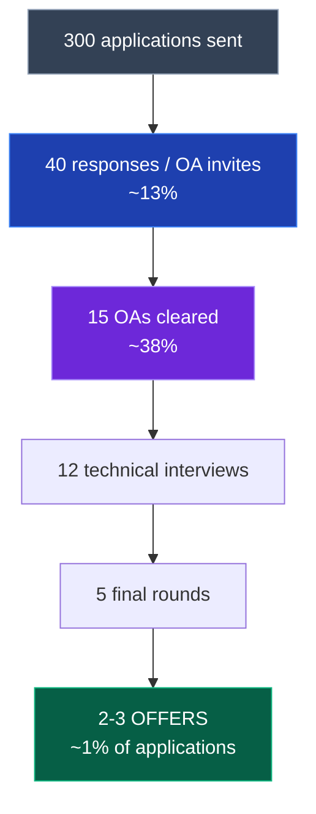

# 📤 Off-Campus Strategy

### 90% of your offers will come from here. This is the most important file in the repo.

[🏠 Home](../README.md) • [🎯 Placements](../placements/) • [🏢 Company tiers](company-tiers.md) • [🧾 Resume](resume.md)

---

## The situation

Your campus will bring 3–5 companies. Two of them will be service companies at ₹3.5 LPA, one will be a "product" company nobody has heard of, and one will cancel at the last minute.

**Meanwhile, thousands of companies hire freshers off-campus every single year, and they never visit any campus at all.**

> [!IMPORTANT]
> **Off-campus hiring is not a backup plan. It IS the plan.** Campus placement is the bonus. Students who understand this in their 3rd year get multiple offers. Students who realise it in April of their final year do not.

---

## The funnel (know your numbers)

**This is a normal, successful outcome — not a failure.**

If you send **30** applications and get nothing, your problem is volume. If you send **300** and get zero OA invites, your problem is your resume. Diagnose correctly before you conclude "tier-3 mein kuch nahi hota."

---

## The 5 channels, ranked by what actually works

| Rank | Channel | Effort | Conversion | Weekly target |
|:---:|---|:---:|:---:|:---:|
| 🥇 | **Referrals** | High | 🟢🟢🟢 Highest | 15 requests |
| 🥈 | **Company career pages** | Medium | 🟢🟢 Good | 8 applications |
| 🥉 | **Cold outreach to startups** | Medium | 🟢🟢 Surprisingly good | 5 emails |
| 4 | **Job portals** | Low | 🟡 Medium | 10 applications |
| 5 | **Hiring challenges / hackathons** | High | 🟢🟢 Good when they land | As they come |

---

## 🥇 Channel 1 — Referrals (do this the most)

**A referred application is roughly 10× more likely to get an interview than a portal application.** The referrer's résumé goes into a separate, much shorter queue.

### How to get referrals from strangers

**Step 1 — Find the right people**
- LinkedIn search: `"SDE" AND "Razorpay"` — filter by 2nd-degree connections
- Prioritise: alumni from your college ⭐ (highest response rate), people from your home state or city, people who post about hiring, engineers with 1–4 years experience *(they're more responsive than senior people and often get referral bonuses)*

**Step 2 — Connect properly**
Send a connection request **with a note**. Never blank.

**Step 3 — Wait 1–2 days after they accept, then send the ask**

<b>📩 Referral message templates that actually work</b>

 

**Template 1 — Alumni (best response rate)**

> Hi [Name], I'm a final-year student at [College] — I saw you graduated from there too. I've been working on [track] and recently built [project] ([live link]).
>
> I noticed [Company] has an open [role] position. Would you be comfortable referring me? Happy to send my resume so you can check if it's a fit.
>
> Totally understand if not — thanks either way!

**Template 2 — Non-alumni**

> Hi [Name], I've been following [Company]'s work on [something specific and real — their product, an engineering blog post, a recent launch].
>
> I'm a final-year student and I recently built [project] using [stack] — [one line on what it does]: [link].
>
> I'm applying for [specific role, with req ID if you have it]. Would you be open to referring me? Happy to share my resume.
>
> Thanks for your time either way.

**Template 3 — After they say yes**

> Thank you so much! Here's my resume: [link]. The role is [title, req ID, link].
>
> One line for context if it helps: final-year CS student, built [project] handling [specific thing], solved 500+ DSA problems, interned at [X].
>
> Really appreciate this.

**Then:** update them when you get an interview, and thank them again after. This is how you build a network rather than just extracting from one.

### Referral rules

| ✅ Do | ❌ Don't |
|---|---|
| Be specific about the role | "Please refer me for any opening" |
| Show proof first (project link) | Ask before demonstrating anything |
| Keep it under 100 words | Send a 500-word life story |
| Give them an easy out | Guilt-trip or beg |
| Send 10–15 a week | Send 2 and give up |
| Follow up **once** after a week | Follow up 5 times |
| Thank them regardless of outcome | Disappear after getting the referral |

> [!TIP]
> **Expect 1–2 replies per 10 messages. That's a good rate.** People are busy, not hostile. This is a numbers game — send 15 a week and you'll get 2–3 referrals a week, which is 100+ over a placement season.

---

## 🥈 Channel 2 — Company career pages

**Apply directly on the company's own site, not through aggregators.** Direct applications land in the actual ATS rather than a third-party queue.

**Build a target list of 100 companies:**

| Bucket | Count | Examples |
|---|:---:|---|
| Dream | 30 | Level 3–4 companies |
| Realistic | 40 | Level 2 product + funded startups |
| Safety | 30 | Service companies + smaller startups |

**Then, every week:** check all 100 career pages for new openings *(or set up alerts)*, apply to anything relevant within 24 hours of it being posted.

> [!TIP]
> **Applying within the first 48 hours of a posting matters enormously.** Recruiters often stop reviewing after the first 200 applications. Set LinkedIn alerts and check career pages on a schedule.

---

## 🥉 Channel 3 — Cold outreach to startups

Startup founders read their own email. A CTO at a 20-person company will genuinely open a well-written cold email from a student.

<b>📧 Cold email template</b>

 

**Subject:** Final-year CS student — built [thing relevant to their product]

> Hi [Founder name],
>
> I've been using [their product] and noticed [something specific — a feature, a limitation, something you genuinely observed].
>
> I'm a final-year CS student. I recently built [project] — [one line]. Live: [link] · Code: [GitHub link]
>
> I'd love to join [Company] as a [role] intern or fresher. I know you may not have an open role, but I wanted to reach out directly.
>
> Resume: [link]. Happy to do a take-home task if that's useful.
>
> Thanks for reading,
> [Your name]

**Why this works:** it proves you used the product, it leads with what you built, it's short, and it offers to do work rather than just asking. **Send 5 a week.** Find founders on LinkedIn, Twitter/X, or the company's About page.

---

## 4 — Job portals

| Portal | Best for |
|---|---|
| **LinkedIn Jobs** ⭐ | Set alerts. Use "Easy Apply" for volume, direct apply for quality |
| **[Instahyre](https://www.instahyre.com/)** ⭐ | Curated product-company roles, good signal-to-noise |
| **[Wellfound](https://wellfound.com/)** ⭐ | Startups. You often message founders directly |
| **[Naukri](https://www.naukri.com/) / Naukri Campus** | Volume, service companies, mass hiring drives |
| **[Unstop](https://unstop.com/)** ⭐ | Hiring challenges — **much less competition than normal applications** |
| **[Internshala](https://internshala.com/)** | Internships, some fresher roles |
| **[Hirist](https://www.hirist.com/)** | Tech-specific |
| **[Cutshort](https://cutshort.io/)** | Startups |
| **[Hasjob](https://hasjob.co/)** | Indian startup jobs |
| **[Y Combinator Work at a Startup](https://www.workatastartup.com/)** | YC startups, many hire remotely from India |

**LinkedIn optimisation that actually matters:**
- [ ] Turn on **"Open to Work"** (recruiter-only visibility if you prefer)
- [ ] Headline: `Final Year CS Student | Full Stack Developer | React, Node.js, PostgreSQL` — **not** "Aspiring Software Engineer"
- [ ] Add all your projects with live links in the Featured section
- [ ] Post about what you build. Consistency here genuinely generates inbound recruiter messages

📖 **[linkedin-and-networking.md](linkedin-and-networking.md)**

---

## 5 — Hiring challenges & hackathons

**The most underused channel.** Far fewer people enter a coding challenge than click "apply", and companies actively hire the top performers.

- **[Unstop](https://unstop.com/)** — company-sponsored hiring challenges
- **[HackerEarth](https://www.hackerearth.com/challenges/)** — company hiring contests
- **[TCS CodeVita](https://www.tcscodevita.com/)** — global contest, direct interview path
- **[Google Kickstart / Meta Hacker Cup](https://codingcompetitions.withgoogle.com/)** — top performers get contacted
- **[Devfolio](https://devfolio.co/) / [MLH](https://mlh.io/)** — hackathons; winning teams get recruiter attention
- **[GSoC](https://summerofcode.withgoogle.com/) / [LFX Mentorship](https://lfx.linuxfoundation.org/tools/mentorship/)** — paid open source, exceptional resume signal

---

## 📋 Your weekly system

**Copy this into your fork. Run it every week from your 3rd year onwards.**

| Day | Task | Time |
|---|---|:---:|
| **Mon** | Check 20 career pages + LinkedIn alerts. Apply to everything relevant | 1 hr |
| **Tue** | Send 8 referral requests on LinkedIn | 45 min |
| **Wed** | Apply on portals (Instahyre, Wellfound, Naukri) — 10 applications | 45 min |
| **Thu** | Send 7 more referral requests + 5 cold emails | 1 hr |
| **Fri** | Follow up on last week's messages. Update tracking sheet | 30 min |
| **Sat** | Mock interview + review the week's rejections | 1.5 hr |
| **Sun** | Plan next week. Refresh target list | 30 min |

**Weekly totals: 25+ applications · 15 referral requests · 5 cold emails**

### Your tracking sheet

| Company | Role | Applied | Channel | Referral? | Status | Next step | Notes |
|---|---|---|---|---|---|---|---|
| Razorpay | SDE-1 | 12 Aug | Referral | Yes — Amit | OA on 20 Aug | Prepare DP | Fintech, DSA-heavy |
| Zoho | Dev | 14 Aug | Career page | No | Rejected | — | Failed round 3 — revise strings |

**Track everything.** After 100 applications you'll see which channels work for you, and you'll stop guessing.

---

## 🩺 Diagnosing what's going wrong

| Symptom | Real problem | Fix |
|---|---|---|
| **0 responses from 100+ applications** | Resume / ATS formatting | Get it reviewed. Single column, no tables, no graphics. → [resume.md](resume.md) |
| **Responses but failing OAs** | DSA speed or depth | Timed practice. 3 Mediums daily. → [core/dsa.md](../core/dsa.md) |
| **Clearing OAs, failing technical rounds** | Communication or fundamentals | Mock interviews. Practise thinking out loud. |
| **Reaching final round, no offer** | Behavioural / culture fit | Prepare STAR answers properly. → [interview-playbook.md](interview-playbook.md) |
| **Only service companies responding** | Projects and DSA depth | Build one Level-3 project. Push DSA to 400+. |
| **Getting ghosted after interviews** | Often just headcount | Follow up once, then move on. It's usually not about you. |

---

## 🧠 The mental game

**You will get rejected 50+ times. Everyone does.** Here's how to not let it break you:

- **Rejection is mostly volume and timing.** A company with 5 seats and 8,000 applicants rejects excellent candidates by necessity. It's arithmetic, not a verdict on you.
- **Apply in batches, not one at a time.** Waiting on a single application for two weeks is emotionally brutal. With 25 in flight, no single rejection matters.
- **Log every rejection with a lesson.** "Failed round 2 — couldn't do the graph question" is actionable. "They rejected me" is not.
- **Don't compare to LinkedIn.** You see the offer posts, not the 60 rejections behind them.
- **Take a full day off every week.** Burnout is why people stop applying in month 3, and stopping is the only way to actually fail.
- **Talk to someone.** r/developersIndia, a friend doing the same grind, a senior. Isolation makes this much worse than it is.

> [!TIP]
> **You need exactly one yes.** Not fifty. One. Every rejection is just a step through the funnel toward it.

---

## ⚠️ Off-campus mistakes

| Mistake | Fix |
|---|---|
| **Starting in the final semester** | Start in your 3rd year. The best openings close early. |
| **Waiting to feel "ready"** | Apply now. Interviews reveal your gaps faster than any amount of prep. |
| **Applying to 20 places total** | 300 is the baseline for a placement season. |
| **Only using one channel** | Use all five. Referrals convert best, but volume comes from portals. |
| **Generic resume for every application** | Tailor keywords to the JD. It takes 5 minutes and beats ATS filters. |
| **Not tracking applications** | You'll re-apply to the same role and miss follow-ups. Track everything. |
| **Giving up after a month** | Placement season runs July to May. Most offers land after month 3. |
| **Not following up** | One polite follow-up after a week genuinely converts. |
| **Taking rejection personally** | It's arithmetic. Log the lesson, send the next application. |

---

### Your campus brings 3 companies. India has thousands. Go get them.

[🏠 Home](../README.md) • [🏢 Company tiers](company-tiers.md) • [🧾 Resume](resume.md) • [💼 LinkedIn](linkedin-and-networking.md) • [🎤 Interviews](interview-playbook.md)

