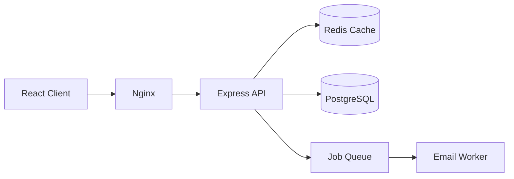

<div align="center">

# 🐙 GitHub & Portfolio

### Your college name won't sell you. This will.

[🏠 Home](../README.md) • [🎯 Placements](../placements/) • [🧾 Resume](resume.md) • [💡 Projects](../projects/README.md)

</div>

---

## Why this is your leverage

A tier-1 student gets an interview because of their college. **You get one because a recruiter clicked your GitHub link and saw real, working software.**

This is genuinely the most level part of the hiring process. Nobody can tell your college from your commit history. They can only see whether you build things, whether you build them well, and whether you kept at it.

> [!IMPORTANT]
> **Recruiters do click your links.** GitHub and a live demo are the two most-clicked things on a fresher's resume. If your GitHub is 12 repos named `practice`, `test1`, and `college assignment`, that click works against you.

---

## 🎯 Your GitHub profile checklist

- [ ] **Professional username** — `sumit-singh-dev` ✅ · `xX_darkGamer_Xx` ❌
- [ ] **Real name** in your profile
- [ ] **Photo** — a clear headshot
- [ ] **Bio** — `Full Stack Developer | React, Node.js, PostgreSQL | Building things that ship`
- [ ] **Location** and a link to your portfolio/LinkedIn
- [ ] **Profile README** *(create a repo named exactly your username)*
- [ ] **6 pinned repositories** — your best work only
- [ ] **Every pinned repo has an excellent README**
- [ ] **Topics/tags** on each repo so they're discoverable
- [ ] **Delete or archive junk repos** — `tutorial-1`, `test`, `hello-world`, abandoned experiments
- [ ] **Consistent commit history** — a visible green graph shows discipline

---

## 📄 The README that gets you hired

**A great README is the difference between a recruiter spending 3 seconds on your repo and 3 minutes.** Most students write none. This alone puts you ahead.

<details>
<summary><b>📋 Copy this README template</b></summary>

<br>

````markdown
<div align="center">

# ShopNest

### A full-stack e-commerce platform with real-time order tracking

[**Live Demo**](https://shopnest.vercel.app) · [**API Docs**](https://api.shopnest.dev/docs) · [**Report Bug**](../../issues)


</div>

---

## What it does

ShopNest is a marketplace where sellers list products and buyers order them, with
real-time order tracking. Built to learn how production e-commerce systems handle
inventory consistency and payment reliability.

**Live demo credentials:** `demo@shopnest.dev` / `demo1234`

## Features

- 🔐 JWT authentication with refresh tokens and 3 roles (buyer / seller / admin)
- 🛒 Cart with inventory reservation to prevent overselling
- 💳 Stripe payments with idempotent webhook handling
- 📦 Real-time order tracking over WebSockets
- 🔍 Full-text product search with filters, sorting and pagination
- 📊 Seller dashboard with sales analytics

## Architecture



## Tech stack

| Layer | Technology | Why |
|---|---|---|
| Frontend | React 18, Redux Toolkit, Tailwind | Component reuse, predictable state |
| Backend | Node.js, Express | Fast iteration, shared language with frontend |
| Database | PostgreSQL | Needed ACID transactions for orders and inventory |
| Cache | Redis | Product listings are read-heavy; cut latency 85% |
| Payments | Stripe | Test mode, good webhook model |
| Deploy | Docker, AWS EC2, GitHub Actions | Reproducible builds, automated deploys |

## Engineering highlights

**Reduced product-search latency from 800ms to 120ms** by adding a Redis
cache-aside layer and composite indexes on `(category_id, price, created_at)`.

**Prevented double-charging** on payment webhooks using an idempotency key
stored in Redis with a 24-hour TTL — Stripe retries failed webhooks, and the
naive implementation created duplicate orders.

**Solved overselling under concurrency** with `SELECT ... FOR UPDATE` row-level
locking during checkout, after load testing revealed the race condition at
50 concurrent requests.

## Running locally

```bash
git clone https://github.com/sumitsingh/shopnest.git
cd shopnest
cp .env.example .env       # add your own keys
docker compose up
```

Open http://localhost:3000

## What I'd do differently

- Split the monolith's payment logic into a separate service — it has different
  scaling and reliability requirements from the catalogue
- Add integration tests for the webhook flow (currently only unit-tested)
- Use a proper message broker instead of a Redis-backed queue for email jobs

## License

MIT
````

</details>

### README rules

<div align="center">

| ✅ Include | ❌ Skip |
|---|---|
| **Live demo link at the top** ⭐ | Walls of unformatted text |
| Screenshot or GIF of it working ⭐ | "This project was made for my college submission" |
| One-line description of what it does | Copy-pasted framework boilerplate README |
| Feature list | A list of every npm package you installed |
| Architecture diagram (Mermaid) | Nothing at all *(most common failure)* |
| **Why you made key technical decisions** ⭐ | |
| Specific engineering problems you solved ⭐ | |
| Setup instructions that actually work | |
| Demo credentials for the live version ⭐ | |
| "What I'd do differently" ⭐ | |

</div>

> [!TIP]
> **The "engineering highlights" and "what I'd do differently" sections are what separate you.** Anyone can list features. Explaining a race condition you found and fixed, or a caching decision and its measured impact, tells a hiring manager you think like an engineer. Those two sections take 20 minutes to write and are the most valuable part of the README.

---

## 🖼️ Adding screenshots and GIFs

**A GIF of your app working is the single highest-impact thing in a README.**

| Tool | Platform |
|---|---|
| [ScreenToGif](https://www.screentogif.com/) | Windows |
| [Kap](https://getkap.co/) | macOS |
| [Peek](https://github.com/phw/peek) | Linux |
| [LICEcap](https://www.cockos.com/licecap/) | Windows/macOS |

**Method:** record a 10–15 second GIF of the core flow, save it in a `docs/` folder in the repo, and embed it right under the title.

---

## 📌 Profile README

Create a repository named **exactly your GitHub username**. Its README shows at the top of your profile.

<details>
<summary><b>📋 Profile README template</b></summary>

<br>

````markdown
<div align="center">

# Hi, I'm Sumit 👋

### Full Stack Developer · Final-year CS student · Building things that ship

[](https://linkedin.com/in/sumitsingh)
[](https://sumitsingh.dev)
[](mailto:sumit@example.com)

</div>

---

I build full-stack web applications, mostly with React and Node.js. Currently
focused on backend systems — caching, queues, and the parts that break at scale.

**Recent work**
- 🛒 [ShopNest](https://github.com/sumitsingh/shopnest) — e-commerce platform with
  real-time order tracking · [live](https://shopnest.vercel.app)
- 👥 [DevConnect](https://github.com/sumitsingh/devconnect) — developer community
  platform, 14-table schema, full-text search · [live](https://devconnect.up.railway.app)
- 📋 [TaskFlow](https://github.com/sumitsingh/taskflow) — real-time collaborative
  Kanban board, 78% test coverage

**Working with**


**Also:** 500+ DSA problems on LeetCode · open to SDE roles for 2026

<div align="center">


</div>
````

</details>

> [!WARNING]
> **Don't over-decorate.** Snake animations, trophy walls, five different stat cards and 40 skill badges look like a student trying to fill space. Two or three visual elements maximum. **Your pinned repos should be the most interesting thing on the page.**

---

## 🌐 Portfolio website

**Worth building, but only after your GitHub is strong.** A portfolio with no real projects behind it is an empty shell.

### What it needs

- [ ] **Hero** — name, role, one line, links to GitHub/LinkedIn/resume
- [ ] **Projects** ⭐ — 3–4 with screenshots, live links, GitHub links, and the tech stack
- [ ] **About** — 3 sentences, not a life story
- [ ] **Skills** — grouped, no rating bars
- [ ] **Contact** — email, working form, or both
- [ ] **Resume download** — a direct PDF link
- [ ] **Responsive** — recruiters open it on their phone
- [ ] **Fast** — Lighthouse score above 90
- [ ] **Custom domain** — ~₹150/year on Namecheap or GoDaddy. Worth it

### Where to host (all free)

| Host | Best for |
|---|---|
| **[Vercel](https://vercel.com/)** ⭐ | React/Next.js. Easiest deployment there is |
| **[Netlify](https://www.netlify.com/)** | Static sites, form handling included |
| **[GitHub Pages](https://pages.github.com/)** | Plain HTML/CSS/JS |
| **[Cloudflare Pages](https://pages.cloudflare.com/)** | Fast, generous free tier |

> [!TIP]
> **Don't spend 3 weeks on your portfolio.** A clean single-page site built in a weekend, with three genuinely good projects on it, beats a beautifully animated site with nothing to show. Build the projects first.

---

## 🌱 The commit graph

Recruiters do glance at it. It's a proxy for consistency.

- **Commit regularly** — even small changes. Daily is ideal; a few times a week is fine
- **Meaningful messages** — `add JWT refresh token rotation` not `update`
- **Don't fake it.** Scripts that generate fake commits are obvious and embarrassing if noticed
- **Gaps are normal** — exam months happen. A long-term upward pattern matters more than a perfect streak

---

## 🤝 Open source (optional but high-value)

Contributing to open source is public proof you can work in someone else's codebase — which is exactly what a job is.

**How to start:**
1. Find a project you actually use
2. Look for `good first issue` or `help wanted` labels → [goodfirstissue.dev](https://goodfirstissue.dev/) · [up-for-grabs.net](https://up-for-grabs.net/)
3. **Start with documentation.** Maintainers desperately need docs help and it's a real, merged contribution
4. Read `CONTRIBUTING.md` before doing anything
5. Comment on the issue before starting work
6. Small, focused PRs. Respond well to review feedback

**Events and programmes:** [Hacktoberfest](https://hacktoberfest.com/) (October) · [GSoC](https://summerofcode.withgoogle.com/) ⭐ · [LFX Mentorship](https://lfx.linuxfoundation.org/tools/mentorship/)

---

## ⚠️ Mistakes

| Mistake | Fix |
|---|---|
| **No README on any repo** | Write one for your 6 pinned repos minimum. |
| **No live demo link** | Deploy everything. Free hosting exists. A dead link is worse than none. |
| **Unprofessional username** | Change it now, before you start applying. |
| **12 repos named `test`, `practice`, `demo`** | Delete or archive. Curate ruthlessly. |
| **Committing `.env` files or API keys** | Add `.gitignore` first. If leaked, rotate the key immediately. |
| **Committing `node_modules`** | `.gitignore` it. It signals inexperience instantly. |
| **One commit: "final project"** | Commit incrementally. History shows how you work. |
| **Over-decorated profile README** | Two or three visual elements max. Let the projects lead. |
| **Portfolio site with no real projects** | Build the projects first, the site second. |
| **Faking commit activity** | Obvious and damaging. Just commit real work. |

---

<div align="center">

### Recruiters can't see your college in your commit history. They can only see your work.

[🏠 Home](../README.md) • [🧾 Resume](resume.md) • [💡 Projects](../projects/README.md) • [💼 LinkedIn](linkedin-and-networking.md) • [🛠️ Git](../core/git-and-linux.md)

</div>
