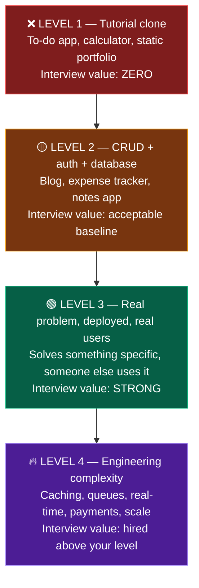
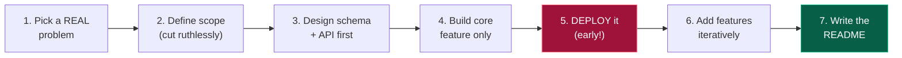

# 💡 Project Ideas

### Projects get you the interview. DSA gets you through it. You need both.

[🏠 Home](../README.md) • [💼 Tracks](../tracks/) • [🐙 GitHub & READMEs](../placements/portfolio-and-github.md)

---

## What actually counts as a project

| ✅ Counts | ❌ Doesn't count |
|---|---|
| Solves a real problem | A tutorial clone with the same name and features |
| **Has a live deployed URL** ⭐ | Only runs on your laptop |
| Auth, database, real CRUD, error handling | A single static HTML page |
| Clean README with screenshots + live link | No README |
| 30+ commits spread over weeks | One commit: `final project` |
| **You can explain every design decision** ⭐ | You copied it and don't know why it works |
| Handles edge cases and failures | Breaks on empty input |

> [!IMPORTANT]
> **2–3 excellent projects beat 10 mediocre ones.** Recruiters look at your pinned repos, not your repo count. One project with caching, real users and a thoughtful README will get you more interviews than eight to-do apps.

---

## The quality ladder

**Target: at least one Level 3, ideally one Level 4.**

---

## 🎨 Frontend projects

| Level | Project | Key challenges |
|:---:|---|---|
| 🟢 | **Personal portfolio** | Responsive, animations, Lighthouse 90+, dark mode |
| 🟢 | **Weather dashboard** | API integration, geolocation, loading/error states, caching |
| 🟡 | **E-commerce UI** | Cart state, filters, search, pagination, skeleton loaders |
| 🟡 | **Admin dashboard** | Charts, data tables, sorting, virtualisation, complex layouts |
| 🟡 | **Movie/anime discovery app** | Infinite scroll, debounced search, favourites, watchlist |
| 🟠 | **Kanban board** | Drag and drop, optimistic updates, undo/redo |
| 🟠 | **Real-time chat UI** | WebSockets, typing indicators, read receipts, presence |
| 🟠 | **Rich text editor** | ContentEditable, formatting, markdown, autosave |
| 🔥 | **Collaborative whiteboard** | Canvas, real-time sync, conflict resolution |
| 🔥 | **Full clone with backend** (Twitter/Notion/Linear) | Everything, integrated |

📖 **[tracks/frontend.md](../tracks/frontend.md)**

---

## ⚙️ Backend projects

| Level | Project | Key challenges |
|:---:|---|---|
| 🟢 | **Blog API** | CRUD, JWT auth, roles, validation, Swagger docs |
| 🟡 | **URL shortener** | Base-62 encoding, Redis caching, click analytics, rate limiting |
| 🟡 | **E-commerce backend** | Inventory consistency, orders, payments, transactions |
| 🟡 | **Library/inventory system** | Complex relational schema, reporting, search |
| 🟠 | **Job queue system** | Background workers, retries, exponential backoff, dead-letter queue |
| 🟠 | **Real-time notification service** | WebSockets, fan-out, multi-channel (email/push/in-app) |
| 🟠 | **File storage service** | Chunked uploads, S3, signed URLs, virus scanning |
| 🔥 | **Multi-tenant SaaS API** | Tenant isolation, billing, usage limits, audit logs |
| 🔥 | **Microservices system** | 3 services, API gateway, message broker, distributed tracing |
| 🔥 | **Rate limiter as a service** | Token bucket, distributed counters, Redis Lua scripts |

📖 **[tracks/backend.md](../tracks/backend.md)**

---

## 🧩 Full stack projects

| Level | Project | Key challenges |
|:---:|---|---|
| 🟢 | **Blogging platform** | Auth, markdown editor, comments, image upload |
| 🟡 | **Job board** | Two user roles, applications, resume upload, search filters |
| 🟡 | **Expense splitter** (Splitwise clone) | Debt simplification algorithm, groups, settlements |
| 🟡 | **Learning management system** | Courses, enrolment, progress tracking, video |
| 🟠 | **Project management tool** | Boards, teams, permissions, activity feed, real-time |
| 🟠 | **Social platform** | Feed ranking, follows, notifications, image CDN |
| 🟠 | **Booking system** (doctor/restaurant/salon) | Slot management, double-booking prevention, reminders |
| 🔥 | **SaaS with subscriptions** | Multi-tenancy, Razorpay/Stripe billing, usage metering |
| 🔥 | **Food delivery platform** | Live tracking, multi-role (customer/restaurant/rider), payments |

📖 **[tracks/full-stack.md](../tracks/full-stack.md)**

---

## 🧪 QA / SDET projects

| Level | Project | Key challenges |
|:---:|---|---|
| 🟢 | **50 test cases + bug reports** for a real site | Test design technique, edge cases, clear reporting |
| 🟢 | **Selenium login automation** | Locators, waits, assertions |
| 🟡 | **POM framework** for an e-commerce site | Page Object Model, reusability, config management |
| 🟡 | **API test suite** (REST Assured + Postman) | Schema validation, auth, chaining requests |
| 🟠 | **Hybrid framework** | POM + TestNG + data-driven + Extent Reports + parallel execution |
| 🟠 | **BDD framework** with Cucumber | Gherkin, step definitions, living documentation |
| 🔥 | **Full CI pipeline** | Jenkins/GitHub Actions, Dockerised, parallel, auto-published reports |
| 🔥 | **Performance test suite** with JMeter | Load profiles, thresholds, bottleneck analysis |

📖 **[tracks/qa-sdet.md](../tracks/qa-sdet.md)**

---

## ☁️ DevOps projects

| Level | Project | Key challenges |
|:---:|---|---|
| 🟢 | **Dockerise a 3-tier app** | Multi-stage builds, docker-compose, networking |
| 🟢 | **Bash automation scripts** | Backups, log rotation, health checks, cron |
| 🟡 | **CI/CD pipeline** | Build → test → deploy, secrets, environments |
| 🟡 | **Terraform infrastructure** | VPC, EC2, RDS, security groups, remote state |
| 🟠 | **Kubernetes deployment** | Multi-service, ingress, HPA, ConfigMaps, secrets |
| 🟠 | **Monitoring stack** | Prometheus + Grafana + Alertmanager on a real app |
| 🔥 | **Full GitOps platform** | Push → CI → Terraform → K8s → monitoring, end to end |

📖 **[tracks/devops-cloud.md](../tracks/devops-cloud.md)**

---

## 🤖 Data / AI / ML projects

| Level | Project | Key challenges |
|:---:|---|---|
| 🔴 | ~~Titanic / Iris / MNIST~~ | **Everyone has these. Do not put them on a resume.** |
| 🟡 | **End-to-end analysis of a messy real dataset** | Cleaning decisions, EDA, business insight, dashboard |
| 🟡 | **Deployed prediction app** (Streamlit) | Model + UI + real inputs, hosted |
| 🟠 | **Scraped your own dataset** → cleaned → modelled → deployed | Full pipeline ownership |
| 🟠 | **Recommendation system** on real data | Collaborative filtering, cold start, evaluation |
| 🟠 | **RAG chatbot** over your own documents | Embeddings, vector DB, retrieval quality, prompt design |
| 🔥 | **Production ML system** | API + Docker + MLflow + monitoring + drift detection + CI/CD |
| 🔥 | **Kaggle top 10%** | Feature engineering, ensembling, validation strategy |

📖 **[tracks/data-ai-ml.md](../tracks/data-ai-ml.md)**

---

## 📱 Mobile projects

| Level | Project | Key challenges |
|:---:|---|---|
| 🟢 | **Weather app** | API, state management, error handling |
| 🟢 | **Notes app** | Local database, CRUD, search |
| 🟡 | **Expense tracker** | Charts, categories, local DB, CSV export |
| 🟡 | **Habit tracker** | Notifications, streaks, widgets, background work |
| 🟠 | **Chat app** | Firebase, real-time, images, push notifications |
| 🟠 | **E-commerce app** | Catalogue, cart, payments, order history, offline cache |
| 🔥 | **Published app with real users** ⭐ | **Beats everything else on this list** |

📖 **[tracks/mobile.md](../tracks/mobile.md)**

---

## 🇮🇳 Ideas that solve real Indian problems

**Projects that solve a problem an interviewer recognises are far more memorable than another to-do app.**

| Problem | Project idea |
|---|---|
| College notice boards are chaos | Campus notice + event app with push notifications and department filters |
| Splitting hostel mess bills | Expense splitter with UPI deep links and settlement suggestions |
| Local shops have no online presence | A one-click storefront generator for small businesses |
| PG/hostel hunting is word-of-mouth | Verified listings platform with maps and reviews |
| Finding second-hand books each semester | Campus marketplace with course-code search |
| Government scheme information is scattered | Aggregator with eligibility checking and reminders |
| Farmers lack price transparency | Mandi price tracker using [data.gov.in](https://data.gov.in/) open APIs |
| Public transport timings are unreliable | Crowd-sourced bus/train tracker for your city |
| Blood donor coordination is manual | Donor matching platform with location and urgency |
| Small clinics have no appointment system | Booking system with SMS/WhatsApp reminders |

> [!TIP]
> **Build for people you know.** Get 10 classmates to actually use it. "200 students at my college use this daily" is one of the strongest sentences you can put in a project description — it proves you can ship something people want, not just something that compiles.

---

## 🛠️ How to build a project properly

**Deploy in week one, not at the end.** Deploying early forces you to solve environment configuration, secrets and build issues while the project is small. Students who leave deployment until the end frequently never deploy at all.

### Checklist for every project

- [ ] Solves a problem you can state in one sentence
- [ ] **Deployed with a live URL**
- [ ] `.gitignore` set up **before** the first commit
- [ ] **No secrets committed** — `.env` in `.gitignore`
- [ ] Auth with properly hashed passwords
- [ ] Input validation and error handling
- [ ] Responsive and it actually looks decent
- [ ] Loading and error states in the UI
- [ ] **README with screenshots, live link, tech stack, and setup steps**
- [ ] Demo credentials for reviewers
- [ ] 30+ meaningful commits
- [ ] You can explain every file in it

📖 **README template: [placements/portfolio-and-github.md](../placements/portfolio-and-github.md)**

### Free deployment

| What | Where |
|---|---|
| Frontend | [Vercel](https://vercel.com/) ⭐ · [Netlify](https://www.netlify.com/) · [Cloudflare Pages](https://pages.cloudflare.com/) |
| Backend | [Render](https://render.com/) ⭐ · [Railway](https://railway.app/) · [Fly.io](https://fly.io/) · AWS EC2 free tier |
| PostgreSQL | [Neon](https://neon.tech/) ⭐ · [Supabase](https://supabase.com/) |
| MongoDB | [MongoDB Atlas](https://www.mongodb.com/atlas) |
| Redis | [Upstash](https://upstash.com/) |
| Files/images | [Cloudinary](https://cloudinary.com/) · AWS S3 free tier |
| Domain | Namecheap / GoDaddy — ~₹150/year. **Worth it** |

---

## ⚠️ Project mistakes

| Mistake | Fix |
|---|---|
| **Building 10 to-do apps** | 2–3 substantial projects. Depth over count. |
| **Never deploying** | Deploy in week one. An undeployed project is invisible. |
| **Following a tutorial exactly** | Build it along, then **rebuild from scratch** with no video. |
| **No README** | The single cheapest improvement you can make. |
| **Committing `.env` or API keys** | `.gitignore` first, always. Rotate any leaked key immediately. |
| **One giant commit at the end** | Commit incrementally. History shows how you work. |
| **Ugly UI** | Use Tailwind, copy layouts from Dribbble. Presentation is part of the work. |
| **Can't explain your own code** | If you can't defend it line by line, don't put it on your resume. |
| **Scope creep — never finishing** | Ship a small version, then iterate. Unfinished projects are worth nothing. |
| **Copying a project wholesale from GitHub** | Interviewers ask about the hardest bug. You'll have no answer. |

---

### One project you can defend for 30 minutes beats ten you built in a weekend.

[🏠 Home](../README.md) • [💼 Tracks](../tracks/) • [🐙 GitHub](../placements/portfolio-and-github.md) • [🧾 Resume](../placements/resume.md)

