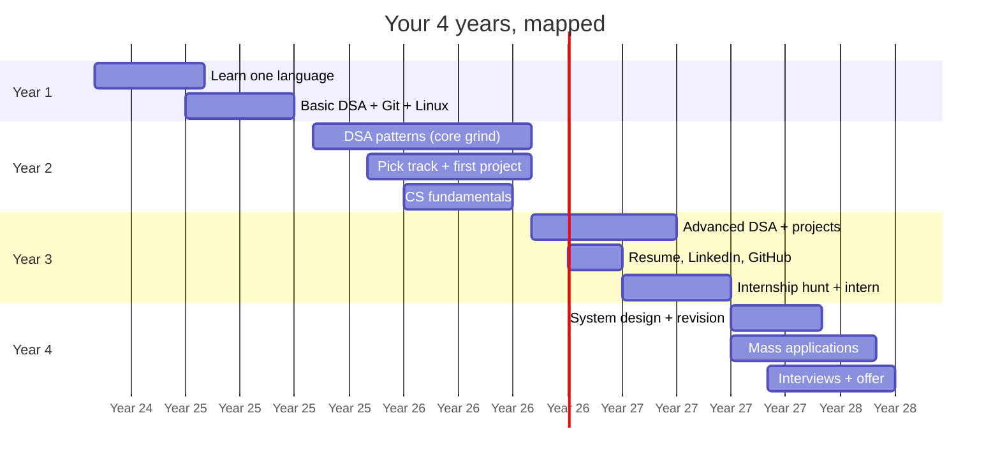

# 🗺️ The 4-Year Roadmap

### What to do in each year of your degree — semester by semester

[🏠 Home](../README.md) • [🚀 Start Here](../START-HERE.md) • [💼 Tracks](../tracks/) • [📚 Core](../core/)

---

## The whole degree on one page

---

## Year-by-year at a glance

| | **[Year 1](year-1.md)** | **[Year 2](year-2.md)** | **[Year 3](year-3.md)** | **[Year 4](year-4.md)** |
|---|---|---|---|---|
| **Theme** | 🌱 Build the base | 🔨 Go deep | 🚀 Prove it | 🎯 Convert |
| **Hours/week** | 8–10 | 12–15 | 15–20 | 20+ |
| **DSA target** | 100–150 problems | 300 total | 500 total | 600+ & revising |
| **Projects** | Tiny practice apps | 1 deployed project | 2–3 solid projects | Polished + documented |
| **Main focus** | One language, properly | Track + patterns | Internship + resume | Applications + interviews |
| **CS theory** | — | OOP, DBMS basics | OS, CN, DBMS full | System design |
| **Applications** | — | Open source / small gigs | Internships | Everything, everywhere |
| **End-of-year proof** | You can code | You built something real | Someone paid you | You have an offer |

---

## The non-negotiables

Whatever year you're in, these five things never stop:

| # | Habit | Why |
|:---:|---|---|
| 1 | **DSA, daily** | The only universal filter. Skipping a year here costs you a tier of companies. |
| 2 | **Push code to GitHub** | Your GitHub *is* your tier-3 resume. Green squares beat a college name. |
| 3 | **CGPA above 7.0** | Many companies hard-filter at 6.5 or 7.0. It's the cheapest requirement to satisfy. |
| 4 | **Build, don't just watch** | Interviewers ask "how did you build it", not "which course did you watch". |
| 5 | **Backlogs: zero** | A single active backlog disqualifies you from most on-campus and many off-campus drives. |

> [!WARNING]
> **Backlogs are the silent career killer in tier-3 colleges.** Most service companies and a lot of product companies require zero active backlogs at the time of joining. Clear them immediately — do not let one carry into your final year.

---

## Pick your entry point

### 🌱 [Year 1 — Build the base](year-1.md)
*You have the most time and the least pressure. This is your biggest advantage. Do not waste it.*

### 🔨 [Year 2 — Pick your track and go deep](year-2.md)
*The make-or-break year. Most tier-3 students who succeed got serious here.*

### 🚀 [Year 3 — Get proof](year-3.md)
*Internships, projects, resume. This is when your work becomes visible to companies.*

### 🎯 [Year 4 — Apply and convert](year-4.md)
*Execution year. Less learning, more applying and interviewing.*

### ⏰ [Started late? Emergency plan](late-start.md)
*3rd or 4th year with nothing done. Compressed, brutal, and it works.*

---

## How to actually follow a roadmap

**Don't read all four files.** Read the one for your current year, and skim the next one so you know what's coming.

Each file gives you:
- A semester-by-semester breakdown
- Checkboxes you can tick (fork the repo first — then it saves)
- A monthly milestone table
- "You're on track if..." checkpoints
- Common mistakes specific to that year

**Every Sunday:** open your year's file, tick what you did, plan the week. 15 minutes. That's the entire system.

---

[🏠 Home](../README.md) • [Year 1](year-1.md) • [Year 2](year-2.md) • [Year 3](year-3.md) • [Year 4](year-4.md) • [Late Start](late-start.md)

