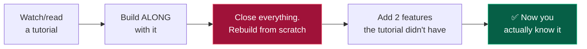

# 🔨 Year 2 — Pick Your Track and Go Deep

### Goal: by May, you have a deployed project, 300 problems solved, and a track you're serious about.

[🏠 Home](../README.md) • [🗺️ All roadmaps](README.md) • [← Year 1](year-1.md) • [Year 3 →](year-3.md)

---

## Why this is the most important year

Ask any tier-3 student who landed a good package when they got serious. Almost all of them say **2nd year**.

Here's the arithmetic. Internship applications open in your **3rd year, semester 1** — around July–September. That is roughly 12 months from now. Whatever you know by then is what you apply with. Year 3 is too late to *start*; it's the year you *use* what you built here.

> [!IMPORTANT]
> **Year 2 is where you convert from "learning to code" to "building things."** If you only do one year properly out of four, make it this one.

---

## The 4 goals of year 2

| # | Goal | Target |
|:---:|---|---|
| 1️⃣ | **Go deep in your track** | Job-ready fundamentals in ONE track |
| 2️⃣ | **DSA patterns** | 300 problems total, all core patterns covered |
| 3️⃣ | **One real, deployed project** | Live URL + GitHub repo + README |
| 4️⃣ | **CS fundamentals started** | OOP, DBMS + SQL solid |

---

## Semester 3 (Aug – Dec)

### Month 1: Commit to your track

- [ ] Read all 8 track files if you haven't: [tracks/README.md](../tracks/README.md)
- [ ] **Pick ONE. Write it down. No switching for 12 months.**
- [ ] Open your track's file and read the full roadmap
- [ ] List the exact tech stack you'll learn this year

| Track | Year-2 stack to learn |
|---|---|
| 🎨 **[Frontend](../tracks/frontend.md)** | HTML, CSS, JS deep, React, Tailwind, REST APIs |
| ⚙️ **[Backend](../tracks/backend.md)** | Node+Express *or* Java+Spring Boot, SQL, REST, auth |
| 🧩 **[Full Stack](../tracks/full-stack.md)** | MERN *or* Java+React, DB, auth, deployment |
| 🧪 **[QA / SDET](../tracks/qa-sdet.md)** | Manual testing, Selenium/Playwright, Java/Python, API testing |
| ☁️ **[DevOps](../tracks/devops-cloud.md)** | Linux, Docker, Git, CI/CD, one cloud (AWS) |
| 🤖 **[Data/AI/ML](../tracks/data-ai-ml.md)** | Python, pandas, NumPy, SQL, statistics, scikit-learn |
| 📱 **[Mobile](../tracks/mobile.md)** | Kotlin+Android *or* Flutter, APIs, local storage |

### Month 2–4: Learn your track's core stack

**How to learn without falling into tutorial hell:**

**Step 3 is the whole thing.** If you can't rebuild it without the video, you didn't learn it — you transcribed it.

- [ ] Complete one solid course/tutorial in your stack
- [ ] Rebuild that project from scratch, no reference
- [ ] Build 2–3 small original apps in your stack
- [ ] Push all of it to GitHub with proper READMEs

### Month 5: DSA — start patterns

Move past "solve random problems" into **pattern recognition**.

- [ ] Two pointers · Sliding window · Prefix sum
- [ ] Hashing patterns · Frequency maps
- [ ] Stack and Queue (incl. monotonic stack, next greater element)
- [ ] Linked lists — reversal, cycle detection, merge
- [ ] Binary search on answer *(this pattern alone shows up constantly)*

**Cumulative target by December: 200 problems.**

---

## Semester 4 (Jan – May)

### Month 6–8: The big DSA push

- [ ] **Trees** — traversals, BST operations, height/diameter, LCA
- [ ] **Graphs** — BFS, DFS, connected components, cycle detection, topological sort
- [ ] **Dynamic Programming** — memo → tabulation, knapsack, LIS, subset sum
- [ ] **Heaps / Priority Queue** — top-K patterns
- [ ] **Greedy** — interval scheduling, activity selection
- [ ] **Backtracking** — subsets, permutations, N-Queens, sudoku

**Cumulative target by May: 300 problems.** Difficulty mix around 40% Easy / 50% Medium / 10% Hard.

📖 Full plan with pattern list: **[core/dsa.md](../core/dsa.md)**

> [!TIP]
> **Do not do "one topic then never again."** Every Sunday, redo 5 old problems from memory. Spaced repetition is the difference between "I solved it once" and "I can solve it in an interview."

### Month 7–9: Your first REAL project

This is the project that goes at the top of your resume for the next two years. Build it properly.

**What makes a project count:**

| ✅ Real project | ❌ Doesn't count |
|---|---|
| Solves an actual problem | A tutorial clone with the same name |
| Has a **live deployed URL** | Only runs on your laptop |
| Auth, database, CRUD, error handling | A single static page |
| Clean README with screenshots + setup steps | No README |
| 30+ commits over weeks | 1 commit: "final project" |
| You can explain every design decision | You copied and don't know why it works |

- [ ] Pick a project idea → [projects/README.md](../projects/README.md)
- [ ] Build it over 6–8 weeks (not 2 days)
- [ ] Deploy it — Vercel, Netlify, Render, or Railway (all have free tiers)
- [ ] Write a proper README: what, why, tech stack, screenshots, live link, how to run
- [ ] Post it on LinkedIn. Yes, really. It's free visibility and it compounds.

<b>💡 Good year-2 project ideas by track</b>

 

| Track | Project |
|---|---|
| Frontend | Job board UI with filters, search, dark mode, pagination — real API, responsive |
| Backend | REST API for an expense tracker — JWT auth, PostgreSQL, roles, rate limiting, Swagger docs |
| Full Stack | Blogging platform — auth, markdown editor, comments, likes, image upload |
| QA/SDET | Automation framework for an e-commerce site — Selenium/Playwright + TestNG + Page Object Model + HTML reports |
| DevOps | Dockerise a 3-tier app, add GitHub Actions CI/CD, deploy to AWS EC2 |
| Data/ML | End-to-end ML app — real dataset, EDA, model, Streamlit UI, deployed |
| Mobile | Expense tracker app — local DB, charts, notifications, published on Play Store |

More: **[projects/README.md](../projects/README.md)**

### Month 9–10: CS fundamentals

- [ ] **OOP** — deep. Design patterns basics (Singleton, Factory, Observer)
- [ ] **DBMS** — normalisation, ACID, transactions, indexing, joins
- [ ] **SQL** — write 50+ queries by hand. Joins, group by, subqueries, window functions
- [ ] Practice SQL: [LeetCode SQL 50](https://leetcode.com/studyplan/top-sql-50/) or [SQLZoo](https://sqlzoo.net/)

📖 **[core/cs-fundamentals.md](../core/cs-fundamentals.md)**

### Month 11–12: Set up for year 3

- [ ] Write your **first resume** → [placements/resume.md](../placements/resume.md)
- [ ] Build your LinkedIn properly → [placements/linkedin-and-networking.md](../placements/linkedin-and-networking.md)
- [ ] Clean your GitHub profile → [placements/portfolio-and-github.md](../placements/portfolio-and-github.md)
- [ ] Research internship openings — see what they're actually asking for
- [ ] **Summer after year 2 is your highest-leverage break.** Do one of:
  - Build a second, bigger project
  - Do a real (even unpaid/small) internship
  - Contribute to open source
  - Take on freelance work — even ₹5,000 counts as professional experience

---

## Monthly milestones

| Month | Milestone | Problems (cumulative) |
|:---:|---|:---:|
| 1 | Track chosen and committed | 150 |
| 3 | Comfortable with your core framework | 170 |
| 5 | Core DSA patterns understood | 200 |
| 7 | Trees + graphs done · project started | 240 |
| 9 | **Project deployed and live** | 270 |
| 11 | DBMS + SQL solid · resume v1 written | 290 |
| 12 | Ready to apply for internships | **300** |

---

## ✅ You're on track if, by May...

- [ ] You can build a working app in your stack **without following a tutorial**
- [ ] You have **one deployed project with a live URL**
- [ ] You've solved **300 problems** and recognise patterns instantly
- [ ] You can write SQL queries with joins and grouping from memory
- [ ] You can explain OOP, DBMS and basic OS concepts in an interview
- [ ] Your GitHub looks like a working developer's, not a student's
- [ ] Your resume exists and fits on one page
- [ ] Your CGPA is **above 7.0** with **zero backlogs**

**Hit 6 or more? You're internship-ready.** Move to [Year 3](year-3.md).

---

## ⚠️ Year-2 traps

| Trap | Fix |
|---|---|
| **Tutorial hell** — 15 courses, 0 original projects | After every tutorial, rebuild from scratch. Non-negotiable. |
| **Learning 5 frameworks shallowly** | One stack, deep. "React + Node" beats "React, Vue, Angular, Django, Flask" every time. |
| **Skipping DSA to build projects** | You need both. Projects get you the interview; DSA gets you through it. |
| **Cloning a to-do app and calling it a project** | Build something with auth + a database + real users. |
| **Not deploying** | An undeployed project is invisible. Deployment is free. Do it. |
| **Solving only Easy problems** | Comfortable = not learning. You should fail ~40% of attempts. |
| **Waiting for a "perfect" project idea** | Ideas are worthless, execution is everything. Pick from [projects/](../projects/README.md) and start today. |
| **Not talking to anyone in the industry** | Start building your network NOW, before you need it. |

---

## 📊 Where you should be vs your batch

| | Average tier-3 student | You, after year 2 |
|---|---|---|
| Coding ability | Copies lab assignments | Builds full apps independently |
| DSA | 0–20 problems | 300 problems, patterns internalised |
| Projects | 1 college mini-project | 1 deployed real project + small apps |
| GitHub | Empty or 1 repo | 15+ repos, consistent commits |
| Resume | Doesn't exist | Written, one page, project-led |
| Awareness | "Placement 4th year mein hoga" | Already knows the target companies |

**That gap is the entire game.** It's built now, quietly, while your batch is doing nothing.

---

### If you get one year right, make it this one.

**[Continue to Year 3 →](year-3.md)**

[🏠 Home](../README.md) • [💼 Tracks](../tracks/) • [📚 DSA](../core/dsa.md) • [💡 Projects](../projects/README.md)

