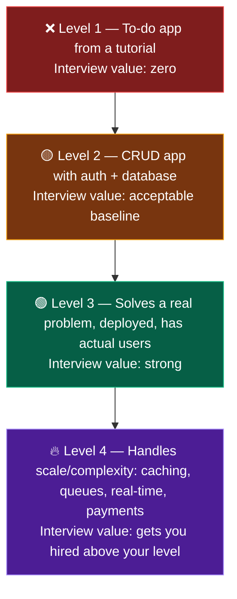

# 🚀 Year 3 — Get Proof

### Goal: an internship, 2–3 strong projects, 500 problems, and a resume that gets replies.

[🏠 Home](../README.md) • [🗺️ All roadmaps](README.md) • [← Year 2](year-2.md) • [Year 4 →](year-4.md)

---

## The shift that happens this year

Years 1 and 2 were about **learning**. Year 3 is about **evidence**.

Nobody hires you for what you know. They hire you for what they can verify: a deployed URL, a GitHub history, an internship on your resume, a referral from someone who's seen your work.

This is also the year the clock becomes real. **Final-year placement drives and off-campus fresher hiring both begin in your 3rd year, semester 2 and 4th year, semester 1.** Internship season starts even earlier — July to September of this year.

> [!IMPORTANT]
> **An internship is the single highest-value thing you can get this year.** A tier-3 student with a 6-month internship beats a tier-1 student with none, in most fresher hiring loops. It converts your resume from "student" to "has worked."

---

## The 5 goals of year 3

| # | Goal | Target |
|:---:|---|---|
| 1️⃣ | **Land an internship** | Any real one. Paid preferred, unpaid acceptable, remote fine |
| 2️⃣ | **DSA to interview level** | 500 total, Mediums comfortable |
| 3️⃣ | **2–3 portfolio-grade projects** | Deployed, documented, defensible |
| 4️⃣ | **Complete CS fundamentals** | OS, DBMS, CN, OOP — interview-ready |
| 5️⃣ | **Build your professional presence** | Resume + LinkedIn + GitHub + referral network |

---

## Semester 5 (Aug – Dec) — Internship hunt

### Month 1: Get application-ready

You cannot apply with a half-built profile. Fix these first — one week, full focus.

- [ ] **Resume** — 1 page, ATS-friendly, projects at the top → [placements/resume.md](../placements/resume.md)
- [ ] **LinkedIn** — headline, about, projects, skills, photo → [placements/linkedin-and-networking.md](../placements/linkedin-and-networking.md)
- [ ] **GitHub** — pinned repos, READMEs with screenshots, profile README → [placements/portfolio-and-github.md](../placements/portfolio-and-github.md)
- [ ] **Portfolio site** — one page, live link, contact info
- [ ] Get your resume reviewed — r/developersIndia, LinkedIn, a senior, or [resumeworded.com](https://resumeworded.com)

### Month 2–4: Apply aggressively

> **Target: 15–20 applications per week. Every week. No exceptions.**

| Channel | How | Response rate |
|---|---|:---:|
| **Referrals** | LinkedIn DMs to employees at target companies | 🟢 Highest — do this most |
| **Internshala / LinkedIn / Unstop** | Direct portal applications | 🟡 Medium |
| **Company career pages** | Apply directly, ignore portals | 🟡 Medium |
| **Cold email** | Startup founders and hiring managers, personalised | 🟡 Surprisingly good at startups |
| **Twitter/X + Discord** | Many startups hire only here | 🟢 Underused, low competition |
| **Open source (GSoC, Hacktoberfest, LFX)** | Contribute → get noticed | 🟢 Excellent long game |

📖 The full playbook: **[placements/internships.md](../placements/internships.md)** and **[placements/off-campus-strategy.md](../placements/off-campus-strategy.md)**

<b>📩 Cold DM template that actually gets replies</b>

 

> Hi [Name], I'm a 3rd-year CS student and I've been following [Company]'s work on [specific thing].
>
> I recently built [project] — [one-line what it does] using [stack]: [live link].
>
> I'm looking for a [role] internship. Would you be open to referring me, or pointing me to the right person? Happy to share my resume.
>
> Thanks for your time either way.

**Why this works:** it's short, it's specific to them, it shows proof before asking, and it gives an easy out. Send 10 a day. Expect 1–2 replies. That's a good rate — it is a numbers game, not a personal judgement.

**Never send:** "Hello sir, please refer me, I need job urgently, I am hardworking."

> [!WARNING]
> **Expect rejection at scale.** 100 applications → ~10 replies → ~3 interviews → 1 offer. If you send 20 applications total and conclude "nothing works for tier-3 students," you didn't run the experiment. Volume is the strategy.

### Month 3–5: DSA at interview level

- [ ] **Advanced graphs** — Dijkstra, union-find/DSU, MST, bipartite checking
- [ ] **DP patterns** — 0/1 knapsack, unbounded, LCS, LIS, matrix chain, DP on grids, DP on trees
- [ ] **Tries** and advanced string algorithms
- [ ] **Segment trees / Fenwick trees** *(only if targeting Level 3–4 companies)*
- [ ] **Bit manipulation** patterns
- [ ] Start doing **contests** — LeetCode weekly + biweekly, CodeChef Div 3
- [ ] Start **timed practice** — 45 min per Medium, mimicking real interviews

**Cumulative target by December: 400 problems.**

---

## Semester 6 (Jan – May) — Build proof

### Month 6–8: Your standout projects

You need **2–3 projects** that survive 20 minutes of hostile questioning.

**The project quality ladder:**

**Aim for at least one Level 3+ project.** Add things that show engineering judgement:

- [ ] Authentication and authorisation (JWT / OAuth, roles)
- [ ] A real database with a considered schema
- [ ] Caching (Redis) — and be able to say *why*
- [ ] Background jobs or a message queue
- [ ] Real-time features (WebSockets)
- [ ] Payment integration (Razorpay/Stripe test mode)
- [ ] Tests — even a few. Almost no student does this; it stands out.
- [ ] CI/CD via GitHub Actions
- [ ] Deployed with a custom domain (~₹150/year on Namecheap or GoDaddy)

<b>🎯 For every project, be able to answer these</b>

 

Interviewers will ask. Write your answers down before the interview.

1. Why did you build this? What problem does it solve?
2. Why this tech stack and not an alternative?
3. Walk me through the architecture.
4. What was the hardest bug you hit? How did you debug it?
5. How does your database schema look? Why did you model it that way?
6. What happens if 10,000 users hit this at once? What breaks first?
7. How did you handle authentication? Where do you store tokens and why?
8. What would you do differently if you rebuilt it today?
9. What did you *not* build, and why?

**If you can't answer #4 and #8 well, the project isn't yours yet.** Those two answers separate builders from copiers.

### Month 8–10: Complete CS fundamentals

- [ ] **Operating Systems** — processes vs threads, scheduling, deadlock, memory management, paging, virtual memory
- [ ] **DBMS** — normalisation, indexing, transactions, ACID, isolation levels, SQL vs NoSQL
- [ ] **Computer Networks** — OSI/TCP-IP, TCP vs UDP, HTTP/HTTPS, DNS, what happens when you type a URL
- [ ] **OOP** — deep, with design patterns
- [ ] **Aptitude** — start now if targeting service companies → [core/aptitude-and-maths.md](../core/aptitude-and-maths.md)

📖 **[core/cs-fundamentals.md](../core/cs-fundamentals.md)**

### Month 10–12: Internship + prepare for final year

- [ ] **Do the internship** (summer, or part-time during the semester)
- [ ] During it: ship real features, ask questions, take notes on what you built
- [ ] **Get a LinkedIn recommendation from your manager before you leave**
- [ ] Ask directly about a PPO (pre-placement offer) — many students never ask
- [ ] Start **system design basics** → [core/system-design.md](../core/system-design.md)
- [ ] Build your target company list for year 4 → [placements/company-tiers.md](../placements/company-tiers.md)
- [ ] **Cumulative DSA target: 500 problems**

> [!TIP]
> **A PPO from your internship is the easiest good offer you will ever get.** No OA, no 5 rounds, no rejection lottery. Treat every internship as a 3-month interview — because it is.

---

## Monthly milestones

| Month | Milestone | Problems (cumulative) |
|:---:|---|:---:|
| 1 | Resume, LinkedIn, GitHub all polished | 300 |
| 2 | Applying 15–20/week consistently | 320 |
| 4 | First interview calls coming in | 360 |
| 5 | **Internship secured** (or plan B active) | 400 |
| 7 | Project #2 deployed | 430 |
| 9 | OS + DBMS + CN complete | 460 |
| 11 | Internship done · recommendation received | 480 |
| 12 | Target company list ready for year 4 | **500** |

---

## ✅ You're on track if, by May...

- [ ] You have **an internship** on your resume (or substantial freelance/open-source work)
- [ ] You have **2–3 deployed projects** you can defend in detail
- [ ] You've solved **500 problems** and Mediums feel routine
- [ ] You can answer OS, DBMS and CN questions without preparing
- [ ] Your resume gets replies (some interviews, not just silence)
- [ ] You have **50+ real connections** in tech on LinkedIn
- [ ] You've done **mock interviews** with actual people
- [ ] You know exactly which companies you're targeting and their processes

**Hit 6 or more? You're ahead of most final-year students already.** Move to [Year 4](year-4.md).

---

## ⚠️ Year-3 traps

| Trap | Fix |
|---|---|
| **"I'll start applying when I'm ready"** | You're never ready. Apply now; you'll get ready by interviewing. |
| **Applying to 10 places and giving up** | 100 applications is the *baseline*, not the extreme. |
| **Refusing unpaid or small internships** | Your first line of experience is worth more than the stipend. |
| **Only using Naukri/Internshala** | Referrals convert 10× better. Spend most of your effort on people. |
| **Building a 4th to-do app** | Depth beats count. One impressive project > four trivial ones. |
| **Ignoring communication skills** | You will lose interviews you technically passed. Practise explaining out loud. |
| **Skipping mock interviews** | The first time you're nervous shouldn't be the real thing. |
| **Not asking for a PPO** | Ask. Explicitly. Many PPOs go to whoever asked. |

---

## 🎤 Start mock interviews now

You can be great at DSA and still fail because you go silent when you're stuck.

- [ ] **[Pramp](https://www.pramp.com/)** — free peer mock interviews
- [ ] **[interviewing.io](https://interviewing.io/)** — free anonymous mocks with real engineers
- [ ] **Discord/college friends** — trade mocks weekly
- [ ] **Record yourself** solving a problem out loud. Watch it. It's painful and it works.

**The habit to build:** narrate your thinking constantly. Brute force first, then optimise, then discuss complexity. Silence reads as "doesn't know." Wrong-but-explained reads as "thinks like an engineer."

📖 **[placements/interview-playbook.md](../placements/interview-playbook.md)**

---

### This is the year your work becomes visible.

**[Continue to Year 4 →](year-4.md)**

[🏠 Home](../README.md) • [🎯 Internships](../placements/internships.md) • [📤 Off-campus](../placements/off-campus-strategy.md) • [🧾 Resume](../placements/resume.md)

