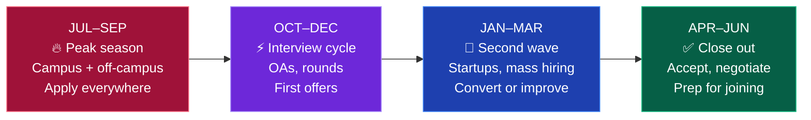

# 🎯 Year 4 — Apply and Convert

### Goal: an offer letter in your hand before you graduate.

[🏠 Home](../README.md) • [🗺️ All roadmaps](README.md) • [← Year 3](year-3.md) • [⏰ Started late?](late-start.md)

---

## The mindset change

**Stop learning new things. Start converting what you know.**

Year 4 is not for picking up a new framework or starting a new track. It's for applying at volume, revising relentlessly, and getting through interviews. Every hour spent learning something brand new is an hour not spent applying.

The only exceptions: **system design** (directly asked in interviews) and **aptitude** (round 1 at service companies).

> [!IMPORTANT]
> **Apply before you feel ready.** Everyone feels underprepared in the 4th year — including the students who get offers. Interviews *are* the preparation. Your 10th interview will be dramatically better than your 1st, and the only way to get to the 10th is to start.

---

## Your year-4 calendar

| Period | What's happening | Your job |
|---|---|---|
| **Jul–Sep** | Peak hiring. Campus drives + off-campus fresher openings | Apply 25+/week. Nothing else matters. |
| **Oct–Dec** | OAs and interview rounds. Most product offers land here | Interview, learn from every rejection, keep applying |
| **Jan–Mar** | Service company mass hiring, startups, second wave | Keep going. Many students get offers here. |
| **Apr–Jun** | Final drives, offer decisions | Accept, negotiate, or plan a switch strategy |

---

## Semester 7 (Jul – Dec) — Peak season

### Month 1: Final profile polish (1 week, then never touch it again)

- [ ] Resume — final version, 1 page, ATS-safe, quantified bullets → [placements/resume.md](../placements/resume.md)
- [ ] LinkedIn — turn on "Open to work", update headline to your target role
- [ ] GitHub — pin your 6 best repos, profile README done
- [ ] Portfolio site live with a custom domain
- [ ] Build a **tracking sheet**: company · role · date applied · status · referral · next step
- [ ] Build your **target list**: 30 dream + 40 realistic + 30 safety companies

📖 **[placements/company-tiers.md](../placements/company-tiers.md)** — who to target and what each expects

### Month 1–6: Apply. Relentlessly.

> **25+ applications per week. Every single week, all year.**

| Channel | Weekly target | Notes |
|---|:---:|---|
| **Referrals** (LinkedIn DMs) | 15 | Highest conversion by far. Do this first, every week. |
| **Company career pages** | 8 | Apply directly. Skip aggregators where possible. |
| **LinkedIn / Naukri / Instahyre / Wellfound** | 10 | Set alerts. Apply within 24 hrs of posting. |
| **Cold emails to startups** | 5 | Founders read their own inbox. Personalise. |
| **Off-campus drive announcements** | As they come | Follow the right pages/Telegram channels |

📖 The full system: **[placements/off-campus-strategy.md](../placements/off-campus-strategy.md)**

<b>📊 The numbers you should expect (so you don't panic)</b>

 

| Stage | Typical count | Conversion |
|---|:---:|:---:|
| Applications sent | 300 | — |
| Responses / OA invites | 40 | ~13% |
| OAs cleared | 15 | ~38% |
| Technical interviews | 12 | — |
| Final rounds | 5 | — |
| **Offers** | **2–3** | ~1% of applications |

**This is a normal, successful outcome.** Not a failure. If you send 30 applications and get nothing, the problem is volume, not you. If you send 300 and get zero OA invites, the problem is your resume — get it reviewed.

### Ongoing: Revision, not new learning

- [ ] **DSA revision** — redo your 200 most important problems. Speed matters now: Medium in under 30 min.
- [ ] **Company-specific prep** — LeetCode company tags, GeeksforGeeks archives, past interview experiences
- [ ] **System design** — HLD basics for SDE-1: load balancing, caching, DB scaling, CAP theorem, designing URL shortener / rate limiter / chat app → [core/system-design.md](../core/system-design.md)
- [ ] **CS fundamentals revision** — OS, DBMS, CN rapid-fire
- [ ] **Aptitude** — if targeting service companies, 1 hour daily for 2 months → [core/aptitude-and-maths.md](../core/aptitude-and-maths.md)
- [ ] **Behavioural / HR answers** — write and rehearse them → [placements/interview-playbook.md](../placements/interview-playbook.md)
- [ ] **Mock interviews weekly** — Pramp, interviewing.io, friends

---

## Semester 8 (Jan – May) — Convert

### If you have an offer

- [ ] **Accept it.** A ₹5 LPA offer in hand beats a hypothetical ₹20 LPA one.
- [ ] Keep interviewing anyway if you want better — but do not reject what you have first
- [ ] Understand your CTC breakdown: base vs variable vs joining bonus vs ESOPs vs "retention"
- [ ] Confirm the joining date and bond/service-agreement terms **in writing**
- [ ] Start your **switch plan**: 18–24 months of good work, then jump 2–3× on salary. This is how most tier-3 engineers reach top companies.

### If you don't have an offer yet

Do not panic. **Jan–May is a huge hiring window**, especially for service companies and startups.

- [ ] Keep applying — 25/week, no reduction
- [ ] Widen your net: tier-2 cities, smaller startups, contract roles, service companies
- [ ] Consider **QA/SDET and support-engineering roles** — far less competition, real career growth → [tracks/qa-sdet.md](../tracks/qa-sdet.md)
- [ ] Diagnose honestly:

| Symptom | Real problem | Fix |
|---|---|---|
| No responses at all | Resume or profile | Get it reviewed. Fix ATS formatting. Add projects. |
| Responses but failing OAs | DSA speed/depth | Timed practice. 3 Mediums a day. |
| Clearing OAs, failing interviews | Communication or fundamentals | Mock interviews. Explain out loud. |
| Reaching final round, no offer | HR/behavioural or culture fit | Prepare behavioural answers properly. Practise. |

📖 **[placements/interview-playbook.md](../placements/interview-playbook.md)**

### Backup plans (real ones, not consolation prizes)

- **Off-campus after graduation** — hiring doesn't stop when you graduate. Many people get their first job 3–8 months out. Keep a project going so your resume has no dead gap.
- **Freelancing** — Upwork, Fiverr, local businesses. Real income and real resume lines.
- **Service company first** — TCS/Infosys/Wipro/Cognizant, then switch in 18–24 months. This is the single most common tier-3 path to a good salary, and it works.
- **Higher studies** — GATE / MS. Valid, but not as an escape from job-hunting.
- **Non-coding tech roles** — BA, product, support, cloud ops → [tracks/non-coding-tech-roles.md](../tracks/non-coding-tech-roles.md)

> [!TIP]
> **The graduation deadline is psychological, not real.** Companies hire year-round. A gap of a few months means nothing if you can show what you built during it. Do not accept a career you don't want out of a panic in April.

---

## ✅ Year-4 weekly checklist

Copy this into your fork and reuse it every week:

- [ ] 25+ applications sent
- [ ] 15+ referral requests sent
- [ ] 15 DSA problems solved (mixed topics, timed)
- [ ] 1 mock interview done
- [ ] 1 system design topic studied
- [ ] Tracking sheet updated
- [ ] Every rejection logged with **what specifically went wrong**

---

## 🧾 The 24 hours before an interview

- [ ] Re-read the JD. Match your talking points to it.
- [ ] Read the company's About page, product and recent news
- [ ] Re-read **your own resume** — you will be asked about every line on it
- [ ] Rehearse your project explanations out loud (2 min each)
- [ ] Review your top 30 DSA patterns — don't grind new problems the night before
- [ ] Prepare 3 questions to ask *them* (always ask; not asking reads as disinterest)
- [ ] Test your setup: camera, mic, internet, backup hotspot, quiet room, charged laptop
- [ ] Keep water, a notebook and a pen next to you
- [ ] Sleep. A tired brain fails easy problems.

📖 **[placements/interview-playbook.md](../placements/interview-playbook.md)**

---

## ⚠️ Year-4 traps

| Trap | Fix |
|---|---|
| **Learning a new framework in September** | Stop. Revise what you have and apply. |
| **Waiting for campus placements to save you** | Your campus will bring 3 companies. Off-campus is 90% of your chances. |
| **Rejecting a decent offer waiting for a dream one** | Take it. Switch in 18 months. Nobody unemployed in June regrets accepting in September. |
| **Stopping applications after one offer** | Keep going until you sign something you're happy with. |
| **Taking rejection personally** | 99% of rejections are volume, timing and headcount — not your worth. |
| **Comparing packages on LinkedIn** | Your first salary is a starting point, not a verdict. It changes fast. |
| **Going silent after a rejection** | Ask for feedback. Some recruiters actually reply, and it's gold. |
| **Neglecting final-year academics** | A backlog can void your offer. Do not lose a job over one subject. |

---

## 💰 When you get the offer

<b>Understanding your CTC (before you celebrate the number)</b>

 

| Component | What it means | Reality check |
|---|---|---|
| **Base / Fixed** | Monthly in-hand pay before tax | **This is the number that matters** |
| **Variable / Bonus** | Performance-linked | Often paid at 60–90%, sometimes not at all |
| **Joining bonus** | One-time | Usually clawed back if you leave within a year |
| **ESOPs / RSUs** | Equity | At a startup, treat as ₹0 until there's a liquidity event |
| **Gratuity / PF** | Statutory | Counted in CTC but not in-hand |
| **"Retention bonus"** | Paid after N years | Frequently a golden handcuff |

**Ask for the fixed component, not the CTC.** A "₹12 LPA" offer with ₹7 LPA fixed is a ₹7 LPA job.

**Also confirm in writing:** joining date, work location, bond or service agreement, notice period, and whether the role is what was advertised.

---

### One offer changes everything. You only need one.

**Struggling? → [Late-start emergency plan](late-start.md)**

[🏠 Home](../README.md) • [🏢 Company tiers](../placements/company-tiers.md) • [📤 Off-campus](../placements/off-campus-strategy.md) • [🎤 Interviews](../placements/interview-playbook.md)

