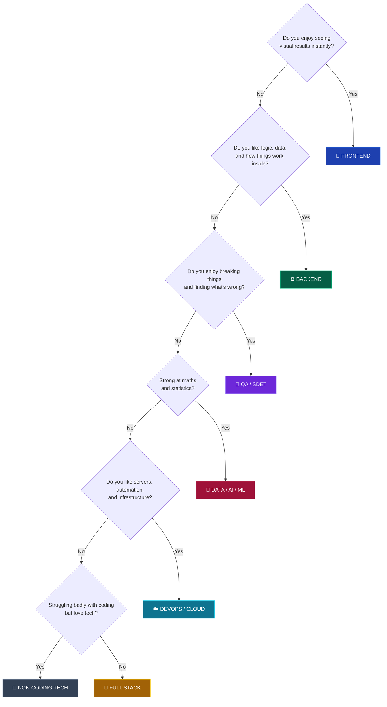

# 💼 Career Tracks

### Pick ONE. Go deep. You can always switch later — nobody's career is ruined by their first job title.

[🏠 Home](../README.md) • [🗺️ Roadmaps](../roadmap/) • [📚 Core skills](../core/)

---

## Choose in 5 minutes

---

## Full comparison

| Track | Entry difficulty | Fresher openings | Fresher CTC | DSA needed | Time to job-ready |
|---|:---:|:---:|:---:|:---:|:---:|
| **[🎨 Frontend](frontend.md)** | 🟢 Easy | 🟢 High | ₹4–18 LPA | Medium | 8–12 months |
| **[⚙️ Backend](backend.md)** | 🟡 Medium | 🟢 High | ₹5–25 LPA | High | 10–14 months |
| **[🧩 Full Stack](full-stack.md)** | 🟡 Medium | 🟢 Highest | ₹4–20 LPA | High | 12–16 months |
| **[🧪 QA / SDET](qa-sdet.md)** | 🟢 Easiest | 🟢 High | ₹3.5–20 LPA | Low–Medium | 6–10 months |
| **[☁️ DevOps / Cloud](devops-cloud.md)** | 🔴 Hard as fresher | 🔴 Low | ₹5–22 LPA | Low | 12–18 months |
| **[🤖 Data / AI / ML](data-ai-ml.md)** | 🔴 Hardest | 🟡 Medium | ₹5–30 LPA | Medium | 15–24 months |
| **[📱 Mobile](mobile.md)** | 🟡 Medium | 🟡 Medium | ₹4–20 LPA | Medium | 10–14 months |
| **[💼 Non-coding tech](non-coding-tech-roles.md)** | 🟢 Easy | 🟢 High | ₹3.5–12 LPA | Very low | 4–8 months |

> [!IMPORTANT]
> **CTC ranges are wide because they span service companies to FAANG.** Your number depends far more on your skill level and target company tier than on your track. A great QA engineer earns more than a mediocre backend developer.

---

## Recommendations for tier-3 students

| Your situation | Recommended track | Why |
|---|---|---|
| **Genuinely no idea** | 🧩 [Full Stack](full-stack.md) | Most fresher openings. You discover your preference by doing both. |
| **Want the fastest realistic job** | 🧪 [QA / SDET](qa-sdet.md) | Lowest competition, genuinely underrated, strong automation career |
| **Love design and visuals** | 🎨 [Frontend](frontend.md) | Fastest visible results — great for staying motivated early |
| **Love logic and systems** | ⚙️ [Backend](backend.md) | Highest ceiling for pure engineering roles |
| **Started very late** | 🧪 [QA](qa-sdet.md) or 🧩 [Full Stack](full-stack.md) | Shortest path from zero to hireable |
| **Strong at maths, patient** | 🤖 [Data/AI/ML](data-ai-ml.md) | High ceiling, but hardest fresher market — have a backup |
| **Coding isn't clicking after 6+ honest months** | 💼 [Non-coding tech](non-coding-tech-roles.md) | Real careers, real salaries, not a consolation prize |

### Tracks to be careful about as a fresher

**☁️ DevOps/Cloud** — brilliant career, but very few *fresher* DevOps roles exist. Companies want 2–3 years of dev experience first. **Best strategy:** get hired as backend or QA, learn DevOps on the job, switch internally in 1–2 years.

**🤖 Data/AI/ML** — huge competition from MTech and PhD candidates. Most "AI/ML fresher" openings are actually data analyst roles. **Best strategy:** learn Python + SQL + analytics deeply, enter as a data analyst, grow into ML.

---

## The rules of picking a track

**1. Pick one. Actually one.**
"Full stack + DevOps + ML" is not a track, it's a way of being mediocre at three things. Depth is what gets hired.

**2. Give it 12 months before judging.**
Everything is confusing and unpleasant for the first 3 months. That feeling is not a signal you chose wrong.

**3. Switching later is cheap.**
Frontend → Backend is a 3-month move. QA → SDE happens constantly. Your first job title is not a life sentence. Companies care about your last 2 years, not your first choice.

**4. Passion is optional.**
"Follow your passion" is bad advice when you need a job. Pick something you don't hate, get good at it, and let interest follow competence — that's the usual order.

**5. The market matters more than the vibe.**
A track with 10,000 openings and moderate interest beats a track with 200 openings you love. You can find fulfilment inside a job you got.

---

## What every track needs (no exceptions)

Whatever you pick, you also need the core:

| | Skill | Why |
|:---:|---|---|
| 🧮 | **[DSA](../core/dsa.md)** | The filter for every product company |
| 🖥️ | **[CS Fundamentals](../core/cs-fundamentals.md)** | OS, DBMS, CN, OOP — asked everywhere |
| 🛠️ | **[Git & Linux](../core/git-and-linux.md)** | Assumed knowledge |
| 🗄️ | **SQL** | Every track touches a database |
| 🏗️ | **[System Design](../core/system-design.md)** | Separates ₹6 LPA from ₹25 LPA |
| 🗣️ | **Communication** | You will lose interviews you technically passed |

---

## Pick yours

**[🎨 Frontend](frontend.md)** • **[⚙️ Backend](backend.md)** • **[🧩 Full Stack](full-stack.md)** • **[🧪 QA / SDET](qa-sdet.md)**

**[☁️ DevOps / Cloud](devops-cloud.md)** • **[🤖 Data / AI / ML](data-ai-ml.md)** • **[📱 Mobile](mobile.md)** • **[💼 Non-coding](non-coding-tech-roles.md)**

 

[🏠 Home](../README.md) • [🗺️ Roadmaps](../roadmap/) • [💡 Projects](../projects/README.md)

