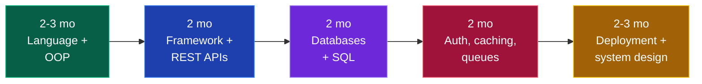

# ⚙️ Backend Developer

### You build the engine — APIs, databases, logic, scale. The part users never see but always feel.

[🏠 Home](../README.md) • [💼 All tracks](README.md) • [🎨 Frontend](frontend.md) • [🧩 Full Stack](full-stack.md)

---

## Is this you?

✅ **Pick backend if:** you like logic and systems more than visuals · you're curious how things work under the hood · you enjoy data modelling and problem solving · you want the highest ceiling in pure engineering

❌ **Skip it if:** you need instant visual feedback to stay motivated · you find databases and abstract architecture boring

**Best part:** the highest ceiling. Backend and distributed systems engineers hit the top of the pay scale, and the skills transfer everywhere.

**Hardest part:** slower initial progress — for weeks you're building things with no UI, testing with Postman. Also, DSA expectations are higher here than in frontend or QA.

---

## The roadmap

### Step 0 — Pick your stack (choose ONE)

| Stack | Pick if | Job market in India |
|---|---|---|
| **Java + Spring Boot** | You want maximum job count, enterprise, service companies | 🟢 **Largest** — most Indian backend jobs |
| **Node.js + Express/Nest** | You want startups, fast development, shared JS with frontend | 🟢 Large, startup-heavy |
| **Python + Django/FastAPI** | You lean toward data/ML too, or want the gentlest ramp | 🟡 Good, growing |
| **Go** | You want distributed systems and modern infra | 🔴 Small but high-paying |

> [!TIP]
> **Java + Spring Boot has the most fresher openings in India by a wide margin.** Node.js is the best startup bet. Both are correct choices. Pick one and stay 12 months — the concepts transfer, the syntax doesn't matter.

### Phase 1 — Language + OOP (2–3 months)

- [ ] Language fundamentals, deeply
- [ ] **OOP** — the 4 pillars, and be able to give real examples
- [ ] Collections — lists, maps, sets, and their time complexities
- [ ] Exception handling and error propagation
- [ ] File I/O
- [ ] Multithreading / concurrency basics *(threads, race conditions, locks — heavily asked in Java interviews)*
- [ ] Memory management — heap vs stack, garbage collection
- [ ] SOLID principles
- [ ] Design patterns — Singleton, Factory, Builder, Observer, Strategy

### Phase 2 — Framework + REST APIs (2 months)

- [ ] MVC architecture — controller / service / repository layering
- [ ] Build a full **CRUD REST API**
- [ ] HTTP deeply — methods, status codes, headers, idempotency
- [ ] REST conventions and good API design
- [ ] Request validation and structured error responses
- [ ] Middleware / interceptors / filters
- [ ] Dependency injection
- [ ] Environment configuration and secrets management
- [ ] **API documentation** — Swagger / OpenAPI
- [ ] **Postman** — collections, environments, testing

### Phase 3 — Databases (2 months)

**SQL (essential — do not skip):**
- [ ] Schema design, primary/foreign keys, relationships
- [ ] **Normalisation** — 1NF, 2NF, 3NF, and when denormalising is right
- [ ] Joins — inner, left, right, full, self
- [ ] `GROUP BY`, `HAVING`, subqueries, CTEs, window functions
- [ ] **Indexing** — how it works, when it helps, when it hurts
- [ ] **Transactions and ACID**, isolation levels, deadlocks
- [ ] Query optimisation, `EXPLAIN`, N+1 query problem
- [ ] ORMs — Hibernate/JPA, Prisma, SQLAlchemy — and their pitfalls

**NoSQL:**
- [ ] MongoDB — documents, collections, aggregation pipeline
- [ ] When NoSQL beats SQL, and when it's the wrong call
- [ ] **Redis** — caching, sessions, rate limiting, TTL

**Practise:** [LeetCode SQL 50](https://leetcode.com/studyplan/top-sql-50/) · [SQLZoo](https://sqlzoo.net/) · write 50+ queries by hand.

### Phase 4 — Production concerns (2 months)

- [ ] **Authentication & authorisation** — JWT, sessions, OAuth 2.0, refresh tokens
- [ ] **Password security** — bcrypt/argon2, salting, *never* plain text
- [ ] Role-based access control
- [ ] **Caching** — Redis, cache invalidation, cache-aside pattern
- [ ] **Rate limiting** and throttling
- [ ] **Message queues** — RabbitMQ or Kafka basics; async processing
- [ ] Background jobs and cron
- [ ] **Logging and monitoring** — structured logs, error tracking
- [ ] **Testing** — unit tests, integration tests, mocking *(big differentiator for freshers)*
- [ ] Security basics — SQL injection, XSS, CSRF, CORS, OWASP Top 10
- [ ] File uploads and object storage (S3 / Cloudinary)
- [ ] Payment integration (Razorpay / Stripe test mode)
- [ ] WebSockets for real-time features

### Phase 5 — Deployment + system design (2–3 months)

- [ ] **Linux** — enough to operate a server → [core/git-and-linux.md](../core/git-and-linux.md)
- [ ] **Docker** — images, containers, `docker-compose`
- [ ] Deploy to Render, Railway, or AWS EC2
- [ ] CI/CD with GitHub Actions
- [ ] Nginx as a reverse proxy
- [ ] **System design** → [core/system-design.md](../core/system-design.md)
  - Load balancing · horizontal vs vertical scaling · DB replication and sharding · CAP theorem · microservices vs monolith · CDNs

---

## 💡 Projects that get you hired

| Level | Project | What it proves |
|:---:|---|---|
| 🟢 | **Blog API** with auth + CRUD | Basic competence |
| 🟡 | **E-commerce backend** — cart, orders, payments, inventory | Real business logic |
| 🟡 | **URL shortener** with analytics + Redis caching | Caching, DB design, scale thinking |
| 🟠 | **Real-time chat** — WebSockets, message persistence, presence | Async, stateful connections |
| 🟠 | **Job queue system** — background workers, retries, dead-letter queue | Distributed thinking |
| 🔥 | **Multi-tenant SaaS** — orgs, roles, billing, rate limits, audit logs | Production-grade engineering |
| 🔥 | **Microservices app** — 3 services, API gateway, message broker, Docker Compose | Architecture maturity |

> [!TIP]
> **Backend projects are invisible unless you make them visible.** Always ship: Swagger docs at a live URL, a great README with an architecture diagram, a Postman collection in the repo, and a short demo video or GIF. Otherwise the recruiter sees a folder of files and moves on.

---

## 🎤 Interview breakdown

| Round | What's tested | Weight |
|---|---|:---:|
| **OA** | DSA — arrays, strings, hashmaps, trees, DP | 🔴 High |
| **DSA rounds (1–2)** | Medium/Hard problems, live coding | 🔴 High |
| **Low-level design** | OOP design: parking lot, BookMyShow, elevator, Splitwise | 🟠 Medium-High |
| **DBMS + SQL** | Normalisation, indexing, transactions, live query writing | 🟠 Medium-High |
| **CS fundamentals** | OS (threads, deadlock, memory), CN (TCP, HTTP, DNS) | 🟠 Medium |
| **System design** | HLD — for freshers at good companies, standard at 2+ YOE | 🟡 Medium |
| **Project deep-dive** | Every design decision you made | 🔴 High |
| **HR / behavioural** | Motivation, teamwork, conflict | 🟡 Medium |

<b>❓ Backend questions you WILL be asked</b>

 

**Databases**
1. Explain normalisation. When would you deliberately denormalise?
2. What is an index? Why can adding one *slow down* writes?
3. Explain ACID with an example.
4. SQL vs NoSQL — when would you choose each?
5. What is the N+1 query problem and how do you fix it?
6. Explain transaction isolation levels and the problems each prevents.

**APIs & architecture**
7. Difference between `PUT` and `PATCH`? What does idempotent mean?
8. How does JWT authentication work? Where do you store the token and why?
9. How would you implement rate limiting?
10. Monolith vs microservices — trade-offs?
11. How do you handle a long-running task in an API request?
12. What is CORS and why does it exist?

**Concurrency & OS**
13. Process vs thread?
14. What is a race condition? How do you prevent it?
15. What is a deadlock and what are the four conditions for it?

**Scale**
16. Your API is slow. Walk me through how you'd diagnose it.
17. How would you scale this to 1 million users?
18. What would you cache here, and how would you invalidate it?

<b>🏗️ Low-level design problems to practise</b>

 

Classic Indian-interview LLD problems. Practise designing classes, relationships and patterns on paper:

1. Parking lot system
2. BookMyShow / movie ticket booking
3. Splitwise
4. Elevator system
5. ATM machine
6. Library management system
7. Rate limiter
8. Logging framework
9. Snake and Ladder
10. Food delivery app (Swiggy/Zomato)

**What they're checking:** can you identify entities, use OOP well, apply the right design pattern, and handle edge cases — not whether you memorised a solution.

---

## 🏢 Who hires backend developers

| Level | Companies | CTC |
|---|---|---|
| 🟢 Service | TCS, Infosys, Wipro, Cognizant, Accenture, Capgemini, LTIMindtree, Tech Mahindra | ₹3.5–7 LPA |
| 🔵 Mid product | Zoho, Freshworks, Nagarro, Thoughtworks, Publicis Sapient, Josh Tech, funded startups | ₹6–15 LPA |
| 🟣 Strong product | Razorpay, Zomato, Swiggy, PhonePe, Groww, CRED, Postman, Zeta, Sprinklr, Navi | ₹15–30 LPA |
| 🔴 Top tier | Google, Amazon, Microsoft, Atlassian, Adobe, Uber, Salesforce, Flipkart, DE Shaw | ₹25–60 LPA |

📖 **[placements/company-tiers.md](../placements/company-tiers.md)**

---

## 📚 Free resources

| Topic | Resource |
|---|---|
| Java | [Telusko](https://www.youtube.com/@Telusko) · [Java Brains](https://www.youtube.com/@Java.Brains) · [Baeldung](https://www.baeldung.com/) |
| Spring Boot | [Spring official guides](https://spring.io/guides) · [Java Brains Spring Boot](https://www.youtube.com/@Java.Brains) |
| Node.js | [Node docs](https://nodejs.org/docs/latest/api/) · [The Net Ninja Node series](https://www.youtube.com/@NetNinja) |
| Python backend | [FastAPI docs](https://fastapi.tiangolo.com/) · [Django docs](https://docs.djangoproject.com/) |
| SQL | [SQLZoo](https://sqlzoo.net/) · [Mode SQL Tutorial](https://mode.com/sql-tutorial/) · [LeetCode SQL 50](https://leetcode.com/studyplan/top-sql-50/) |
| Databases (deep) | [Use The Index, Luke](https://use-the-index-luke.com/) · [CMU Database Course](https://www.youtube.com/@CMUDatabaseGroup) |
| System design | [System Design Primer](https://github.com/donnemartin/system-design-primer) · [ByteByteGo](https://www.youtube.com/@ByteByteGo) |
| LLD | [Low Level Design Primer](https://github.com/prasadgujar/low-level-design-primer) |
| APIs | [Postman Learning Center](https://learning.postman.com/) |
| Docker | [Docker official get-started](https://docs.docker.com/get-started/) |

---

## ⚠️ Backend-specific mistakes

| Mistake | Fix |
|---|---|
| **Skipping SQL** | Every backend interview tests SQL. Write 50 queries by hand. |
| **Never deploying** | A backend that only runs on localhost doesn't exist. Deploy it. |
| **No API documentation** | Add Swagger. It takes 30 minutes and instantly looks professional. |
| **Ignoring security** | Plain-text passwords in a project repo is an instant red flag. |
| **Only CRUD projects** | Add caching, queues, or real-time. That's what shows engineering thinking. |
| **Learning 3 frameworks shallowly** | One stack, deep. Spring Boot mastery beats "Spring + Express + Django". |
| **Skipping concurrency** | Threads and race conditions are asked constantly, especially in Java roles. |
| **No tests** | Almost no fresher writes tests. Writing even a few makes you memorable. |

---

### Backend has the highest ceiling. It also takes the longest to look impressive. Be patient.

[🏠 Home](../README.md) • [💼 Tracks](README.md) • [🏗️ System Design](../core/system-design.md) • [📚 DSA](../core/dsa.md) • [💡 Projects](../projects/README.md)

