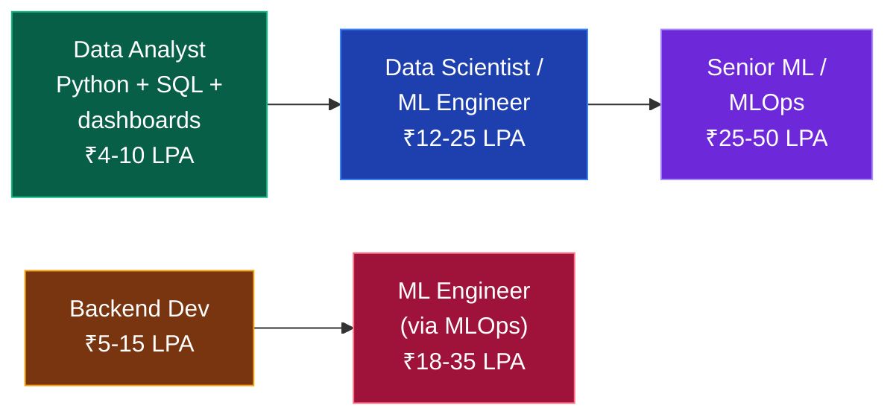

# 🤖 Data / AI / ML

### Highest ceiling, hardest fresher market. Go in with your eyes open.

[🏠 Home](../README.md) • [💼 All tracks](README.md) • [⚙️ Backend](backend.md) • [💼 Non-coding](non-coding-tech-roles.md)

---

## ⚠️ The honest warning

Every student wants to "do AI/ML." Here's what actually happens in the market:

- **You're competing with MTech and PhD candidates** for the same fresher roles, at companies that can afford to be picky.
- **Most "ML Engineer — Fresher" postings are really data analyst roles.** The title is inflated; the work is SQL, dashboards and reporting.
- **Genuine ML research roles essentially require a master's degree.** That's not gatekeeping, it's just what the hiring bar is.
- **Doing 5 Kaggle notebooks does not make you hireable.** Everyone has those. It's the baseline, not the differentiator.

> [!WARNING]
> **Do not pick this track just because AI is in the news.** Pick it if you genuinely enjoy statistics, data and experimentation. If you're chasing the hype, you'll burn 18 months and end up with fewer options than a full-stack developer had after 12.

### The realistic path in

**Enter as a Data Analyst.** It's a real job, it hires freshers, it pays fine, and it puts you next to the data and the ML teams. Grow into data science from inside the company. This is how the large majority of Indian data scientists actually got there — not by landing a "Junior ML Engineer" role out of college.

**Alternative:** become a strong backend developer, learn MLOps, and move into ML engineering. Companies need people who can *deploy and serve* models far more than they need another person who can train one in a notebook.

---

## The roadmap

### Phase 1 — Python + maths (3 months)

**Python:**
- [ ] Syntax, data structures, functions, OOP basics
- [ ] List comprehensions, generators, decorators
- [ ] **NumPy** — arrays, broadcasting, vectorised operations
- [ ] **pandas** ⭐ — DataFrames, `groupby`, merge, pivot, missing data, time series *(you will live in pandas)*
- [ ] **Matplotlib + Seaborn** — plots that communicate clearly

**Maths (do not skip — this is what separates you from notebook-copiers):**
- [ ] **Statistics** ⭐ — mean/median/mode, variance, standard deviation, distributions (normal, binomial), **hypothesis testing, p-values, confidence intervals**, correlation vs causation, sampling bias
- [ ] **Probability** — conditional probability, **Bayes' theorem**, expected value
- [ ] **Linear algebra** — vectors, matrices, dot products, eigenvalues *(the mechanics of ML)*
- [ ] **Calculus** — derivatives, partial derivatives, gradients, chain rule *(how models learn)*

📖 **[core/aptitude-and-maths.md](../core/aptitude-and-maths.md)**

> [!IMPORTANT]
> **Statistics is the single most-tested topic in data interviews** — more than deep learning. Most candidates can call `.fit()` but can't explain a p-value or when a t-test applies. Be the one who can.

### Phase 2 — SQL + data wrangling (2 months)

- [ ] **SQL** ⭐ — the most-used skill in every data job
  - Joins, `GROUP BY`, `HAVING`, subqueries, CTEs
  - **Window functions** — `ROW_NUMBER`, `RANK`, `LAG`, `LEAD` *(heavily asked)*
  - Query optimisation
- [ ] Data cleaning — missing values, outliers, duplicates, type issues
- [ ] Feature engineering — encoding, scaling, binning, date features
- [ ] **EDA** — exploratory data analysis as a repeatable process
- [ ] Excel / Google Sheets — pivot tables, VLOOKUP *(genuinely used in analyst roles)*
- [ ] **Tableau or Power BI** — dashboards *(Power BI is more common in Indian companies)*

**Practise:** [LeetCode SQL 50](https://leetcode.com/studyplan/top-sql-50/) · [StrataScratch](https://www.stratascratch.com/) · [DataLemur](https://datalemur.com/)

### Phase 3 — Machine learning (3–4 months)

- [ ] ML fundamentals — supervised vs unsupervised, train/validation/test splits
- [ ] **Bias-variance tradeoff**, overfitting, underfitting, regularisation
- [ ] **Cross-validation**
- [ ] **Supervised:** linear regression, logistic regression, decision trees, random forest, **gradient boosting (XGBoost, LightGBM)** ⭐, SVM, KNN, Naive Bayes
- [ ] **Unsupervised:** K-means, hierarchical clustering, PCA, DBSCAN
- [ ] **Evaluation metrics** — accuracy, **precision, recall, F1**, ROC-AUC, confusion matrix, RMSE, MAE, R² *(know when each is the wrong metric)*
- [ ] Handling imbalanced data — SMOTE, class weights
- [ ] Hyperparameter tuning — grid search, random search
- [ ] **scikit-learn** — pipelines, transformers, model selection

> [!TIP]
> **XGBoost/LightGBM win most real-world tabular problems.** Deep learning gets the headlines; gradient boosting gets the production deployments. Master the classical models before touching neural networks.

### Phase 4 — Deep learning (2–3 months, optional but valuable)

- [ ] Neural network fundamentals — neurons, layers, activation functions
- [ ] Backpropagation, gradient descent, optimisers (SGD, Adam)
- [ ] Loss functions
- [ ] **PyTorch** *(preferred in research and increasingly in industry)* or TensorFlow/Keras
- [ ] **CNNs** — image classification, transfer learning
- [ ] **RNNs / LSTMs** — sequence data
- [ ] **Transformers and attention** ⭐ — the architecture behind everything modern
- [ ] Hugging Face — using and fine-tuning pretrained models
- [ ] **LLM application skills** — prompt engineering, embeddings, vector databases, RAG *(the highest-demand skill right now)*

### Phase 5 — Production / MLOps (2 months) — the real differentiator

Almost every candidate can train a model in a notebook. Very few can ship one.

- [ ] Model serialisation (pickle, joblib, ONNX)
- [ ] **Serving models via an API** — FastAPI or Flask
- [ ] **Streamlit / Gradio** — fast interactive demos *(great for portfolios)*
- [ ] **Docker** for reproducible environments
- [ ] Experiment tracking — **MLflow** or Weights & Biases
- [ ] Data versioning — DVC
- [ ] Model monitoring and drift detection
- [ ] Cloud deployment — AWS SageMaker, GCP Vertex AI, or plain EC2
- [ ] Data pipelines — Airflow basics
- [ ] Big data basics — Spark/PySpark *(if targeting data engineering)*

---

## 💡 Projects that get you hired

| Level | Project | What it proves |
|:---:|---|---|
| 🔴 | ~~Titanic / Iris / MNIST~~ | **Nothing. Everyone has these. Do not put them on your resume.** |
| 🟡 | **End-to-end analysis** on a real messy dataset + dashboard | You can handle real data |
| 🟡 | **Deployed ML app** (Streamlit/FastAPI) solving a specific problem | You can ship, not just train |
| 🟠 | **Scraped your own dataset** → cleaned → modelled → deployed | Full pipeline ownership |
| 🟠 | **RAG chatbot** over your own documents (embeddings + vector DB + LLM) | Current, in-demand skills |
| 🔥 | **Production ML system** — API + Docker + MLflow + monitoring + CI/CD | You're an ML *engineer*, not a notebook user |
| 🔥 | **Kaggle top 10%** in a real competition | Verifiable, competitive proof |

**What makes a data project actually count:**
- ✅ You collected or found the data yourself (not a clean Kaggle CSV)
- ✅ You show the *messy* parts — cleaning decisions, failed approaches, why you chose that metric
- ✅ **It's deployed** — a live Streamlit link beats a `.ipynb` file every time
- ✅ You can explain the business impact: "reduced X by Y%"
- ✅ You compare multiple models and justify the winner
- ✅ The README tells a story, not just "run cell 1 to 40"

---

## 🎤 Interview breakdown

| Round | What's tested | Weight |
|---|---|:---:|
| **SQL** ⭐ | Joins, aggregations, **window functions** — live query writing | 🔴 Highest |
| **Statistics** ⭐ | Hypothesis testing, p-values, distributions, A/B testing | 🔴 High |
| **ML theory** | Algorithms, bias-variance, metrics, when to use what | 🔴 High |
| **Python / pandas** | Data manipulation, live coding | 🟠 Medium-High |
| **Case study** | "How would you reduce customer churn?" — end-to-end thinking | 🔴 High |
| **Project deep-dive** | Every decision in your projects | 🔴 High |
| **DSA** | Usually lighter than SDE, but still present | 🟡 Medium |

<b>❓ Data/ML questions you WILL be asked</b>

 

**Statistics**
1. Explain p-value to a non-technical stakeholder.
2. What is the Central Limit Theorem and why does it matter?
3. Type I vs Type II error — give a real-world example of each.
4. How would you design an A/B test? How do you decide the sample size?
5. Correlation vs causation — how do you establish causation?

**ML**
6. Explain the bias-variance tradeoff.
7. Your model has 99% accuracy. Why might that be terrible? *(Class imbalance — the classic trap)*
8. Precision vs recall — when do you optimise for each? *(Cancer detection vs spam filtering)*
9. How do you handle imbalanced datasets?
10. How does a random forest reduce overfitting compared to a single tree?
11. What is regularisation? L1 vs L2?
12. How do you detect and handle data leakage?
13. Your model performs well offline but badly in production. What happened?

**SQL**
14. Find the 2nd highest salary per department. *(Window functions)*
15. Find users active 3 days in a row.
16. Calculate a running total / month-over-month growth.

**Case study**
17. Users are churning. How do you investigate and what would you build?
18. How would you build a recommendation system for our product?

**Question 7 and 8 are the filters.** They separate people who understand ML from people who ran `model.fit()`.

---

## 🏢 Who hires data / ML

| Role | Companies | CTC |
|---|---|---|
| **Data Analyst** 🟢 *(best fresher entry)* | Service companies, Deloitte, EY, PwC, KPMG, Flipkart, Swiggy, banks, every mid-size company | ₹4–10 LPA |
| **Business/Product Analyst** 🟢 | Startups, e-commerce, fintech | ₹5–12 LPA |
| **Data Engineer** 🔵 | Product companies, Mu Sigma, Fractal, Tiger Analytics | ₹6–18 LPA |
| **Data Scientist** 🟣 | Flipkart, Swiggy, Zomato, PhonePe, Myntra, Meesho, banks | ₹12–28 LPA |
| **ML Engineer** 🟣 | Product companies, AI startups | ₹15–35 LPA |
| **Applied Scientist / Research** 🔴 | Google, Amazon, Microsoft, Adobe, Nvidia *(usually MTech/PhD)* | ₹30–60 LPA |

📖 **[placements/company-tiers.md](../placements/company-tiers.md)**

---

## 📚 Free resources

| Topic | Resource |
|---|---|
| Python for data | [Kaggle Learn](https://www.kaggle.com/learn) *(free, short, excellent)* |
| pandas | [pandas official tutorials](https://pandas.pydata.org/docs/getting_started/) |
| Statistics | [StatQuest (YouTube)](https://www.youtube.com/@statquest) ⭐ *(the single best free stats resource)* |
| Maths for ML | [3Blue1Brown — Linear Algebra & Calculus](https://www.youtube.com/@3blue1brown) ⭐ |
| ML course | [Andrew Ng ML Specialization (audit free)](https://www.coursera.org/specializations/machine-learning-introduction) |
| Practical ML | [fast.ai](https://course.fast.ai/) *(top-down, project-first)* |
| Deep learning | [Deep Learning Book](https://www.deeplearningbook.org/) · [Karpathy's Neural Networks: Zero to Hero](https://www.youtube.com/@AndrejKarpathy) ⭐ |
| SQL practice | [DataLemur](https://datalemur.com/) · [StrataScratch](https://www.stratascratch.com/) · [LeetCode SQL 50](https://leetcode.com/studyplan/top-sql-50/) |
| LLMs / RAG | [Hugging Face course](https://huggingface.co/learn) · [LangChain docs](https://python.langchain.com/) |
| Competitions | [Kaggle](https://www.kaggle.com/competitions) |
| Datasets | [Kaggle Datasets](https://www.kaggle.com/datasets) · [data.gov.in](https://data.gov.in/) · [Google Dataset Search](https://datasetsearch.research.google.com/) |

---

## ⚠️ Data/ML specific mistakes

| Mistake | Fix |
|---|---|
| **Skipping statistics** | It's the most-tested topic. StatQuest, 3 weeks. Do it. |
| **Titanic/Iris on your resume** | Instant signal of inexperience. Build something original. |
| **Notebooks only, nothing deployed** | Deploy with Streamlit in an hour. It changes how your work is perceived. |
| **Jumping straight to deep learning** | Master classical ML + statistics first. Most jobs use XGBoost, not transformers. |
| **Weak SQL** | SQL is the #1 tested skill in data interviews. Practise 100 queries. |
| **Targeting only "ML Engineer" roles** | Apply to data analyst roles too. That's where the fresher openings are. |
| **No domain understanding** | "Predicted churn with 92% accuracy" means nothing without business context. |
| **Ignoring MLOps** | Deployment skills are scarce and highly paid. This is your edge. |

---

### Enter through data analysis. Grow into ML. That's the path that actually works.

[🏠 Home](../README.md) • [💼 Tracks](README.md) • [💼 Non-coding roles](non-coding-tech-roles.md) • [➗ Maths](../core/aptitude-and-maths.md)

