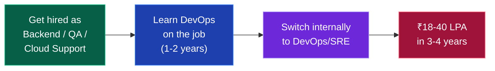

# ☁️ DevOps / Cloud Engineer

### You build the pipelines and infrastructure that let code reach users safely.

[🏠 Home](../README.md) • [💼 All tracks](README.md) • [⚙️ Backend](backend.md) • [🧪 QA/SDET](qa-sdet.md)

---

## ⚠️ Read this first — the honest warning

**DevOps is an excellent career with a serious catch: there are very few true fresher DevOps roles.**

Companies want DevOps engineers who have *already been developers* — because you can't automate a deployment pipeline for software you've never written, and you can't debug a production incident without understanding the application. Most job descriptions say "2–4 years experience" and they mean it.

> [!WARNING]
> **Do not make DevOps your only plan as a fresher.** Students who go DevOps-only often spend a year on certifications and then find nothing is hiring them at entry level.

### The strategy that actually works

**Realistic entry points for a fresher:**

| Role | Why it's a good door | CTC |
|---|---|---|
| **Backend developer** | Best path. You learn the app, then automate it. | ₹5–15 LPA |
| **Cloud Support Engineer** (AWS, Azure, Oracle) | Actively hires freshers, real cloud exposure, direct route to DevOps | ₹5–12 LPA |
| **Site Reliability Engineer (SRE) intern** | Some companies do hire fresher SREs | ₹8–20 LPA |
| **Build & Release Engineer** | Common entry title in service companies | ₹4–8 LPA |
| **QA / SDET with CI-CD focus** | You own the pipeline; a natural slide into DevOps | ₹6–15 LPA |

**So: learn DevOps as a powerful add-on to another track, not instead of one.** A backend developer who knows Docker, Kubernetes and Terraform is far more hireable than either specialist alone.

---

## The roadmap

### Phase 1 — Linux & networking (2 months) — the real foundation

- [ ] Linux commands — files, permissions, processes, users, `systemd`
- [ ] `grep`, `awk`, `sed`, pipes, redirection
- [ ] **Bash scripting** — variables, loops, conditionals, functions, cron
- [ ] Package management (apt/yum), services
- [ ] SSH, key-based auth, `scp`, `rsync`
- [ ] Process monitoring — `top`, `htop`, `ps`, `netstat`, `lsof`
- [ ] Log analysis — `journalctl`, `tail -f`, log rotation
- [ ] **Networking** — IP, subnets, DNS, TCP/UDP, ports, firewalls, load balancing, HTTP/HTTPS, TLS certificates

📖 **[core/git-and-linux.md](../core/git-and-linux.md)**

> [!TIP]
> **Linux is 50% of DevOps.** Most students skip straight to Kubernetes and then can't debug a service that won't start. Get genuinely comfortable in a terminal first.

### Phase 2 — Programming & version control (2 months)

- [ ] **Python** — automation scripts, API calls, file processing, `boto3`
- [ ] **Git deeply** — branching strategies (GitFlow, trunk-based), rebasing, resolving conflicts, hooks
- [ ] YAML and JSON — you will read and write these constantly
- [ ] REST APIs — how to consume them from scripts
- [ ] Basic understanding of how web apps are built and run

### Phase 3 — Containers (2 months)

- [ ] **Docker** — images, containers, layers, volumes, networks
- [ ] Writing good Dockerfiles, multi-stage builds, image size optimisation
- [ ] `docker-compose` for multi-service applications
- [ ] Docker registries (Docker Hub, ECR)
- [ ] Container security basics
- [ ] **Kubernetes** — pods, deployments, services, ConfigMaps, Secrets, ingress
- [ ] `kubectl`, namespaces, resource limits, health probes
- [ ] Helm charts
- [ ] Practise locally with Minikube or Kind

### Phase 4 — CI/CD (1–2 months)

- [ ] CI/CD concepts — build, test, deploy stages
- [ ] **GitHub Actions** — workflows, jobs, secrets, matrix builds *(easiest to start, free)*
- [ ] **Jenkins** — pipelines, Jenkinsfile, plugins, agents *(still dominant in Indian enterprises)*
- [ ] GitLab CI *(optional)*
- [ ] Artifact management (Nexus, Artifactory)
- [ ] Deployment strategies — blue-green, canary, rolling
- [ ] Automated testing inside pipelines
- [ ] Secret management (Vault, AWS Secrets Manager)

### Phase 5 — Cloud (2–3 months) — pick ONE

| Cloud | Market share in India | Start here |
|---|:---:|---|
| **AWS** ⭐ | Largest | Yes, unless you have a reason not to |
| **Azure** | Growing fast, strong in enterprise/service companies | Good second choice |
| **GCP** | Smaller but well-paid | Only if targeting specific companies |

**AWS core services to learn:**
- [ ] **EC2** (compute), **S3** (storage), **VPC** (networking), **IAM** (permissions)
- [ ] RDS (managed databases), Route 53 (DNS)
- [ ] ELB/ALB (load balancers), Auto Scaling
- [ ] Lambda (serverless), API Gateway
- [ ] ECS / EKS (containers), CloudWatch (monitoring), CloudFormation
- [ ] Cost management *(genuinely valued — cloud bills are a real business problem)*

**Certification:** **AWS Certified Cloud Practitioner** → **AWS Solutions Architect Associate**. These genuinely help a tier-3 resume get past filters. ~₹8,000–12,000 each; free training on [AWS Skill Builder](https://skillbuilder.aws/).

### Phase 6 — IaC & observability (2 months)

- [ ] **Terraform** ⭐ — providers, resources, state, modules, workspaces *(the industry standard)*
- [ ] **Ansible** — playbooks, roles, inventory (configuration management)
- [ ] **Prometheus + Grafana** — metrics, dashboards, alerting
- [ ] **ELK / Loki** — centralised logging
- [ ] Distributed tracing basics
- [ ] Incident response, on-call, postmortems
- [ ] SLI / SLO / SLA and error budgets
- [ ] DevSecOps basics — vulnerability scanning, secrets detection

---

## 💡 Projects that get you hired

| Level | Project | What it proves |
|:---:|---|---|
| 🟢 | **Dockerise a 3-tier app** (frontend + backend + DB) | Container fundamentals |
| 🟢 | **Bash scripts** for backups, log rotation, health checks | Linux + automation |
| 🟡 | **CI/CD pipeline** — GitHub Actions: build → test → deploy to EC2 | End-to-end automation |
| 🟡 | **Terraform infra** — VPC, EC2, RDS, security groups from code | IaC competence |
| 🟠 | **Kubernetes deployment** — multi-service app on EKS/Minikube with ingress and autoscaling | Orchestration |
| 🟠 | **Monitoring stack** — Prometheus + Grafana + alerts on a real app | Observability |
| 🔥 | **Complete platform** — GitOps: push code → CI runs → Terraform provisions → K8s deploys → Grafana monitors | Everything, integrated |

> [!TIP]
> **Document with architecture diagrams.** DevOps work is invisible without them. Use [draw.io](https://app.diagrams.net) or Mermaid, add the diagram to your README, include screenshots of your Grafana dashboards and pipeline runs. Write a blog post explaining what you built — DevOps hiring managers read blogs.
>
> **Watch your cloud bill.** Use the AWS free tier, set a billing alarm at ₹100, and destroy resources after every practice session (`terraform destroy`). Students genuinely rack up ₹20,000 bills by leaving instances running.

---

## 🎤 Interview breakdown

| Round | What's tested |
|---|---|
| **Linux** | Commands, troubleshooting, permissions, processes, scripting |
| **Networking** | DNS, TCP/IP, load balancing, firewalls, HTTPS/TLS |
| **Docker & Kubernetes** | Architecture, troubleshooting, writing manifests |
| **CI/CD** | Pipeline design, deployment strategies, rollback |
| **Cloud** | Core services, IAM, VPC design, cost optimisation |
| **Scripting** | Write a Bash or Python automation script live |
| **Scenario / troubleshooting** ⭐ | "The site is down. Walk me through your diagnosis." |
| **IaC** | Terraform state, modules, drift |

<b>❓ DevOps questions you WILL be asked</b>

 

1. What happens when you type a URL and press enter? *(Asked in almost every DevOps interview — go deep: DNS → TCP → TLS → HTTP → load balancer → server → response)*
2. A production server is at 100% CPU. How do you debug it? *(`top`, `htop`, `ps`, logs, recent deploys, rollback)*
3. Docker container vs virtual machine?
4. What is a Kubernetes pod? Why not just run containers directly?
5. How do you achieve zero-downtime deployment?
6. What is Terraform state and why does it matter? What happens if two people apply at once?
7. Explain blue-green vs canary deployment.
8. How do you manage secrets in a CI/CD pipeline?
9. Your deployment failed at 2 AM. Walk me through your response.
10. How would you reduce a company's AWS bill by 30%?
11. Difference between Docker `CMD` and `ENTRYPOINT`?
12. What is an IAM role vs an IAM user?
13. How does a load balancer decide where to send traffic?
14. What are SLI, SLO and SLA?

**Questions 1, 2 and 9 matter most.** DevOps interviews are heavily troubleshooting-focused — they want to see a structured diagnostic process, not memorised facts.

---

## 🏢 Who hires DevOps / Cloud

| Level | Companies | CTC (fresher/junior) |
|---|---|---|
| 🟢 Service | TCS, Infosys, Wipro, Accenture, HCL, Capgemini, LTIMindtree | ₹4–7 LPA |
| 🟢 Cloud support | **AWS, Microsoft, Oracle, Google Cloud support teams** *(actively hire freshers)* | ₹5–12 LPA |
| 🔵 Mid product | Nagarro, Thoughtworks, Publicis Sapient, Mphasis, funded startups | ₹7–15 LPA |
| 🟣 Strong product | Razorpay, PhonePe, Swiggy, Zomato, CRED, Postman, Zeta | ₹15–28 LPA |
| 🔴 Top tier (SRE) | Google SRE, Amazon, Microsoft, Atlassian, Uber, Salesforce | ₹25–50 LPA |

📖 **[placements/company-tiers.md](../placements/company-tiers.md)**

---

## 📚 Free resources

| Topic | Resource |
|---|---|
| Full roadmap | [roadmap.sh/devops](https://roadmap.sh/devops) |
| Linux | [Linux Journey](https://linuxjourney.com/) · [OverTheWire Bandit](https://overthewire.org/wargames/bandit/) *(learn by hacking)* |
| Docker & K8s | [TechWorld with Nana (YouTube)](https://www.youtube.com/@TechWorldwithNana) *(best free DevOps channel)* |
| Kubernetes | [kubernetes.io/docs/tutorials](https://kubernetes.io/docs/tutorials/) · [KillerCoda free labs](https://killercoda.com/) |
| AWS | [AWS Skill Builder](https://skillbuilder.aws/) *(free)* · [freeCodeCamp AWS courses](https://www.youtube.com/@freecodecamp) |
| Terraform | [developer.hashicorp.com/terraform/tutorials](https://developer.hashicorp.com/terraform/tutorials) |
| CI/CD | [GitHub Actions docs](https://docs.github.com/actions) · [Jenkins handbook](https://www.jenkins.io/doc/book/) |
| Monitoring | [Prometheus docs](https://prometheus.io/docs/) · [Grafana tutorials](https://grafana.com/tutorials/) |
| SRE | [Google SRE Book](https://sre.google/books/) *(free, and genuinely excellent)* |
| Practice | [KodeKloud free labs](https://kodekloud.com/free-labs/) · [Play with Docker](https://labs.play-with-docker.com/) |

---

## ⚠️ DevOps-specific mistakes

| Mistake | Fix |
|---|---|
| **DevOps as your only fresher plan** | Have backend, QA or cloud support as your entry. Add DevOps on top. |
| **Skipping Linux** | Linux is half the job. Do not jump to Kubernetes first. |
| **Collecting certifications without projects** | Certs get you past filters. Projects get you hired. Do both, projects first. |
| **Not learning to code** | You automate with Python and Bash daily. It's a coding job. |
| **Learning Kubernetes before Docker** | K8s orchestrates containers. Understand containers first. |
| **Never touching a real cloud account** | Use the free tier. Set a billing alarm. Build something real. |
| **Leaving cloud resources running** | `terraform destroy` after every session. Students get ₹20k bills this way. |
| **No troubleshooting practice** | Interviews are 60% "it's broken, fix it." Deliberately break your own setups and fix them. |

---

### DevOps pays extremely well. It just isn't usually your *first* job — plan around that.

[🏠 Home](../README.md) • [💼 Tracks](README.md) • [⚙️ Backend](backend.md) • [🧪 QA/SDET](qa-sdet.md) • [🛠️ Git & Linux](../core/git-and-linux.md)

