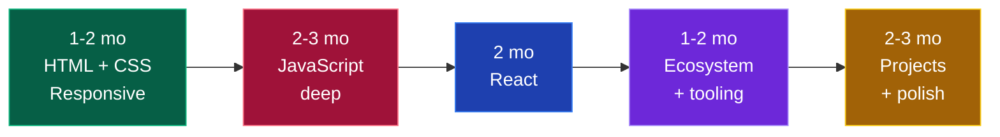

# 🎨 Frontend Developer

### You build what users actually see, click and feel.

[🏠 Home](../README.md) • [💼 All tracks](README.md) • [⚙️ Backend](backend.md) • [🧩 Full Stack](full-stack.md)

---

## Is this you?

✅ **Pick frontend if:** you like seeing instant visual results · you have an eye for design and detail · you enjoy making things feel smooth · you get satisfaction from "this looks exactly right"

❌ **Skip it if:** you find CSS maddening rather than interesting · you'd rather think about data and algorithms than pixels · you dislike browser quirks and edge cases

**Best part:** the fastest visible progress of any track. You build something that *looks real* in week 2, which matters enormously for staying motivated.

**Hardest part:** CSS layout is genuinely harder than it looks, and state management in large apps gets complex fast. Also, the field is crowded at the junior level — you need real projects to stand out.

---

## The roadmap

### Phase 1 — HTML & CSS (1–2 months)

- [ ] Semantic HTML — `header`, `nav`, `main`, `section`, `article`, `footer`
- [ ] Forms, inputs, validation, labels
- [ ] **Accessibility** — alt text, ARIA basics, keyboard navigation *(most students skip this; interviewers notice when you don't)*
- [ ] CSS selectors, specificity, the box model
- [ ] **Flexbox** — learn it properly, you'll use it daily
- [ ] **CSS Grid** — for page layouts
- [ ] Responsive design — media queries, mobile-first, `rem`/`em`/`vh`/`vw`
- [ ] Positioning: static, relative, absolute, fixed, sticky
- [ ] Transitions, transforms, animations
- [ ] CSS variables

**Build:** 5 pixel-perfect clones (a landing page, a pricing page, a dashboard layout, a blog, a product page). Clone real sites — Netflix, Spotify, Airbnb, Linear.

### Phase 2 — JavaScript, properly (2–3 months)

> This is the phase that separates real frontend developers from people who can only follow React tutorials. **Do not rush it.**

- [ ] Variables, `let`/`const`, data types, type coercion
- [ ] Functions, arrow functions, callbacks
- [ ] Arrays: `map`, `filter`, `reduce`, `find`, `some`, `every`, `sort`
- [ ] Objects, destructuring, spread/rest
- [ ] **The DOM** — selecting, creating, modifying, removing elements
- [ ] **Events** — listeners, bubbling, delegation, `preventDefault`
- [ ] **Async JS** — callbacks → Promises → `async/await`
- [ ] `fetch`, REST APIs, JSON, error handling
- [ ] **Closures, `this`, hoisting, the event loop, scope** *(the classic interview five)*
- [ ] ES6+ modules, `import`/`export`
- [ ] `localStorage` / `sessionStorage`

**Build:** weather app (real API), quiz app, expense tracker with localStorage, infinite-scroll image gallery, typing-speed test. **All in vanilla JS, no framework.**

<b>❓ JavaScript interview questions you WILL be asked</b>

 

1. What is a closure? Give a real use case.
2. Explain the event loop, call stack and task queue.
3. `var` vs `let` vs `const` — and what is hoisting?
4. What does `this` refer to in different contexts?
5. Difference between `==` and `===`?
6. What is event bubbling? What is event delegation and why use it?
7. Promise vs `async/await` — and what does `Promise.all` do?
8. Explain debouncing and throttling. When would you use each?
9. What is the prototype chain?
10. Shallow copy vs deep copy — how do you deep-clone an object?
11. What are higher-order functions?
12. Explain `call`, `apply` and `bind`.

**Practice explaining these out loud.** Knowing them silently is worth nothing in an interview.

### Phase 3 — React (2 months)

- [ ] Components, JSX, props
- [ ] `useState`, `useEffect` (and the dependency array — really understand it)
- [ ] Lists, keys, conditional rendering
- [ ] Forms — controlled vs uncontrolled
- [ ] `useRef`, `useMemo`, `useCallback` — and **when not to use them**
- [ ] Custom hooks
- [ ] Context API
- [ ] React Router
- [ ] Data fetching patterns, loading and error states
- [ ] State management — Zustand or Redux Toolkit *(learn one)*
- [ ] `React.memo`, lazy loading, code splitting
- [ ] Error boundaries

**Build:** e-commerce UI with cart and filters, a Kanban board with drag-and-drop, a real-time chat UI.

### Phase 4 — Ecosystem & tooling (1–2 months)

- [ ] **Tailwind CSS** — the industry default now, learn it
- [ ] **TypeScript** — increasingly mandatory. Types, interfaces, generics basics
- [ ] **Next.js** — SSR/SSG, App Router, API routes *(huge hiring advantage)*
- [ ] Vite, npm/pnpm, `package.json`
- [ ] Chrome DevTools — really learn the Network and Performance tabs
- [ ] Testing — Jest + React Testing Library basics *(almost no student does this; big differentiator)*
- [ ] Git workflows — branches, PRs, code review
- [ ] Deployment — Vercel or Netlify
- [ ] Core Web Vitals, Lighthouse, basic performance optimisation

---

## 💡 Projects that get you hired

| Level | Project | What it proves |
|:---:|---|---|
| 🟢 | **Portfolio site** | You can ship something live |
| 🟢 | **Weather / movie app** | API integration, async handling, error states |
| 🟡 | **E-commerce frontend** | Cart state, filters, search, pagination, routing |
| 🟡 | **Admin dashboard** | Charts, tables, complex layouts, data density |
| 🟠 | **Real-time chat UI** | WebSockets, optimistic updates |
| 🟠 | **Collaborative editor** | Hard state management, conflict handling |
| 🔥 | **Clone with real backend** (Twitter/Notion/Trello) | Full product thinking, auth, persistence |

> [!TIP]
> **Frontend is judged visually.** Your project must *look* good — recruiters make a judgement in 5 seconds. Use Tailwind, copy layouts from [Dribbble](https://dribbble.com) or [Mobbin](https://mobbin.com), add dark mode, make it responsive, and add smooth transitions. A technically simple project that looks polished beats a complex one that looks like a 2009 college assignment.

---

## 🎤 Interview breakdown

| Round | What's tested | How to prepare |
|---|---|---|
| **OA** | DSA (arrays, strings, hashmaps) + JS output questions | [core/dsa.md](../core/dsa.md) |
| **Machine coding** | Build a component in 60–90 min *(most important round)* | Practice: star rating, autocomplete, infinite scroll, carousel, todo with filters |
| **JS deep-dive** | Closures, event loop, `this`, promises, polyfills | The list above, out loud |
| **React round** | Hooks, re-renders, performance, state design | Build enough that this is instinct |
| **CSS round** | Flexbox, Grid, centring, responsive, specificity | Practice on [CSS Battle](https://cssbattle.dev/) |
| **System design (frontend)** | Component architecture, state management, rendering strategy, caching | For 2+ YOE, sometimes freshers at good companies |
| **HR** | Projects, motivation, behavioural | [placements/interview-playbook.md](../placements/interview-playbook.md) |

<b>🔨 Machine-coding round: practise these exact problems</b>

 

These come up again and again in Indian frontend interviews:

1. **Star rating component** (hover, click, half stars)
2. **Autocomplete / typeahead** with debouncing
3. **Infinite scroll** using IntersectionObserver
4. **Image carousel** with autoplay
5. **Nested comments** (recursive rendering)
6. **Todo list** with filters and localStorage
7. **Accordion / tabs** component
8. **Pagination** component
9. **Modal** with a portal and focus trap
10. **File explorer tree** (recursion)
11. **Toast notification** system
12. **Debounce and throttle** implemented from scratch
13. **Polyfills**: `Array.map`, `Promise.all`, `bind`, deep clone

**Practise each in under 45 minutes.** Speed matters — the round is timed.

---

## 🏢 Who hires frontend developers

| Level | Companies | CTC |
|---|---|---|
| 🟢 Service | TCS, Infosys, Wipro, Cognizant, Accenture, LTIMindtree | ₹3.5–7 LPA |
| 🔵 Mid product | Zoho, Nagarro, Publicis Sapient, Thoughtworks, Josh Tech, funded startups | ₹6–15 LPA |
| 🟣 Strong product | Razorpay, Zomato, Swiggy, PhonePe, Groww, CRED, Postman, Sprinklr, Zeta | ₹15–30 LPA |
| 🔴 Top tier | Google, Microsoft, Adobe, Atlassian, Uber, Flipkart, Media.net | ₹25–60 LPA |

📖 **[placements/company-tiers.md](../placements/company-tiers.md)**

---

## 📚 Free resources

| Topic | Resource |
|---|---|
| HTML/CSS/JS basics | [freeCodeCamp](https://www.freecodecamp.org/learn/) · [MDN Web Docs](https://developer.mozilla.org/) |
| CSS layout | [Flexbox Froggy](https://flexboxfroggy.com/) · [Grid Garden](https://cssgridgarden.com/) · [CSS-Tricks guides](https://css-tricks.com/) |
| JavaScript deep | [javascript.info](https://javascript.info/) *(the best free JS resource, period)* |
| JS challenges | [Namaste JavaScript (YouTube)](https://www.youtube.com/@AkshaySaini) · [JS30](https://javascript30.com/) |
| React | [react.dev](https://react.dev/learn) *(official, excellent)* |
| TypeScript | [Total TypeScript free tutorials](https://www.totaltypescript.com/tutorials) |
| Next.js | [nextjs.org/learn](https://nextjs.org/learn) |
| Tailwind | [tailwindcss.com/docs](https://tailwindcss.com/docs) |
| Practice UIs | [Frontend Mentor](https://www.frontendmentor.io/) *(real designs to build)* |
| Machine coding | [GreatFrontEnd](https://www.greatfrontend.com/) · [BigFrontEnd.dev](https://bigfrontend.dev/) |
| Design inspiration | [Dribbble](https://dribbble.com) · [Mobbin](https://mobbin.com) · [Land-book](https://land-book.com/) |

---

## ⚠️ Frontend-specific mistakes

| Mistake | Fix |
|---|---|
| **Learning React before JS** | You'll hit a wall at hooks. Do 2–3 months of vanilla JS first. |
| **Ugly projects** | Frontend is judged on looks. Polish is part of the skill. |
| **Skipping responsive design** | Recruiters open your site on a phone. Test on mobile. |
| **No accessibility** | Big companies genuinely care. It's cheap to learn and it differentiates you. |
| **Ignoring DSA** | Product companies still test DSA for frontend roles. |
| **Never practising machine coding** | This round decides most frontend offers. Practise timed. |
| **Only tutorials, no original builds** | Rebuild everything without the video. |
| **Skipping TypeScript** | Most serious frontend jobs now require it. |

---

### Frontend is the fastest way to build something people can *see*. Use that.

[🏠 Home](../README.md) • [💼 Tracks](README.md) • [🧩 Full Stack](full-stack.md) • [💡 Projects](../projects/README.md) • [📚 DSA](../core/dsa.md)

