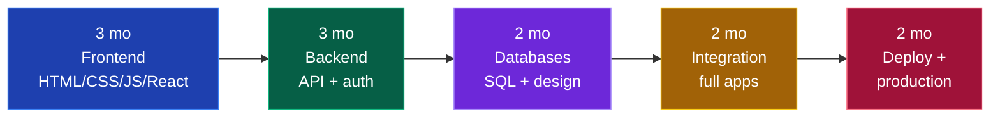

# 🧩 Full Stack Developer

### You build the whole thing — UI, API, database, deployment. The most hired role for freshers in India.

[🏠 Home](../README.md) • [💼 All tracks](README.md) • [🎨 Frontend](frontend.md) • [⚙️ Backend](backend.md)

---

## Why this is the default recommendation

**If you have no idea what to pick, pick this.**

- **Most fresher openings** — especially at startups, which hire the most tier-3 students
- **You discover your real preference** by actually doing both ends
- **Best for solo projects** — you can build and ship a complete product alone, which is the strongest possible portfolio
- **Easy to specialise later** — after a year of full stack you'll know whether you're a frontend or backend person, and switching is trivial from here

**Hardest part:** the breadth trap. Knowing a little of everything and enough of nothing is the #1 way full-stack developers fail interviews.

> [!WARNING]
> **The breadth trap is real.** "I know React, Node, MongoDB, Express, Python, Django, Flutter, AWS" reads as "I did a tutorial in each." Go deep in ONE stack. Depth in MERN beats surface knowledge of six ecosystems, every single time.

---

## Pick your stack (ONE)

| Stack | Components | Best for |
|---|---|---|
| **MERN** ⭐ | MongoDB · Express · React · Node | Startups, fastest to build with, one language everywhere |
| **PERN** | PostgreSQL · Express · React · Node | Same but with a real relational DB *(better for interviews)* |
| **Java Full Stack** ⭐ | Spring Boot · React · MySQL/PostgreSQL | Service companies, enterprise, **most Indian job openings** |
| **Next.js Full Stack** | Next.js · Prisma · PostgreSQL | Modern, fewest moving parts, excellent for solo projects |
| **Python Full Stack** | Django/FastAPI · React · PostgreSQL | If you also lean toward data/ML |

> [!TIP]
> **Two safest picks:** **Java + Spring Boot + React** if you want maximum job openings in India (service + enterprise + product). **MERN/Next.js** if you're targeting startups and want to ship fast. Pick one, stay 12 months.

---

## The roadmap

### Phase 1 — Frontend (3 months)

- [ ] HTML — semantic tags, forms, accessibility basics
- [ ] CSS — Flexbox, Grid, responsive design, Tailwind
- [ ] **JavaScript deeply** — DOM, events, async/await, fetch, closures, `this`, event loop
- [ ] React — components, hooks, state, routing, forms, data fetching
- [ ] State management — Context or Zustand
- [ ] Loading states, error handling, form validation

📖 Full detail: **[frontend.md](frontend.md)** *(follow phases 1–3)*

### Phase 2 — Backend (3 months)

- [ ] Your backend language + framework
- [ ] REST API design, HTTP methods, status codes
- [ ] MVC / layered architecture
- [ ] **Authentication** — JWT, password hashing (bcrypt), refresh tokens
- [ ] Authorisation and role-based access
- [ ] Middleware, validation, structured error responses
- [ ] File uploads (Multer / S3 / Cloudinary)
- [ ] Environment variables and secrets
- [ ] API docs with Swagger/Postman

📖 Full detail: **[backend.md](backend.md)** *(follow phases 1–2)*

### Phase 3 — Databases (2 months)

- [ ] **SQL** — schema design, joins, group by, subqueries, indexing, transactions
- [ ] Normalisation and when to denormalise
- [ ] MongoDB — documents, aggregation *(if MERN)*
- [ ] ORM — Prisma / Mongoose / Hibernate / SQLAlchemy
- [ ] Relationships — one-to-many, many-to-many
- [ ] **Redis** — caching and sessions
- [ ] Database migrations

### Phase 4 — Putting it together (2 months)

This is where you become a *full stack* developer rather than two half-developers.

- [ ] Connect a React frontend to your own API
- [ ] Handle CORS properly
- [ ] Full auth flow — signup → login → protected routes → logout → token refresh
- [ ] Global loading and error states
- [ ] Pagination, search and filtering — end to end
- [ ] Real-time features with WebSockets (Socket.io)
- [ ] Payment integration (Razorpay/Stripe test mode)
- [ ] Email notifications (Nodemailer / SendGrid)
- [ ] Image uploads end to end

### Phase 5 — Production (2 months)

- [ ] **Git workflows** — branches, PRs, resolving merge conflicts
- [ ] **Docker** — containerise your app, `docker-compose`
- [ ] **Deployment** — frontend on Vercel/Netlify, backend on Render/Railway/EC2, DB on Neon/Supabase/Atlas
- [ ] Environment configuration across environments
- [ ] **CI/CD** with GitHub Actions
- [ ] Custom domain + HTTPS
- [ ] Basic monitoring and error tracking (Sentry)
- [ ] Security — OWASP basics, rate limiting, input sanitisation
- [ ] **Testing** — a few unit and integration tests *(rare among freshers, very noticeable)*

---

## 💡 Projects that get you hired

You need **2–3 complete, deployed, defensible applications.**

| Level | Project | Key features |
|:---:|---|---|
| 🟢 | **Blog platform** | Auth, CRUD, markdown, comments, image upload |
| 🟡 | **E-commerce store** | Products, cart, checkout, payments, orders, admin panel |
| 🟡 | **Job board** | Two user roles, applications, search + filters, resume upload |
| 🟠 | **Real-time chat** | Socket.io, rooms, online presence, message history, typing indicators |
| 🟠 | **Project management tool** | Boards, drag-and-drop, teams, permissions, activity feed |
| 🔥 | **SaaS with subscriptions** | Multi-tenant, Razorpay/Stripe billing, usage limits, admin dashboard |
| 🔥 | **Social platform** | Feed, follows, notifications, real-time updates, image CDN |

**A full-stack project must have all of this:**
- ✅ Live deployed URL (frontend AND backend)
- ✅ GitHub repo with a strong README — screenshots, architecture diagram, live link, setup steps
- ✅ Authentication with proper password hashing
- ✅ A real database with a considered schema
- ✅ Responsive UI that actually looks good
- ✅ Error handling and loading states
- ✅ 30+ commits spread over weeks, not one "final commit"

📖 **[projects/README.md](../projects/README.md)**

---

## 🎤 Interview breakdown

| Round | What's tested |
|---|---|
| **OA** | DSA — arrays, strings, hashmaps, trees, basic DP |
| **DSA round** | Live coding, Medium difficulty |
| **Frontend round** | React hooks, JS fundamentals, CSS, machine coding a component |
| **Backend round** | API design, auth, database design, SQL queries |
| **Project deep-dive** ⭐ | *The most important round for full stack.* Architecture, trade-offs, bugs, scale |
| **System design** | Design a URL shortener / chat app / e-commerce backend |
| **HR** | Motivation, teamwork, why this company |

<b>❓ Full-stack questions you WILL be asked</b>

 

1. Walk me through what happens when a user clicks "Login" in your app — browser to database and back.
2. How did you implement authentication? Where is the JWT stored and what are the trade-offs?
3. What happens if your database goes down? What does the user see?
4. How would you handle 10,000 concurrent users on this?
5. Why did you choose MongoDB over PostgreSQL (or vice versa)?
6. How do you prevent SQL injection / XSS / CSRF?
7. What is CORS and why did you have to configure it?
8. How does your frontend handle a failed API call?
9. What was the hardest bug in this project? How did you find it?
10. What would you refactor if you rebuilt it today?
11. How do you handle file uploads at scale?
12. Explain your database schema and why you modelled it that way.

**Question 1 is the classic full-stack question.** Rehearse it out loud until it's fluent — it demonstrates that you understand the *whole* system, which is the entire point of the role.

---

## 🏢 Who hires full stack developers

| Level | Companies | CTC |
|---|---|---|
| 🟢 Service | TCS, Infosys, Wipro, Cognizant, Accenture, LTIMindtree, Capgemini | ₹3.5–7 LPA |
| 🔵 Mid product & startups | Zoho, Nagarro, Thoughtworks, Publicis Sapient, **most funded startups** | ₹6–15 LPA |
| 🟣 Strong product | Razorpay, Zomato, Swiggy, PhonePe, Groww, CRED, Postman, Zeta | ₹15–30 LPA |
| 🔴 Top tier | Usually hire specialists rather than "full stack" titles | ₹25–60 LPA |

> [!TIP]
> **Startups are the tier-3 student's best market, and they overwhelmingly hire full stack.** A 15-person startup needs someone who can ship a whole feature alone — they care about what you've built, not where you studied. Target them hard. → [placements/off-campus-strategy.md](../placements/off-campus-strategy.md)

---

## 📚 Free resources

| Topic | Resource |
|---|---|
| Full MERN course | [Chai aur Code (Hitesh Choudhary)](https://www.youtube.com/@chaiaurcode) · [The Net Ninja MERN](https://www.youtube.com/@NetNinja) |
| Java Full Stack | [Telusko](https://www.youtube.com/@Telusko) + [react.dev](https://react.dev/learn) |
| The full path | [roadmap.sh/full-stack](https://roadmap.sh/full-stack) |
| JavaScript deep | [javascript.info](https://javascript.info/) |
| React | [react.dev/learn](https://react.dev/learn) |
| Next.js | [nextjs.org/learn](https://nextjs.org/learn) |
| Databases | [SQLZoo](https://sqlzoo.net/) · [Prisma docs](https://www.prisma.io/docs) |
| Deployment | [Vercel](https://vercel.com/docs) · [Render](https://render.com/docs) · [Railway](https://docs.railway.app/) |
| Free DB hosting | [Neon](https://neon.tech) · [Supabase](https://supabase.com) · [MongoDB Atlas](https://www.mongodb.com/atlas) |

---

## ⚠️ Full-stack specific mistakes

| Mistake | Fix |
|---|---|
| **Breadth without depth** | One stack, 12 months. Resist the urge to sample. |
| **Listing 15 technologies on your resume** | List 5–6 you can be interviewed on. Every listed skill is fair game. |
| **Only building CRUD apps** | Add real-time, payments, caching, or file handling. Show engineering. |
| **Frontend deployed, backend on localhost** | Deploy both. A dead demo link is worse than no link. |
| **Weak on DSA because "I build projects"** | Projects get you the interview. DSA gets you through it. You need both. |
| **Can't explain the full request lifecycle** | Practise the "click to database and back" walkthrough out loud. |
| **No database design thinking** | Learn normalisation. Bad schemas get picked apart in interviews. |
| **Chasing every new framework** | The stack you know is fine. Depth compounds; novelty doesn't. |

---

### One person, whole product. That's the most employable thing a fresher can be.

[🏠 Home](../README.md) • [💼 Tracks](README.md) • [💡 Projects](../projects/README.md) • [📚 DSA](../core/dsa.md) • [📤 Off-campus](../placements/off-campus-strategy.md)

