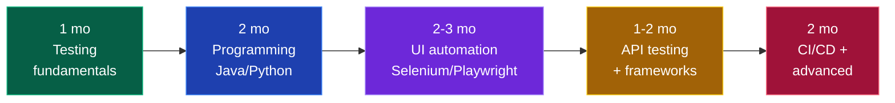

# 🧪 QA Engineer / SDET

### The most underrated path from a tier-3 college into a product company.

[🏠 Home](../README.md) • [💼 All tracks](README.md) • [⚙️ Backend](backend.md) • [☁️ DevOps](devops-cloud.md)

---

## Read this before you dismiss QA

Most students ignore QA because they've been told it's "for people who can't code." **That is outdated and wrong**, and believing it costs tier-3 students real opportunities.

**The reality in 2026:**

- **SDET (Software Development Engineer in Test)** is a coding role. You write automation frameworks in Java/Python/JS. The engineering is real.
- **Google, Microsoft, Amazon, Atlassian, Adobe, Uber and Salesforce all hire SDETs**, often at pay bands close to their SDE-1s.
- **The competition is 10× lower.** 500 students apply to every SDE opening; 50 apply to the SDET one. Same company, same office, same salary band, one-tenth the queue.
- **DSA expectations are lower** — usually Easy/Medium, not Hard graph and DP problems.
- **SDET → SDE is a well-worn internal path.** Many engineers at top companies entered through test.

> [!IMPORTANT]
> **If you're a tier-3 student who wants a product company but is struggling with hard DSA, this is your highest-probability route in.** It is not a lesser career. Automation engineers who understand systems deeply are genuinely scarce.

---

## Manual QA vs SDET — know the difference

| | **Manual QA** | **SDET / Automation** |
|---|---|---|
| What you do | Test by hand, write test cases, report bugs | Write code that tests code |
| Coding required | Minimal | **Substantial** |
| Fresher CTC | ₹3–6 LPA | **₹6–20 LPA** |
| Career ceiling | Limited without automation | High — SDET II, SDET III, SET, SDE |
| Long-term outlook | Shrinking | Growing |

**Learn manual testing concepts (2–4 weeks) because they're the foundation and they're asked in interviews. Then spend all your remaining time on automation.** Do not aim to be a purely manual tester.

---

## The roadmap

### Phase 1 — Testing fundamentals (1 month)

- [ ] SDLC and **STLC** (Software Testing Life Cycle)
- [ ] Verification vs validation
- [ ] Testing types: **unit, integration, system, acceptance**
- [ ] Functional vs non-functional testing
- [ ] **Black box, white box, grey box**
- [ ] Smoke, sanity, regression, retesting
- [ ] **Test case design** — equivalence partitioning, boundary value analysis, decision tables, state transition
- [ ] **Bug life cycle** — new → assigned → open → fixed → retest → closed/reopened
- [ ] Severity vs priority *(classic interview question — know the difference cold)*
- [ ] Writing a good bug report: steps to reproduce, expected vs actual, environment, severity, attachments
- [ ] **Agile & Scrum** — sprints, standups, the QA role in a sprint
- [ ] Tools: **JIRA**, TestRail, Zephyr

**Do:** write 50 test cases by hand for a real app (Swiggy, IRCTC, Amazon). Include negative and edge cases. This becomes portfolio material.

### Phase 2 — Programming (2 months)

Pick **Java** (most QA jobs), **Python** (easiest), or **JavaScript** (if targeting Playwright/Cypress-heavy teams).

- [ ] Syntax, data types, control flow
- [ ] **OOP** — classes, inheritance, polymorphism, encapsulation, abstraction *(essential for Page Object Model)*
- [ ] Collections — lists, maps, sets
- [ ] Exception handling
- [ ] File I/O and reading test data from Excel/CSV/JSON
- [ ] Basic DSA — arrays, strings, hashmaps, sorting, searching → [core/dsa.md](../core/dsa.md)

> [!TIP]
> **Java is the safest QA language in India.** The overwhelming majority of Selenium job postings ask for Java, and most QA frameworks in Indian companies are Java-based.

### Phase 3 — UI automation (2–3 months)

- [ ] **Selenium WebDriver** — locators (id, name, xpath, CSS), waits (implicit/explicit/fluent), WebElement actions
- [ ] Handling: dropdowns, alerts, frames, windows, tables, file uploads
- [ ] Actions class — mouse hover, drag and drop, keyboard
- [ ] **TestNG** (Java) or **PyTest** (Python) — annotations, assertions, groups, priorities, parallel execution, data providers
- [ ] **Page Object Model (POM)** ⭐ — the architecture every interview asks about
- [ ] Page Factory
- [ ] Data-driven testing (Excel/CSV/JSON) with Apache POI
- [ ] Reporting — Extent Reports / Allure
- [ ] Screenshots on failure, logging (Log4j)
- [ ] Cross-browser testing
- [ ] **Playwright or Cypress** — modern, increasingly demanded, faster and less flaky

### Phase 4 — API & performance testing (1–2 months)

- [ ] **REST fundamentals** — methods, status codes, headers, request/response
- [ ] **Postman** — collections, environments, variables, pre-request scripts, test scripts, Newman CLI
- [ ] **REST Assured** (Java) or **requests + pytest** (Python) for automated API tests
- [ ] Response validation — status, body, schema, headers
- [ ] Auth testing — API keys, JWT, OAuth
- [ ] **SQL for testing** — verifying data in the database after an action → [core/cs-fundamentals.md](../core/cs-fundamentals.md)
- [ ] **JMeter** — load and performance testing basics
- [ ] Mocking and stubbing (WireMock)

### Phase 5 — CI/CD and advanced (2 months)

- [ ] **Git & GitHub** — branching, PRs → [core/git-and-linux.md](../core/git-and-linux.md)
- [ ] **Jenkins** or **GitHub Actions** — running tests automatically on every commit
- [ ] Maven / Gradle (Java) or pip/poetry (Python)
- [ ] **Docker basics** — containerised test environments
- [ ] **BDD with Cucumber** — Gherkin, feature files, step definitions
- [ ] Selenium Grid / parallel execution
- [ ] Test strategy — what to automate and what *not* to
- [ ] Flaky test debugging *(a genuinely valued skill)*
- [ ] Mobile automation — Appium *(optional, opens more roles)*
- [ ] Security testing basics — OWASP Top 10

---

## 💡 Projects that get you hired

| Level | Project | What it proves |
|:---:|---|---|
| 🟢 | **50 test cases + bug reports** for a real site | You understand testing, not just tools |
| 🟢 | **Selenium scripts** automating a login flow | Basic automation |
| 🟡 | **POM framework** for an e-commerce site | Architecture — the key interview topic |
| 🟡 | **API test suite** with REST Assured + Postman collection | API testing competence |
| 🟠 | **Hybrid framework** — POM + TestNG + data-driven + Extent Reports + Jenkins | Production-grade |
| 🟠 | **BDD framework** with Cucumber + Selenium | Industry-standard practice |
| 🔥 | **Full CI pipeline** — tests run on every push, results published, Dockerised, parallel | Genuinely senior-level for a fresher |

> [!TIP]
> **Your framework repo IS your resume as an SDET.** Make it excellent: a clear README with an architecture diagram, folder structure explained, sample reports, setup instructions, and a screenshot of the Jenkins/GitHub Actions run. One outstanding framework repo will get you more interviews than five half-finished ones.

---

## 🎤 Interview breakdown

| Round | What's tested | Weight |
|---|---|:---:|
| **Manual testing / theory** | STLC, test design, bug lifecycle, severity vs priority | 🔴 High |
| **Coding** | DSA — usually Easy/Medium (strings, arrays, hashmaps) | 🟠 Medium |
| **Automation coding** | Write Selenium code live, XPath, waits, POM | 🔴 High |
| **Framework design** | "Design a test framework from scratch" — architecture, layers, reporting | 🔴 High |
| **API testing** | REST concepts, Postman, REST Assured, status codes | 🟠 Medium |
| **SQL** | Joins, group by, verifying data | 🟠 Medium |
| **Scenario-based** | "How would you test a lift / login page / Swiggy checkout?" | 🔴 High |
| **HR** | Motivation, why QA, teamwork | 🟡 Medium |

<b>❓ QA/SDET questions you WILL be asked</b>

 

**Theory**
1. Severity vs priority — give an example of high severity + low priority.
2. Explain the bug life cycle.
3. Smoke vs sanity vs regression testing?
4. What is boundary value analysis? Give an example.
5. When would you NOT automate a test?
6. Verification vs validation?
7. What goes into a good bug report?

**Selenium**
8. Implicit vs explicit vs fluent wait — when do you use each?
9. What is `StaleElementReferenceException` and how do you handle it?
10. Absolute vs relative XPath — which is better and why?
11. How do you handle dynamic elements?
12. How do you handle multiple windows / frames / alerts?
13. `driver.close()` vs `driver.quit()`?

**Framework**
14. Explain the Page Object Model and why it matters.
15. Walk me through your framework's architecture.
16. How do you handle test data?
17. How do you run tests in parallel?
18. How do you deal with flaky tests?

**Scenario**
19. How would you test a login page? *(Give 25+ cases: valid, invalid, empty, SQL injection, XSS, session timeout, browser back, password masking, caps lock, remember me, rate limiting, accessibility...)*
20. How would you test a lift/elevator? *(Tests non-web thinking)*
21. The developer says "it works on my machine." What do you do?
22. You have 2 days to test a release and 5 days of test cases. How do you prioritise?

**Question 19 is asked in nearly every QA interview.** Prepare 25+ cases across functional, negative, security, usability and performance. Most candidates give 6 and stop.

---

## 🏢 Who hires QA / SDET

| Level | Companies | CTC |
|---|---|---|
| 🟢 Service | TCS, Infosys, Wipro, Cognizant, Accenture, Capgemini, LTIMindtree | ₹3.5–6 LPA |
| 🔵 Mid product | Zoho, Nagarro, Thoughtworks, Publicis Sapient, QA-focused firms (Qualitest) | ₹6–12 LPA |
| 🟣 Strong product | Razorpay, Swiggy, PhonePe, Zomato, Postman, Sprinklr, Freshworks | ₹12–22 LPA |
| 🔴 Top tier | **Google, Microsoft, Amazon, Adobe, Atlassian, Uber, Salesforce** all hire SDETs | ₹20–45 LPA |

📖 **[placements/company-tiers.md](../placements/company-tiers.md)**

---

## 📚 Free resources

| Topic | Resource |
|---|---|
| Manual testing | [Software Testing Help](https://www.softwaretestinghelp.com/) · [Guru99 Testing](https://www.guru99.com/software-testing.html) |
| ISTQB syllabus (free) | [istqb.org](https://www.istqb.org/) *(great structured theory, certification optional)* |
| Selenium | [SDET-QA Automation Techie (YouTube)](https://www.youtube.com/@sdetqaautomationtechie) · [Naveen AutomationLabs](https://www.youtube.com/@naveenautomationlabs) |
| Selenium docs | [selenium.dev/documentation](https://www.selenium.dev/documentation/) |
| Playwright | [playwright.dev](https://playwright.dev/) *(official docs are excellent)* |
| Cypress | [docs.cypress.io](https://docs.cypress.io/) |
| API testing | [Postman Learning Center](https://learning.postman.com/) · [REST Assured docs](https://rest-assured.io/) |
| Practice sites | [the-internet.herokuapp.com](https://the-internet.herokuapp.com/) · [demoqa.com](https://demoqa.com/) · [saucedemo.com](https://www.saucedemo.com/) |
| JMeter | [Apache JMeter docs](https://jmeter.apache.org/usermanual/) |
| Interview prep | Search "Selenium interview questions" on Guru99 + GeeksforGeeks |

---

## ⚠️ QA-specific mistakes

| Mistake | Fix |
|---|---|
| **Staying purely manual** | Automation is where the money and the future are. Learn to code. |
| **Learning Selenium without OOP** | POM is entirely OOP. Learn the language properly first. |
| **Copying a framework from YouTube** | Build your own. You'll be asked to defend every design decision. |
| **Skipping DSA entirely** | SDET roles at product companies do test DSA. Easy/Medium is enough. |
| **No API testing skills** | API testing is now half of most QA jobs. |
| **Not learning SQL** | You'll be asked to verify database state. It comes up constantly. |
| **Treating QA as a fallback** | Interviewers detect this instantly. Own the choice — automation is real engineering. |
| **Ignoring CI/CD** | Tests that don't run automatically have limited value. Learn Jenkins or GitHub Actions. |

---

### Same company. Same salary band. One-tenth the competition.

**If you want a product company from a tier-3 college, this is the shortest honest path.**

[🏠 Home](../README.md) • [💼 Tracks](README.md) • [🏢 Company tiers](../placements/company-tiers.md) • [💡 Projects](../projects/README.md)

